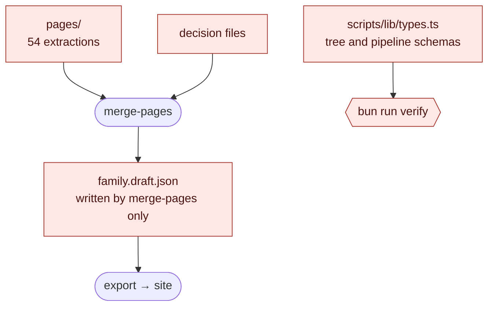
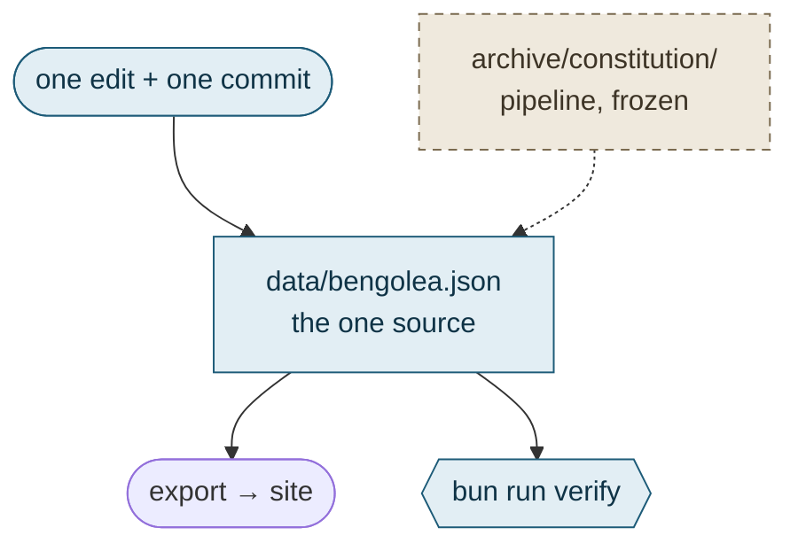
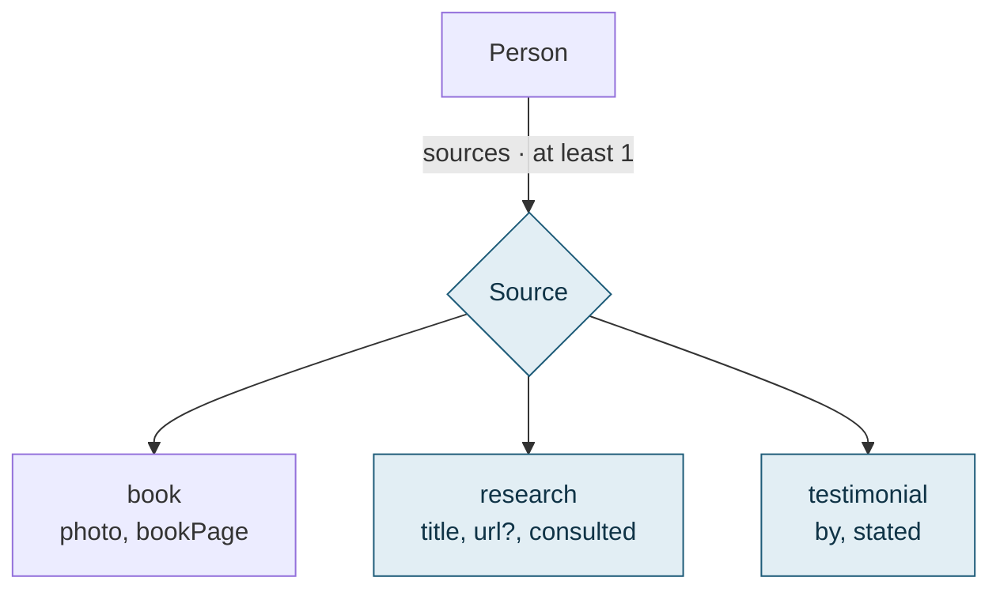
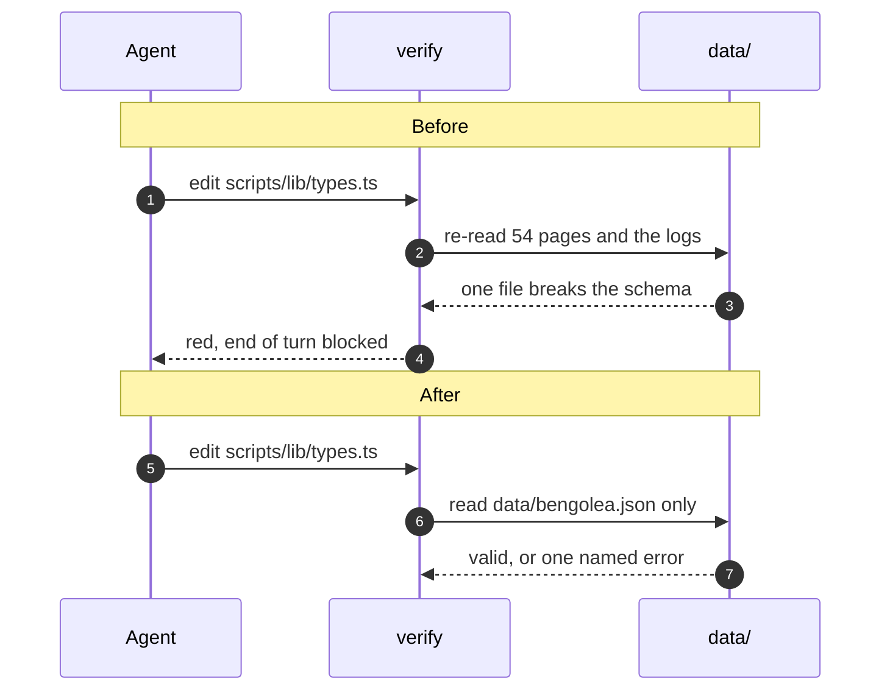

# Views

One worked example per row of the views table in `SKILL.md`. Most come from bengous/arbre-genealogique-bengolea-src#76: 152 files, about 120 of them moved into `archive/`, a pipeline taken out of every tool, a data model changed. Its first body was six sections of prose; the shape below is what it should have led with. The call tree and the component tree come from Matt Pocock's `pr` and Dex Horthy's `show-me`: `../CREDITS.md`.

## An architecture: two views, the shape changes

Nodes vanish and the flow reroutes, so Before and After are two diagrams, same ids, same direction. The legend comes first.

Red: what `verify` re-reads on every push. Blue: new, or a new role. Dashed: archived. Rounded: a script; rectangle: a file.

**Before**: the tree is the output of a pipeline, and `verify` re-reads every intermediate file.



**After**: the tree is the source, edited directly, and `verify` reads only it.



Read by `io.ts`, `validate.ts`, `normalize.ts`, `viz-payload.ts`, `gedcom.ts`.

## A data model: one view, the shape survives

`Person` keeps its links; a union and two kinds of source are new. One diagram, the delta in blue.



## Behaviour over time

What an agent hits when it edits a schema, before and after, in one diagram.



## Moved directories: the tree diff

`tree-diff.ts` on #76 prints 24 lines for 152 files. Trimmed to what the reader needs, `scripts/` opened on the one file that matters, each line commented:

```diff
+archive/constitution/                # the pipeline, frozen, run by no tool
+├── data/  ← data/ (69 of 70 files)  # pages, decisions, logs
+├── scripts/  ← scripts/ (27 of 40 files)
+└── README.md                        # how to replay it from the tag
 data/
+└── bengolea.json  ← family.draft.json  # the one source, edited directly
 scripts/lib/
 └── types.ts                         # the tree schema only
 packages/  (9 files modified)
```

## Logic: pseudocode as a diff

The surrounding shape exists; only the lines that change are marked. From this plugin's own change of step 4:

```diff
 step 4
-  visible change    → Before/After pair
-  otherwise         → nothing
+  visible change    → Before/After pair, a clip for a transition
+  structural change → the smallest view that makes the key point clear
```

## Runtime control flow: a call tree

```text
submitForm
  createSession
    persistPrompt
    launchAgent
  navigateToSession
```

A change to it, as a diff of the same tree:

```diff
 submitForm
   createSession
     persistPrompt
+    expandSkillMention
     launchAgent
   navigateToSession
+    subscribeToEvents
```

## UI structure: a component tree

With the state and module boundaries that matter:

```text
<SessionPage> (apps/example/src/routes/session.tsx)
  useSessionEvents()
  <SessionToolbar>
    <RunSkillButton> (packages/ui)
```

A change to it:

```diff
 <SessionPage>
   useSessionEvents()
   <SessionToolbar>
+    <RunSkillButton />
   <SessionTimeline>
+    <SkillResultCard />
```

## Contrasts that share no shape

Rows that no single diagram or diff can hold together. One line per cell.

| | Before | After |
|---|---|---|
| What `verify` reads | 54 pages, 11 decision and log files, the draft | `data/bengolea.json` |
| Fix a date | write a decision, re-run three scripts | edit, cite, commit |
| Replay the build | the pipeline in `scripts/` | `git worktree add ../constitution constitution` |

## A decision in the code

The line the decision hangs on, then two lines.

```text
data/bengolea.json: persons[0].sources[0].kind: missing (expected one of book, research, testimonial), beside an unknown field "knd"
```

The union words its own refusal, then hands back to the shared wording for every other error. A misspelt key is named instead of reported as a failed union.

## Something a user sees

```markdown
**Before**, the settings page on a phone:


**After**, the same page:

```

`<capture dir>` is the absolute path of the directory the captures went to, outside the repo, the same string as in the `--attach` arguments. A transition gets a clip for the After: `references/video.md`.
