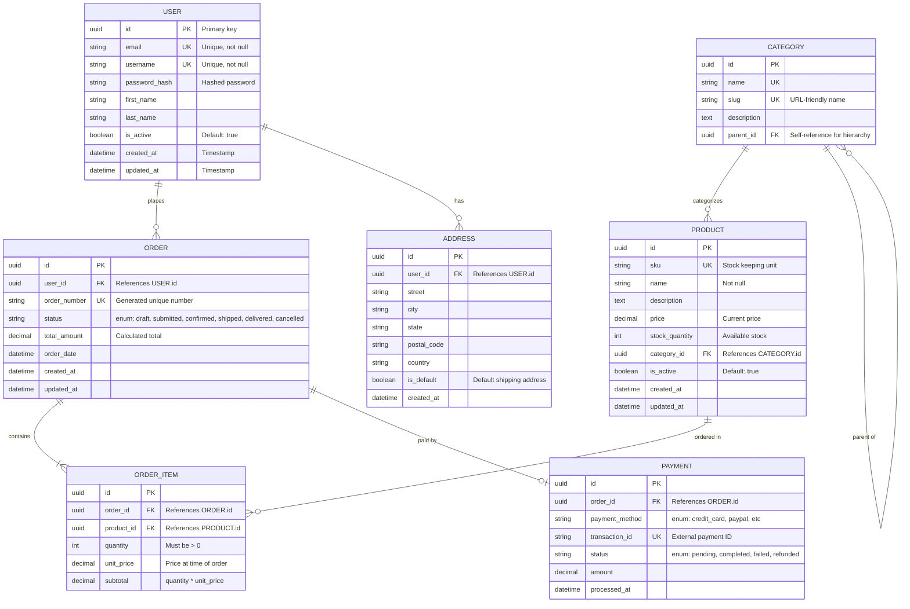

**Database Schema Documentation Notes:**

**Naming Conventions:**
- Tables: UPPERCASE (or lowercase, be consistent)
- Columns: snake_case
- Primary keys: `id`
- Foreign keys: `{table}_id`

**Common Patterns:**
- Timestamps: `created_at`, `updated_at`
- Soft deletes: `deleted_at` or `is_deleted`
- Primary keys: `uuid id PK` or `int id PK`
- Audit fields: `created_by`, `updated_by`

**Relationship Cardinality:**
- `||--||` : One to One (rare)
- `||--o{` : One to Many (most common)
- `}o--o{` : Many to Many (use junction table)
- `|o--o|` : Zero or One to Zero or One

**Usage Tips:**
1. Group related entities into sections
2. Document constraints in descriptions
3. Mark all primary and foreign keys
4. Include enum values in descriptions
5. Document calculated fields
6. Note any special indexes or constraints
