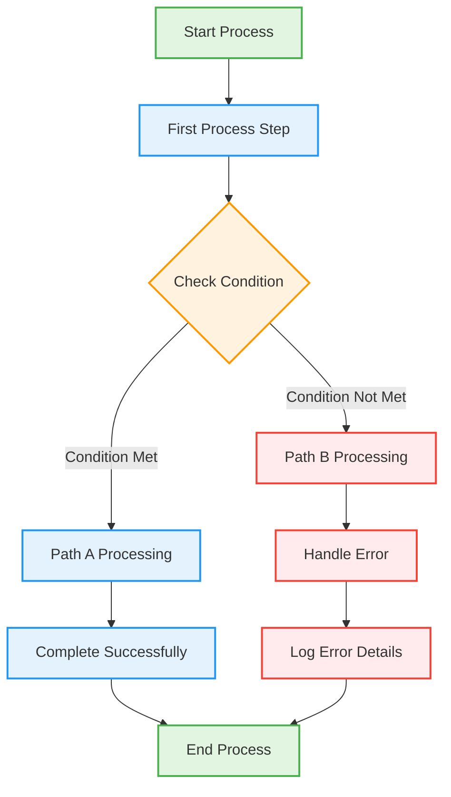

**Usage Tips:**
1. Replace section descriptions with your actual use case
2. Keep related nodes grouped in sections
3. Use comments to explain complex logic
4. Define connections separately from node definitions
5. Apply styling last (optional)
