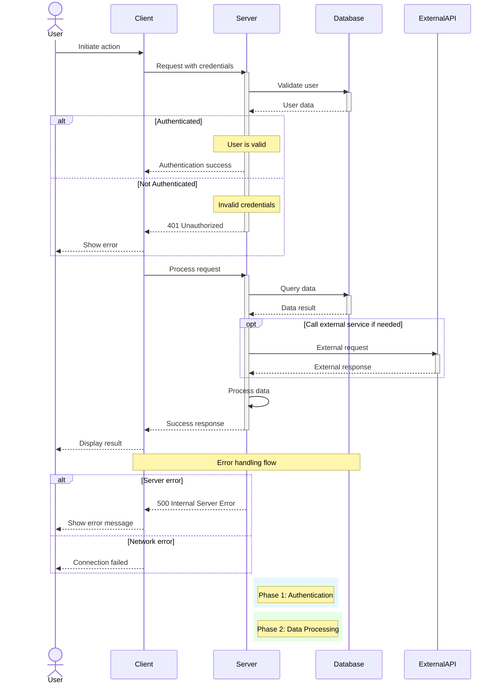

**Usage Tips:**
1. Always declare participants explicitly at the top
2. Group related interactions into commented sections
3. Use activate/deactivate to show processing time
4. Include error paths with alt/else blocks
5. Add notes to explain complex logic
6. Use autonumber if sequence matters (add at top)
