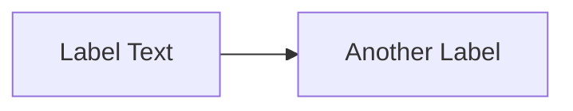
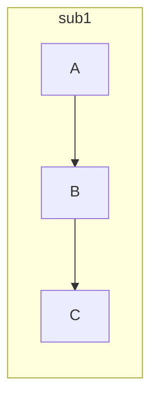
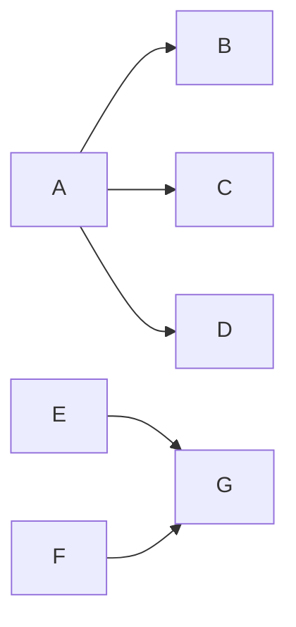
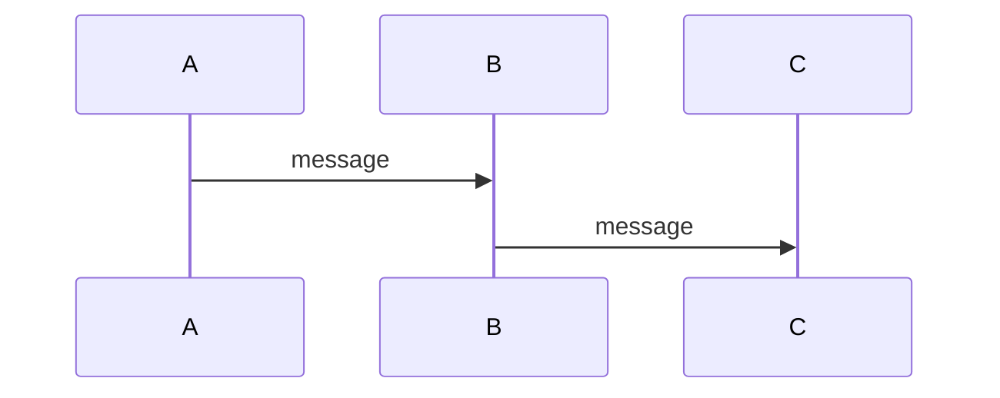
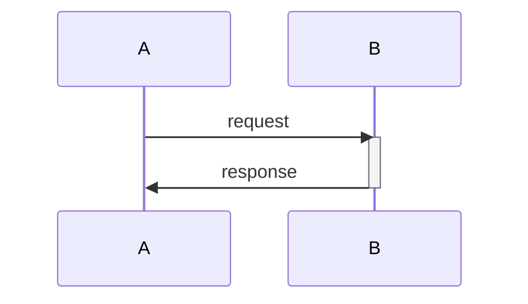
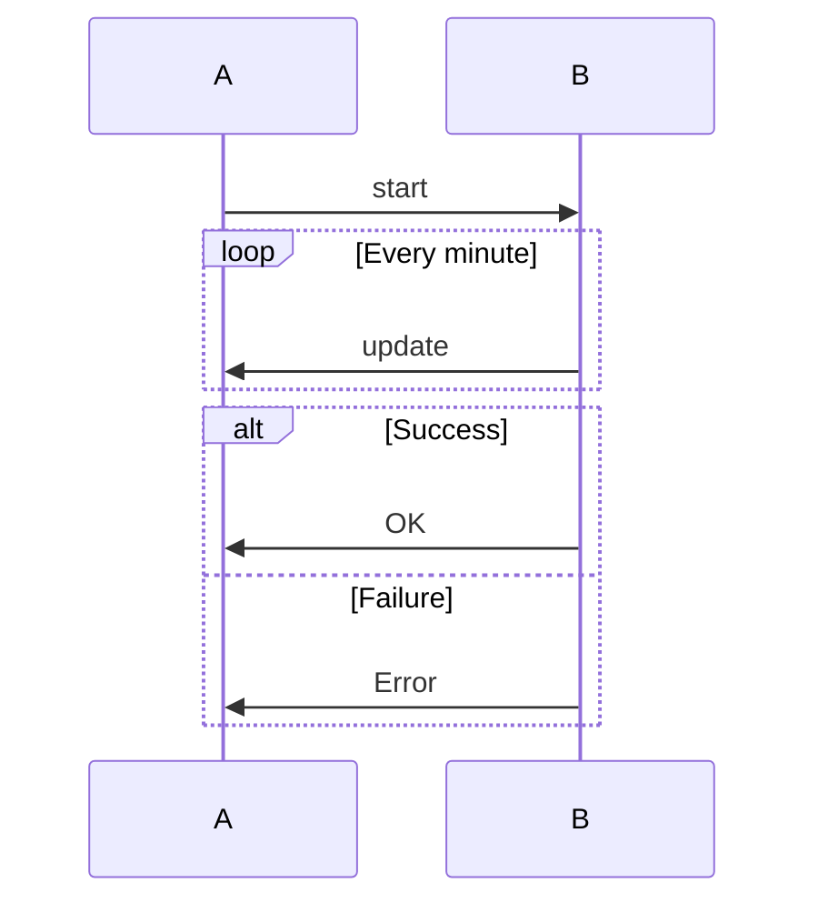
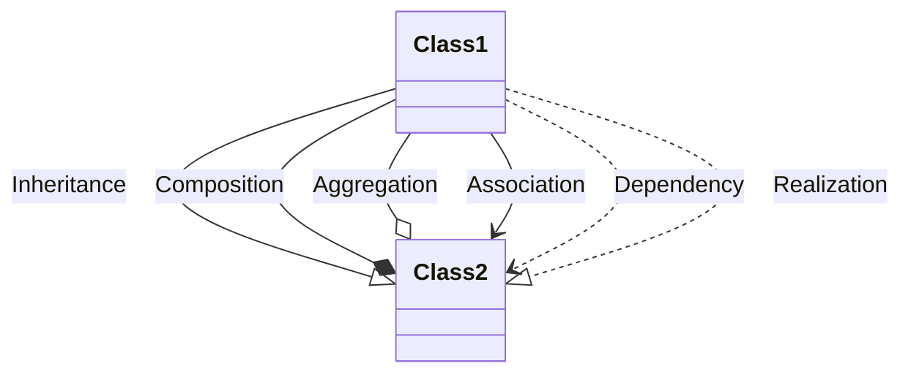
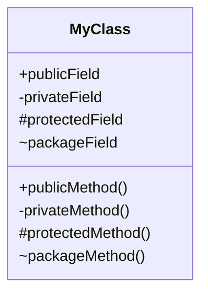
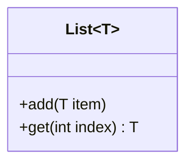
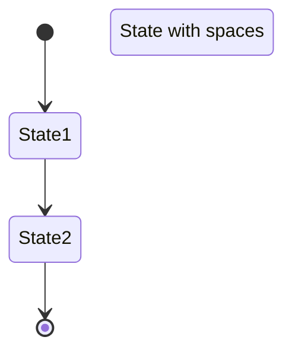

# Mermaid Gotchas and Common Errors

This document covers common pitfalls, special characters, reserved keywords, and syntax issues that break Mermaid diagrams.

## Reserved Keywords

These words have special meaning in Mermaid and can cause issues if used as node IDs or labels:

- `end` (especially in flowcharts)
- `graph`
- `subgraph`
- `style`
- `class`
- `classDef`
- `click`
- `callback`
- `link`
- `linkStyle`
- `default`

**Solution:** If you must use these words, wrap them in quotes or use them only as labels with square brackets.

```mermaid
%% ❌ BAD - 'end' is reserved
flowchart LR
    start --> end

%% ✅ GOOD - Use different ID or quote it
flowchart LR
    start --> finish
    start2["start"] --> end["end"]
```

## Special Characters and Escaping

### Characters That Break Syntax

**Parentheses, brackets, and braces** in labels must be escaped or the text must be quoted:

```mermaid
%% ❌ BAD - Unescaped parentheses
flowchart LR
    A[getData()] --> B

%% ✅ GOOD - Use quotes
flowchart LR
    A["getData()"] --> B

%% ✅ ALSO GOOD - Use escape with #
flowchart LR
    A[getData#40;#41;] --> B
```

**HTML entities for common characters:**
- `(` = `#40;`
- `)` = `#41;`
- `[` = `#91;`
- `]` = `#93;`
- `{` = `#123;`
- `}` = `#125;`
- `<` = `&lt;`
- `>` = `&gt;`
- `"` = `&quot;`
- `#` = `#35;`

**Quotes and apostrophes:**

```mermaid
%% ❌ BAD - Unescaped quotes break the syntax
flowchart LR
    A["He said "hello""] --> B

%% ✅ GOOD - Use &quot; or #quot;
flowchart LR
    A["He said &quot;hello&quot;"] --> B
    
%% ✅ GOOD - Mix quote types
flowchart LR
    A['He said "hello"'] --> B
```

### Newlines and Long Text

**CRITICAL:** Blank lines inside node labels will cause "Unsupported markdown: code" errors!

```mermaid
%% ❌ BAD - Blank lines break syntax
flowchart LR
    A["Server Action

    createPhotoAction()"]

%% ✅ GOOD - Use <br> or <br/> for line breaks
flowchart LR
    A["Server Action<br/><br/>createPhotoAction()"]
    B["First line<br>Second line<br>Third line"]
```

**Always use `<br>` or `<br/>` for line breaks - NEVER blank lines!**

### Semicolons

Semicolons can be used to end statements but are optional. Be consistent:

```mermaid
%% Both valid - just be consistent
flowchart LR
    A --> B;
    B --> C;

flowchart LR
    A --> B
    B --> C
```

## Node ID Pitfalls

### Invalid Characters in IDs

Node IDs should:
- Start with a letter
- Contain only letters, numbers, hyphens, and underscores
- Avoid spaces (use underscores instead)

```mermaid
%% ❌ BAD - Spaces and special chars in IDs
flowchart LR
    my node --> another-node!

%% ✅ GOOD
flowchart LR
    my_node --> another_node
```

### ID vs Label Confusion

IDs are for Mermaid's internal reference. Labels are what users see:



## Direction and Orientation

### Flowchart Direction Must Be First

```mermaid
%% ❌ BAD - Nodes before direction
flowchart
    A --> B
    LR

%% ✅ GOOD - Direction right after type
flowchart LR
    A --> B
```

### Valid Directions

- `TB` or `TD` - Top to Bottom (default)
- `BT` - Bottom to Top
- `LR` - Left to Right
- `RL` - Right to Left

## Subgraph Issues

### Subgraph Must Have Unique IDs

```mermaid
%% ❌ BAD - Duplicate subgraph IDs
flowchart LR
    subgraph sub1
        A --> B
    end
    subgraph sub1
        C --> D
    end

%% ✅ GOOD - Unique IDs
flowchart LR
    subgraph sub1
        A --> B
    end
    subgraph sub2
        C --> D
    end
```

### Subgraph Direction

Subgraphs can have their own direction:



## Arrow and Link Syntax

### Arrow Length Matters

More dashes = longer arrow visually:

```mermaid
flowchart LR
    A --> B    %% Short
    A ---> B   %% Medium
    A -----> B %% Long
```

### Link Text Syntax

```mermaid
%% ✅ GOOD - Text on links
flowchart LR
    A -->|label text| B
    A --|label text|-> B  %% Same thing
    A -- label text --> B  %% Also works
```

### Multiple Links



## Sequence Diagram Gotchas

### Participant Order

Participants appear in the order they're first mentioned or explicitly declared:



### Activation/Deactivation

Must be balanced:



### Loop/Alt/Par Must Have End



## Class Diagram Issues

### Relationship Arrows

Be precise with relationship syntax:



### Method/Field Syntax



### Generic Types

Use `~` for generics:



## State Diagram Gotchas

### State Naming

Be careful with state names:



### Direction

State diagrams can be horizontal:

```mermaid
stateDiagram-v2
    direction LR
    [*] --> Active
    Active --> [*]
```

## ER Diagram Issues

### Relationship Cardinality

Syntax: `Entity1 Relationship Cardinality Entity2 : "label"`

```mermaid
erDiagram
    CUSTOMER ||--o{ ORDER : places
    ORDER ||--|{ LINE-ITEM : contains
    PRODUCT ||--o{ LINE-ITEM : "ordered in"
```

**Cardinality markers:**
- `||` - Exactly one
- `|o` - Zero or one
- `}|` - One or more
- `}o` - Zero or more

## C4 Diagram Specific

### Container Boundaries

Boundaries must be properly closed:

```mermaid
C4Context
    Person(user, "User")
    
    Boundary(b1, "System Boundary") {
        System(sys, "System")
    }
```

## Git Graph Issues

### Commit Must Have ID

```mermaid
gitGraph
    commit id: "Initial"
    commit id: "Feature A"
    branch develop
    commit id: "Dev work"
```

### Branch Before Checkout

Create branch before you can checkout:

```mermaid
gitGraph
    commit
    branch feature
    checkout feature
    commit
```

## General Best Practices to Avoid Errors

### 1. Always Use Quotes for Complex Labels

When in doubt, quote your labels:

```mermaid
flowchart LR
    A["Any complex text: (with) [special] {chars}"] --> B["Is safe"]
```

### 2. Comment Liberally

Use `%%` for comments to explain complex logic:

```mermaid
flowchart LR
    %% User authentication flow
    A --> B
    
    %% Error handling branch
    B --> C
```

### 3. Test Incrementally

Build diagrams piece by piece. Don't add everything at once:
1. Start with basic structure
2. Add nodes and connections
3. Add styling last
4. Test after each major addition

### 4. Validate IDs

Keep IDs simple and consistent:
- Use snake_case or camelCase
- No special characters
- Descriptive but concise

### 5. Separate Concerns

Keep structure separate from styling:

```mermaid
flowchart LR
    %% Structure first
    A --> B
    B --> C
    
    %% Styling last
    style A fill:#f9f
    style B fill:#bbf
```

## Debugging Tips

### When Diagram Won't Render

1. Check for unbalanced quotes
2. Look for reserved keywords as IDs
3. Verify all subgraphs/loops/alts are closed
4. Check for special characters in labels
5. Ensure direction is specified correctly
6. Validate arrow syntax
7. Check for duplicate IDs

### Common Error Messages

- "Syntax error in text" → Usually unescaped special characters or unclosed quotes
- "Parse error" → Typically wrong keyword order or invalid syntax
- "Diagram not defined" → Missing diagram type declaration or wrong type name
- Blank output → Check JavaScript console for specific errors

### Testing Strategy

Use a Mermaid live editor to test complex sections:
- https://mermaid.live
- Test each subgraph independently
- Build complexity gradually
- Save working versions before major changes
