# Software Architecture Patterns for Mermaid

Common software architecture patterns and how to represent them in Mermaid diagrams.

## Table of Contents

- [Layered Architecture](#layered-architecture)
- [Microservices](#microservices)
- [Event-Driven Architecture](#event-driven-architecture)
- [Hexagonal Architecture](#hexagonal-architecture)
- [CQRS](#cqrs)
- [API Gateway Pattern](#api-gateway-pattern)
- [Service Mesh](#service-mesh)
- [Saga Pattern](#saga-pattern)

## Layered Architecture

### Flowchart Representation

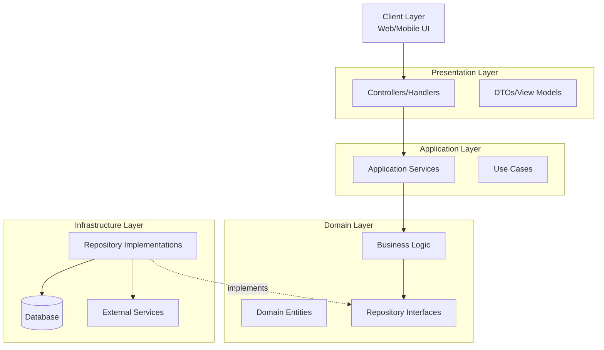
```mermaid
flowchart TB
    Client[Client Layer<br>Web/Mobile UI]
    
    subgraph presentation[Presentation Layer]
        Controllers[Controllers/Handlers]
        DTOs[DTOs/View Models]
    end
    
    subgraph application[Application Layer]
        Services[Application Services]
        UseCases[Use Cases]
    end
    
    subgraph domain[Domain Layer]
        Entities[Domain Entities]
        Logic[Business Logic]
        Interfaces[Repository Interfaces]
    end
    
    subgraph infrastructure[Infrastructure Layer]
        Repositories[Repository Implementations]
        Database[(Database)]
        External[External Services]
    end
    
    Client --> Controllers
    Controllers --> Services
    Services --> Logic
    Logic --> Interfaces
    Repositories -.implements.-> Interfaces
    Repositories --> Database
    Repositories --> External
```

### Class Diagram Representation

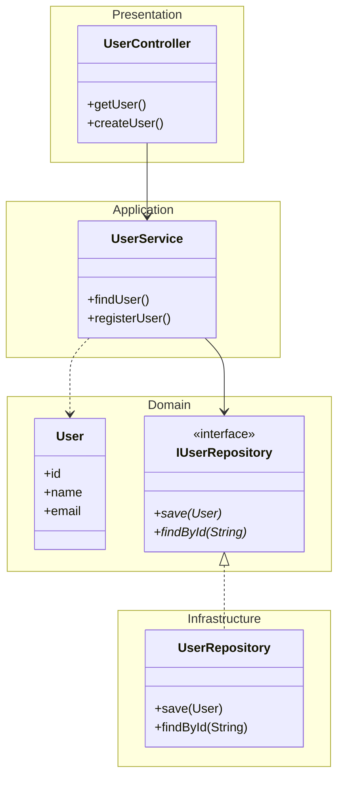
```mermaid
classDiagram
    namespace Presentation {
        class UserController {
            +getUser()
            +createUser()
        }
    }
    
    namespace Application {
        class UserService {
            +findUser()
            +registerUser()
        }
    }
    
    namespace Domain {
        class User {
            +id
            +name
            +email
        }
        
        class IUserRepository {
            <<interface>>
            +save(User)*
            +findById(String)*
        }
    }
    
    namespace Infrastructure {
        class UserRepository {
            +save(User)
            +findById(String)
        }
    }
    
    UserController --> UserService
    UserService --> IUserRepository
    UserService ..> User
    IUserRepository <|.. UserRepository
```

## Microservices

### C4 Container Diagram

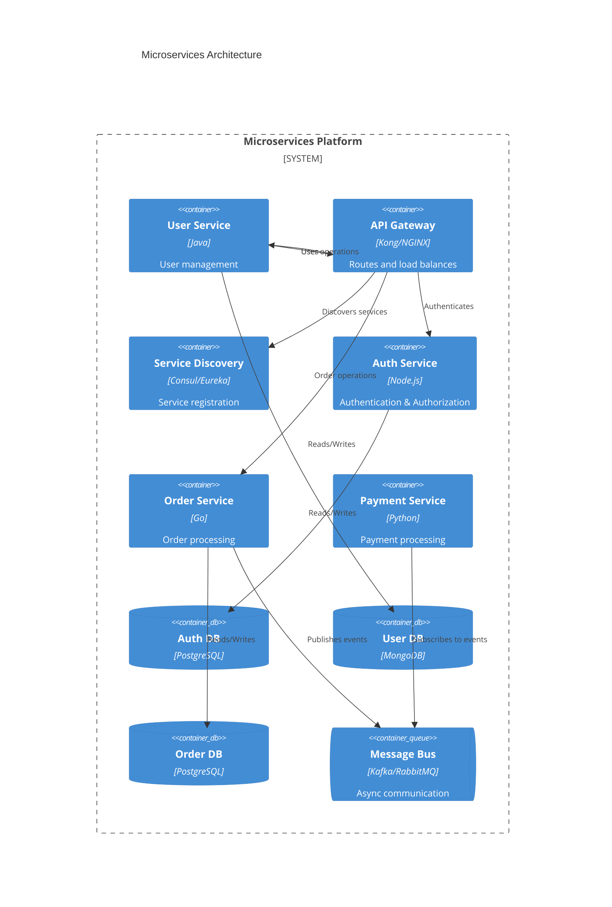
```mermaid
C4Container
    title Microservices Architecture
    
    Person(user, "User")
    
    System_Boundary(services, "Microservices Platform") {
        Container(gateway, "API Gateway", "Kong/NGINX", "Routes and load balances")
        Container(discovery, "Service Discovery", "Consul/Eureka", "Service registration")
        
        Container(auth, "Auth Service", "Node.js", "Authentication & Authorization")
        Container(user, "User Service", "Java", "User management")
        Container(order, "Order Service", "Go", "Order processing")
        Container(payment, "Payment Service", "Python", "Payment processing")
        
        ContainerDb(auth_db, "Auth DB", "PostgreSQL")
        ContainerDb(user_db, "User DB", "MongoDB")
        ContainerDb(order_db, "Order DB", "PostgreSQL")
        
        ContainerQueue(queue, "Message Bus", "Kafka/RabbitMQ", "Async communication")
    }
    
    Rel(user, gateway, "Uses")
    Rel(gateway, discovery, "Discovers services")
    Rel(gateway, auth, "Authenticates")
    Rel(gateway, user, "User operations")
    Rel(gateway, order, "Order operations")
    
    Rel(auth, auth_db, "Reads/Writes")
    Rel(user, user_db, "Reads/Writes")
    Rel(order, order_db, "Reads/Writes")
    
    Rel(order, queue, "Publishes events")
    Rel(payment, queue, "Subscribes to events")
```

### Sequence Diagram - Service Communication

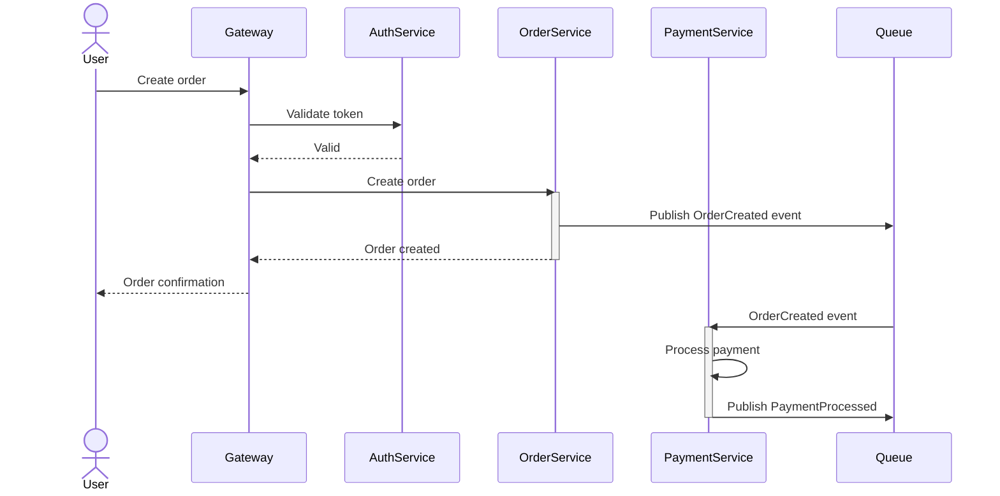
```mermaid
sequenceDiagram
    actor User
    participant Gateway
    participant AuthService
    participant OrderService
    participant PaymentService
    participant Queue
    
    User->>Gateway: Create order
    Gateway->>AuthService: Validate token
    AuthService-->>Gateway: Valid
    
    Gateway->>OrderService: Create order
    activate OrderService
    OrderService->>Queue: Publish OrderCreated event
    OrderService-->>Gateway: Order created
    deactivate OrderService
    
    Gateway-->>User: Order confirmation
    
    Queue->>PaymentService: OrderCreated event
    activate PaymentService
    PaymentService->>PaymentService: Process payment
    PaymentService->>Queue: Publish PaymentProcessed
    deactivate PaymentService
```

## Event-Driven Architecture

### Flowchart Representation

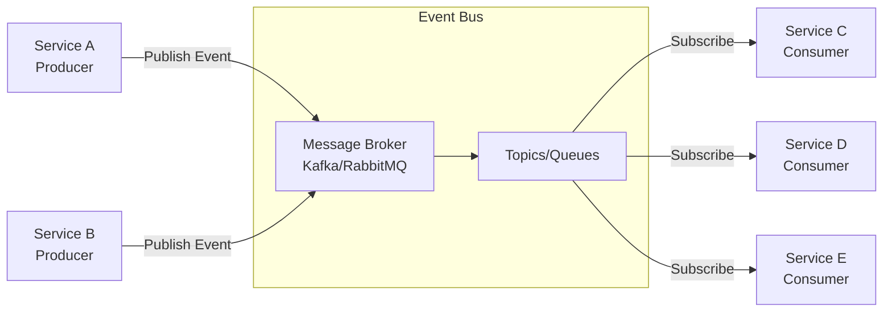
```mermaid
flowchart LR
    Producer1[Service A<br>Producer]
    Producer2[Service B<br>Producer]
    
    subgraph eventbus[Event Bus]
        Broker[Message Broker<br>Kafka/RabbitMQ]
        Topics[Topics/Queues]
    end
    
    Consumer1[Service C<br>Consumer]
    Consumer2[Service D<br>Consumer]
    Consumer3[Service E<br>Consumer]
    
    Producer1 -->|Publish Event| Broker
    Producer2 -->|Publish Event| Broker
    
    Broker --> Topics
    
    Topics -->|Subscribe| Consumer1
    Topics -->|Subscribe| Consumer2
    Topics -->|Subscribe| Consumer3
```

### Sequence Diagram - Event Flow

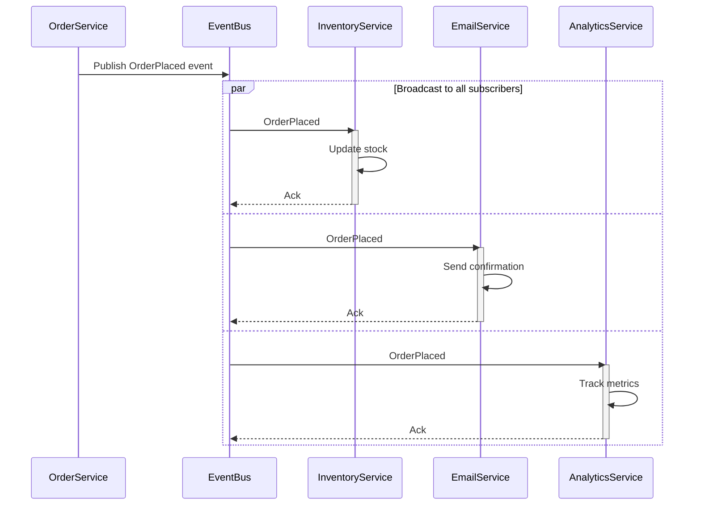
```mermaid
sequenceDiagram
    participant OrderService
    participant EventBus
    participant InventoryService
    participant EmailService
    participant AnalyticsService
    
    OrderService->>EventBus: Publish OrderPlaced event
    
    par Broadcast to all subscribers
        EventBus->>InventoryService: OrderPlaced
        activate InventoryService
        InventoryService->>InventoryService: Update stock
        InventoryService-->>EventBus: Ack
        deactivate InventoryService
    and
        EventBus->>EmailService: OrderPlaced
        activate EmailService
        EmailService->>EmailService: Send confirmation
        EmailService-->>EventBus: Ack
        deactivate EmailService
    and
        EventBus->>AnalyticsService: OrderPlaced
        activate AnalyticsService
        AnalyticsService->>AnalyticsService: Track metrics
        AnalyticsService-->>EventBus: Ack
        deactivate AnalyticsService
    end
```

## Hexagonal Architecture

### Flowchart with Ports and Adapters

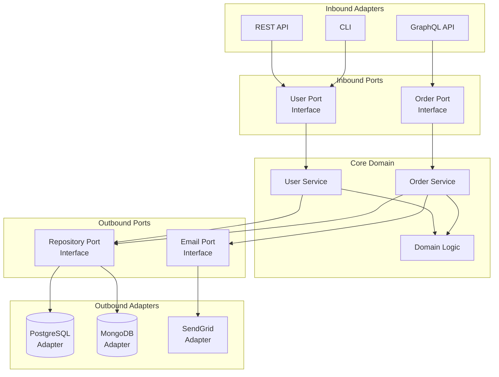
```mermaid
flowchart TB
    subgraph adapters_in[Inbound Adapters]
        REST[REST API]
        GraphQL[GraphQL API]
        CLI[CLI]
    end
    
    subgraph ports_in[Inbound Ports]
        UserPort[User Port<br>Interface]
        OrderPort[Order Port<br>Interface]
    end
    
    subgraph core[Core Domain]
        UserService[User Service]
        OrderService[Order Service]
        DomainLogic[Domain Logic]
    end
    
    subgraph ports_out[Outbound Ports]
        RepoPort[Repository Port<br>Interface]
        EmailPort[Email Port<br>Interface]
    end
    
    subgraph adapters_out[Outbound Adapters]
        PostgreSQL[(PostgreSQL<br>Adapter)]
        MongoDB[(MongoDB<br>Adapter)]
        SendGrid[SendGrid<br>Adapter]
    end
    
    REST --> UserPort
    GraphQL --> OrderPort
    CLI --> UserPort
    
    UserPort --> UserService
    OrderPort --> OrderService
    
    UserService --> DomainLogic
    OrderService --> DomainLogic
    
    UserService --> RepoPort
    OrderService --> RepoPort
    OrderService --> EmailPort
    
    RepoPort --> PostgreSQL
    RepoPort --> MongoDB
    EmailPort --> SendGrid
```

### Class Diagram

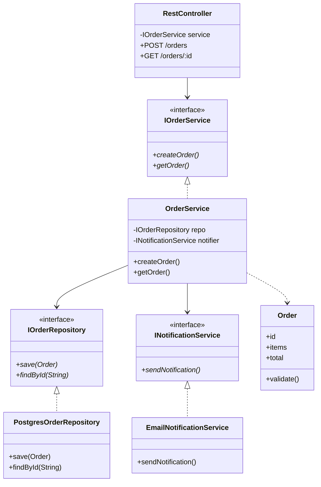
```mermaid
classDiagram
    %% Inbound Port
    class IOrderService {
        <<interface>>
        +createOrder()*
        +getOrder()*
    }
    
    %% Outbound Port
    class IOrderRepository {
        <<interface>>
        +save(Order)*
        +findById(String)*
    }
    
    class INotificationService {
        <<interface>>
        +sendNotification()*
    }
    
    %% Core Domain
    class OrderService {
        -IOrderRepository repo
        -INotificationService notifier
        +createOrder()
        +getOrder()
    }
    
    class Order {
        +id
        +items
        +total
        +validate()
    }
    
    %% Adapters
    class RestController {
        -IOrderService service
        +POST /orders
        +GET /orders/:id
    }
    
    class PostgresOrderRepository {
        +save(Order)
        +findById(String)
    }
    
    class EmailNotificationService {
        +sendNotification()
    }
    
    %% Relationships
    RestController --> IOrderService
    IOrderService <|.. OrderService
    OrderService --> IOrderRepository
    OrderService --> INotificationService
    OrderService ..> Order
    IOrderRepository <|.. PostgresOrderRepository
    INotificationService <|.. EmailNotificationService
```

## CQRS

### Flowchart Representation

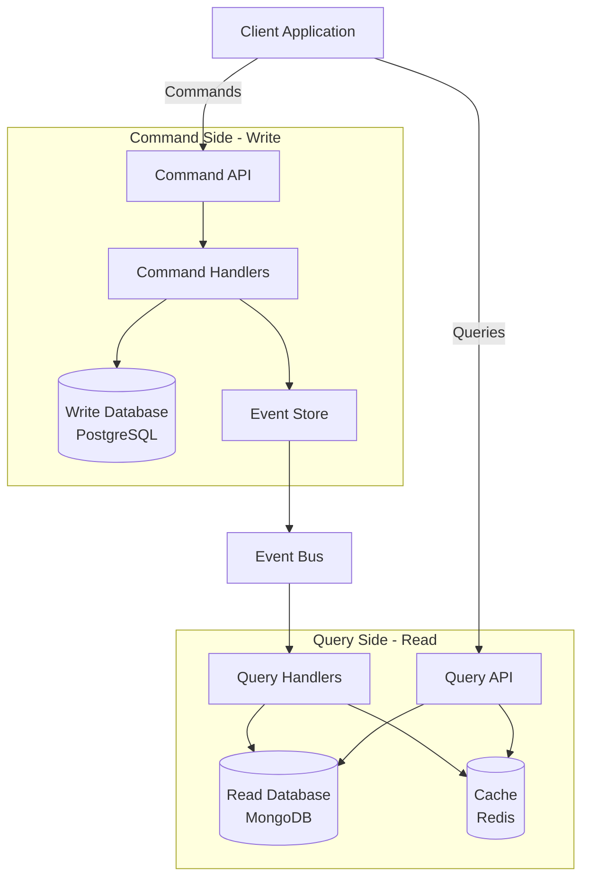
```mermaid
flowchart TB
    Client[Client Application]
    
    subgraph command[Command Side - Write]
        CmdAPI[Command API]
        CmdHandlers[Command Handlers]
        WriteDB[(Write Database<br>PostgreSQL)]
        EventStore[Event Store]
    end
    
    subgraph query[Query Side - Read]
        QueryAPI[Query API]
        QueryHandlers[Query Handlers]
        ReadDB[(Read Database<br>MongoDB)]
        Cache[(Cache<br>Redis)]
    end
    
    EventBus[Event Bus]
    
    Client -->|Commands| CmdAPI
    Client -->|Queries| QueryAPI
    
    CmdAPI --> CmdHandlers
    CmdHandlers --> WriteDB
    CmdHandlers --> EventStore
    
    EventStore --> EventBus
    EventBus --> QueryHandlers
    QueryHandlers --> ReadDB
    QueryHandlers --> Cache
    
    QueryAPI --> ReadDB
    QueryAPI --> Cache
```

### Sequence Diagram - Command Flow

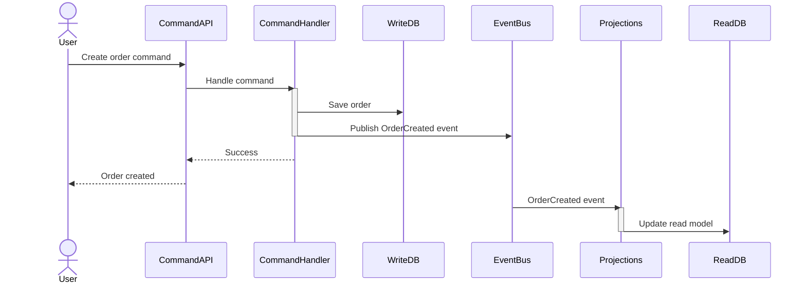
```mermaid
sequenceDiagram
    actor User
    participant CommandAPI
    participant CommandHandler
    participant WriteDB
    participant EventBus
    participant Projections
    participant ReadDB
    
    User->>CommandAPI: Create order command
    CommandAPI->>CommandHandler: Handle command
    activate CommandHandler
    CommandHandler->>WriteDB: Save order
    CommandHandler->>EventBus: Publish OrderCreated event
    deactivate CommandHandler
    CommandHandler-->>CommandAPI: Success
    CommandAPI-->>User: Order created
    
    EventBus->>Projections: OrderCreated event
    activate Projections
    Projections->>ReadDB: Update read model
    deactivate Projections
```

## API Gateway Pattern

### C4 Container Diagram

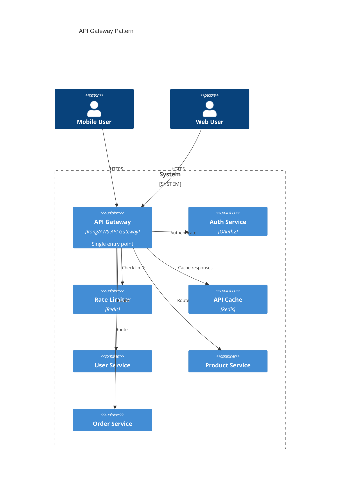
```mermaid
C4Container
    title API Gateway Pattern
    
    Person(mobile, "Mobile User")
    Person(web, "Web User")
    
    System_Boundary(system, "System") {
        Container(gateway, "API Gateway", "Kong/AWS API Gateway", "Single entry point")
        
        Container(auth, "Auth Service", "OAuth2")
        Container(ratelimit, "Rate Limiter", "Redis")
        Container(cache, "API Cache", "Redis")
        
        Container(userSvc, "User Service")
        Container(productSvc, "Product Service")
        Container(orderSvc, "Order Service")
    }
    
    Rel(mobile, gateway, "HTTPS")
    Rel(web, gateway, "HTTPS")
    
    Rel(gateway, auth, "Authenticate")
    Rel(gateway, ratelimit, "Check limits")
    Rel(gateway, cache, "Cache responses")
    
    Rel(gateway, userSvc, "Route")
    Rel(gateway, productSvc, "Route")
    Rel(gateway, orderSvc, "Route")
```

## Service Mesh

### Flowchart Representation

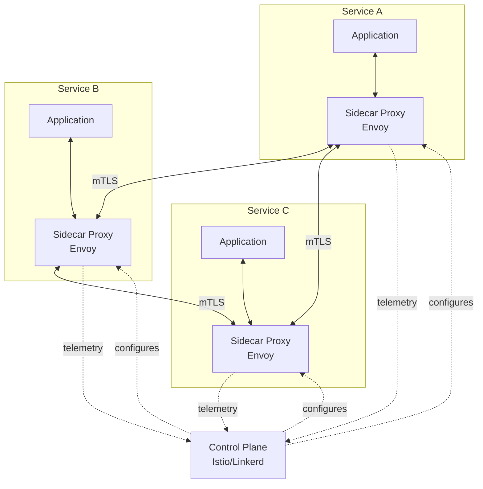
```mermaid
flowchart TB
    subgraph service1[Service A]
        App1[Application]
        Proxy1[Sidecar Proxy<br>Envoy]
    end
    
    subgraph service2[Service B]
        App2[Application]
        Proxy2[Sidecar Proxy<br>Envoy]
    end
    
    subgraph service3[Service C]
        App3[Application]
        Proxy3[Sidecar Proxy<br>Envoy]
    end
    
    ControlPlane[Control Plane<br>Istio/Linkerd]
    
    App1 <--> Proxy1
    App2 <--> Proxy2
    App3 <--> Proxy3
    
    Proxy1 <-->|mTLS| Proxy2
    Proxy2 <-->|mTLS| Proxy3
    Proxy1 <-->|mTLS| Proxy3
    
    ControlPlane -.configures.-> Proxy1
    ControlPlane -.configures.-> Proxy2
    ControlPlane -.configures.-> Proxy3
    
    Proxy1 -.telemetry.-> ControlPlane
    Proxy2 -.telemetry.-> ControlPlane
    Proxy3 -.telemetry.-> ControlPlane
```

## Saga Pattern

### Sequence Diagram - Choreography-based

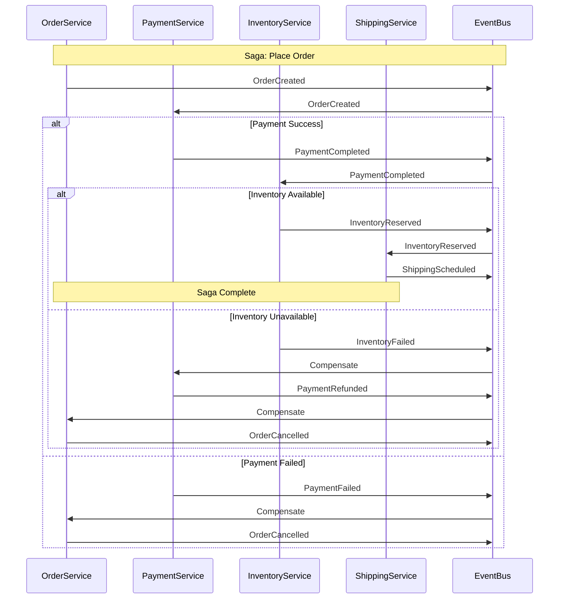
```mermaid
sequenceDiagram
    participant OrderService
    participant PaymentService
    participant InventoryService
    participant ShippingService
    participant EventBus
    
    Note over OrderService,EventBus: Saga: Place Order
    
    OrderService->>EventBus: OrderCreated
    EventBus->>PaymentService: OrderCreated
    
    alt Payment Success
        PaymentService->>EventBus: PaymentCompleted
        EventBus->>InventoryService: PaymentCompleted
        
        alt Inventory Available
            InventoryService->>EventBus: InventoryReserved
            EventBus->>ShippingService: InventoryReserved
            ShippingService->>EventBus: ShippingScheduled
            Note over OrderService,ShippingService: Saga Complete
        else Inventory Unavailable
            InventoryService->>EventBus: InventoryFailed
            EventBus->>PaymentService: Compensate
            PaymentService->>EventBus: PaymentRefunded
            EventBus->>OrderService: Compensate
            OrderService->>EventBus: OrderCancelled
        end
    else Payment Failed
        PaymentService->>EventBus: PaymentFailed
        EventBus->>OrderService: Compensate
        OrderService->>EventBus: OrderCancelled
    end
```

### State Diagram - Saga States

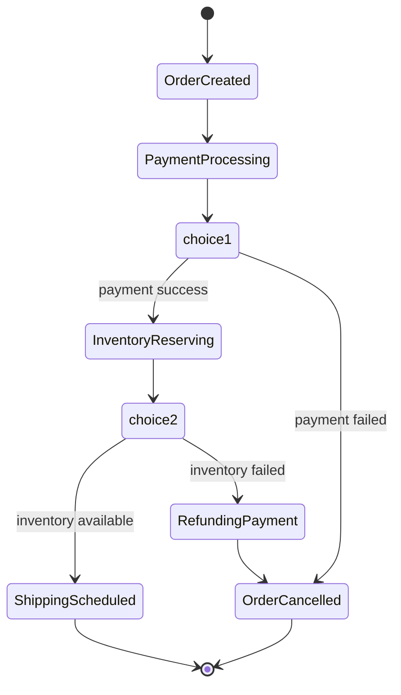
```mermaid
stateDiagram-v2
    [*] --> OrderCreated
    
    OrderCreated --> PaymentProcessing
    
    PaymentProcessing --> choice1
    state choice1 <<choice>>
    choice1 --> InventoryReserving: payment success
    choice1 --> OrderCancelled: payment failed
    
    InventoryReserving --> choice2
    state choice2 <<choice>>
    choice2 --> ShippingScheduled: inventory available
    choice2 --> RefundingPayment: inventory failed
    
    RefundingPayment --> OrderCancelled
    ShippingScheduled --> [*]
    OrderCancelled --> [*]
```

## Repository Pattern

### Class Diagram

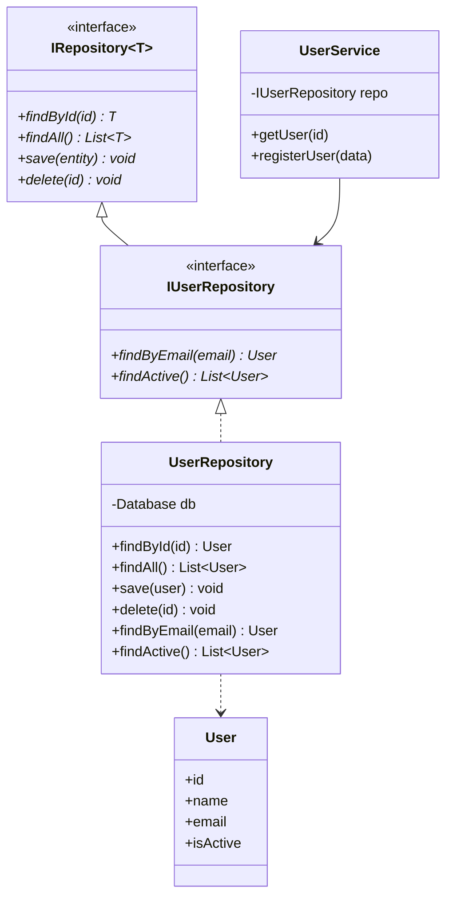
```mermaid
classDiagram
    class IRepository~T~ {
        <<interface>>
        +findById(id)* T
        +findAll()* List~T~
        +save(entity)* void
        +delete(id)* void
    }
    
    class IUserRepository {
        <<interface>>
        +findByEmail(email)* User
        +findActive()* List~User~
    }
    
    class UserRepository {
        -Database db
        +findById(id) User
        +findAll() List~User~
        +save(user) void
        +delete(id) void
        +findByEmail(email) User
        +findActive() List~User~
    }
    
    class User {
        +id
        +name
        +email
        +isActive
    }
    
    class UserService {
        -IUserRepository repo
        +getUser(id)
        +registerUser(data)
    }
    
    IRepository <|-- IUserRepository
    IUserRepository <|.. UserRepository
    UserService --> IUserRepository
    UserRepository ..> User
```

## Best Practices

### 1. Choose the Right Diagram Type

- **Flowchart**: High-level architecture, data flow
- **Sequence**: Time-based interactions, API calls
- **Class**: Object relationships, domain models
- **C4**: System architecture at different levels
- **State**: State machines, workflows

### 2. Use Consistent Naming

Keep naming consistent across all diagrams in your architecture documentation.

### 3. Add Context

Include comments and notes to explain architectural decisions.

### 4. Layer Diagrams

Start with high-level overview, then drill down into details in separate diagrams.

### 5. Keep It Updated

Architecture diagrams should evolve with your system. Include them in code reviews.

## Common Architectural Styles

### Monolithic

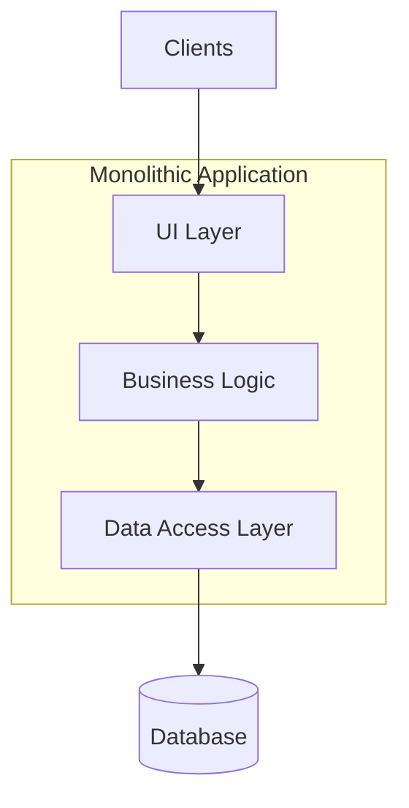
```mermaid
flowchart TB
    Client[Clients]
    
    subgraph monolith[Monolithic Application]
        UI[UI Layer]
        BL[Business Logic]
        DAL[Data Access Layer]
    end
    
    DB[(Database)]
    
    Client --> UI
    UI --> BL
    BL --> DAL
    DAL --> DB
```

### Serverless

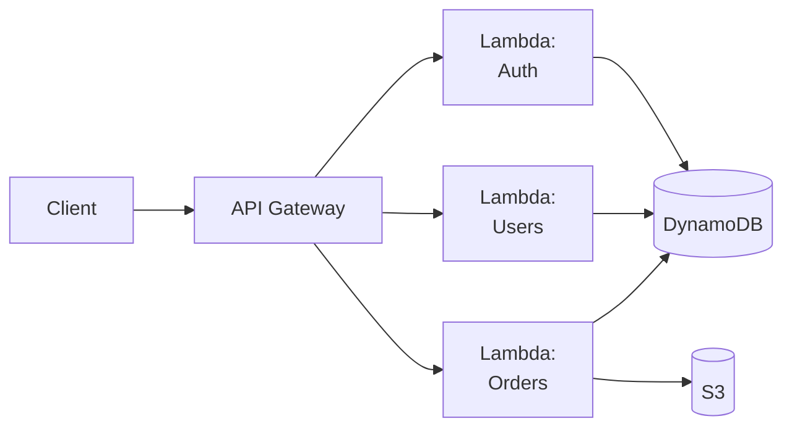
```mermaid
flowchart LR
    Client[Client]
    Gateway[API Gateway]
    
    Lambda1[Lambda:<br>Auth]
    Lambda2[Lambda:<br>Users]
    Lambda3[Lambda:<br>Orders]
    
    DB[(DynamoDB)]
    S3[(S3)]
    
    Client --> Gateway
    Gateway --> Lambda1
    Gateway --> Lambda2
    Gateway --> Lambda3
    
    Lambda1 --> DB
    Lambda2 --> DB
    Lambda3 --> DB
    Lambda3 --> S3
```

### Event Sourcing

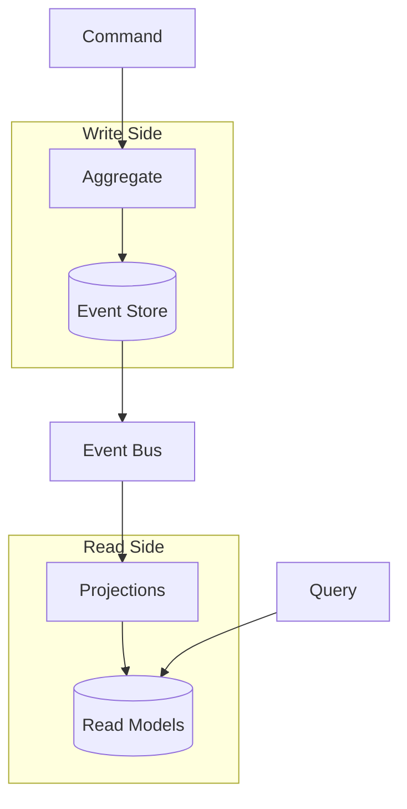
```mermaid
flowchart TB
    Command[Command]
    
    subgraph write[Write Side]
        Aggregate[Aggregate]
        EventStore[(Event Store)]
    end
    
    EventBus[Event Bus]
    
    subgraph read[Read Side]
        Projections[Projections]
        ReadModels[(Read Models)]
    end
    
    Query[Query]
    
    Command --> Aggregate
    Aggregate --> EventStore
    EventStore --> EventBus
    EventBus --> Projections
    Projections --> ReadModels
    Query --> ReadModels
```
