# Mermaid Styling and Theming

Complete guide to styling Mermaid diagrams with themes, colors, and custom styles.

## Themes

Mermaid comes with built-in themes that can be set globally or per diagram.

### Available Themes

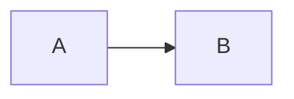

**Built-in themes:**
- `default` - Standard blue and grey
- `forest` - Green tones
- `dark` - Dark background
- `neutral` - Greyscale
- `base` - Minimal styling (good for custom styling)

### Setting Theme

**In diagram initialization:**

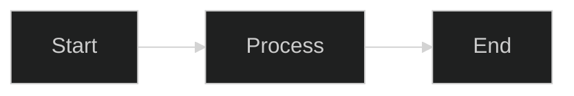

**Multiple initialization options:**

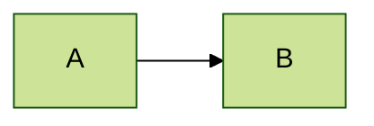

## Theme Variables

Customize theme colors using `themeVariables`:

### Flowchart Variables

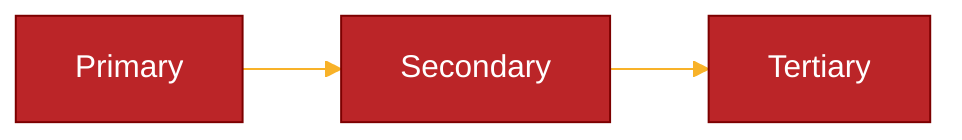

**Common variables:**
- `primaryColor` - Main node fill color
- `primaryTextColor` - Text color for primary nodes
- `primaryBorderColor` - Border color for primary nodes
- `secondaryColor` - Secondary node color
- `tertiaryColor` - Tertiary node color
- `lineColor` - Connection line color
- `fontSize` - Base font size
- `fontFamily` - Font family

### Sequence Diagram Variables

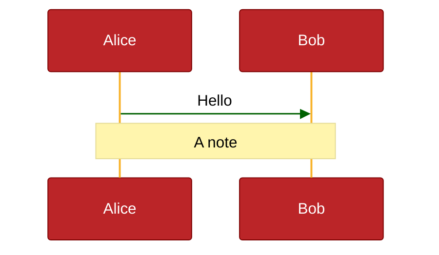

### Class Diagram Variables

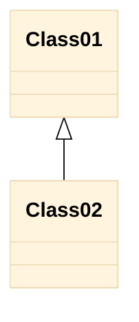

## Node-Specific Styling

### Flowchart Node Styles

**Inline styling:**

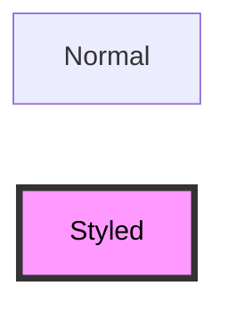

**Style properties:**
- `fill` - Background color
- `stroke` - Border color
- `stroke-width` - Border thickness
- `color` - Text color
- `stroke-dasharray` - Dashed border (e.g., `5 5`)

**Multiple nodes with same style:**

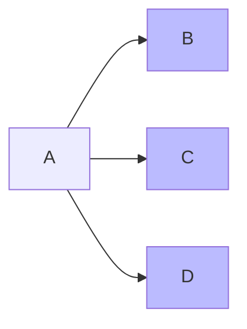

### Class Definitions (classDef)

Define reusable styles:

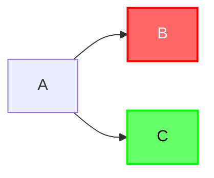

**Apply to multiple nodes:**

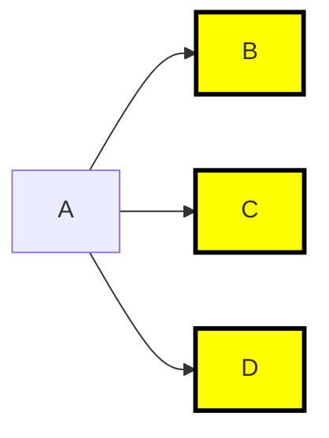

### Default Styles

Style all nodes of a type:

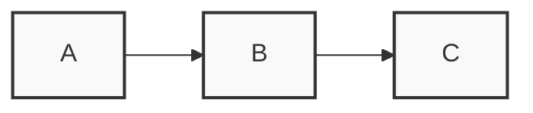

## Link Styling

### Basic Link Styles

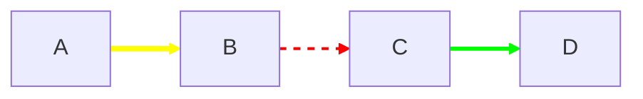

**Link style properties:**
- `stroke` - Line color
- `stroke-width` - Line thickness
- `stroke-dasharray` - Dashed line pattern
- `fill` - Not used for links

**Link indices** are zero-based in the order they appear.

### Styling Multiple Links

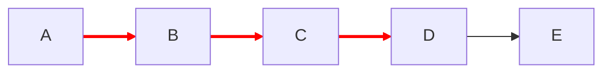

### Default Link Style

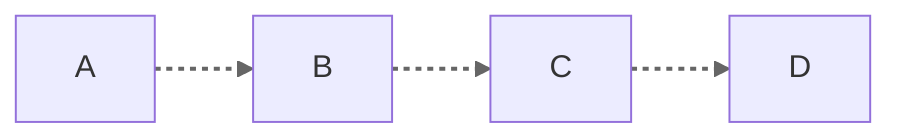

## Sequence Diagram Styling

### Actor Styling

Actors can't be styled individually inline, use theme variables or CSS.

### Message Styling

Messages follow the theme but can be influenced by theme variables.

### Activation Boxes

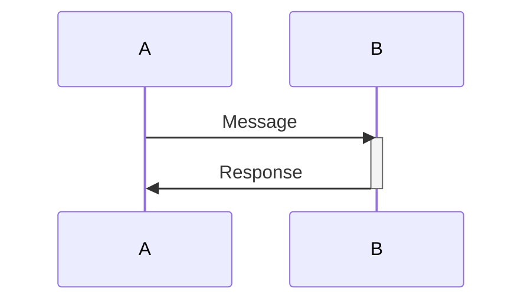

## Class Diagram Styling

### Class Boxes

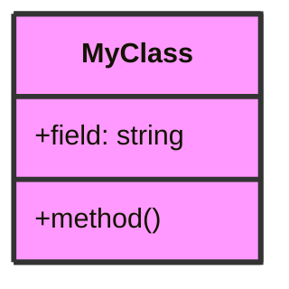

### Relationship Lines

Use theme variables for relationship line colors:

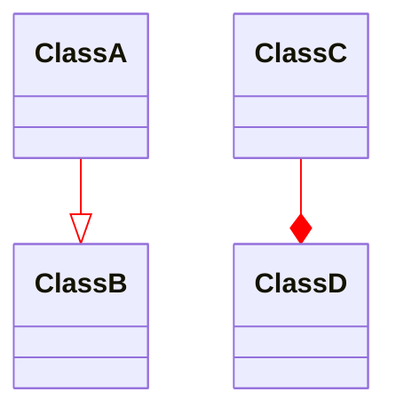

## State Diagram Styling

### State Styling

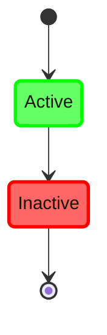

## ER Diagram Styling

ER diagrams have limited styling options. Use theme variables:

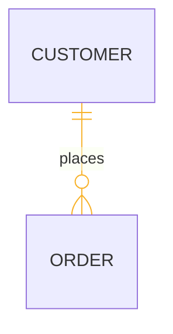

## C4 Diagram Styling

C4 diagrams have built-in styling by element type. Use theme for global colors:

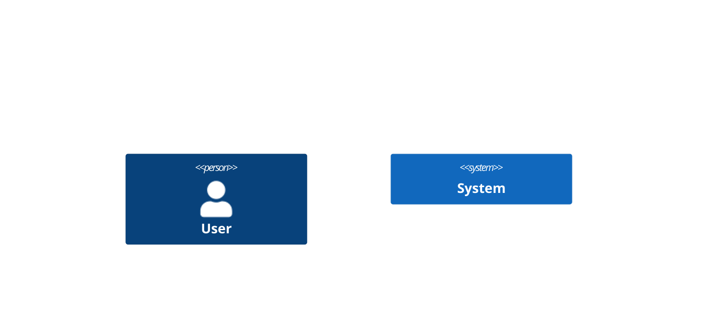

## Git Graph Styling

Git graphs follow the theme. Limited custom styling available:

```mermaid
%%{init: {
  'theme':'base',
  'themeVariables': {
    'git0':'#f00',
    'git1':'#0f0',
    'git2':'#00f'
  }
}}%%
gitGraph
    commit
    branch develop
    commit
    checkout main
    commit
```

## Advanced Styling Patterns

### Conditional Styling Pattern

Create classes for different states:

```mermaid
flowchart LR
    Start --> Processing
    Processing --> Success
    Processing --> Error
    
    classDef running fill:#ff0,stroke:#f90,stroke-width:2px
    classDef success fill:#6f6,stroke:#0f0,stroke-width:2px
    classDef error fill:#f66,stroke:#f00,stroke-width:2px
    
    class Processing running
    class Success success
    class Error error
```

### Semantic Color Schemes

**Standard semantic colors:**

```mermaid
flowchart LR
    Info --> Warning
    Warning --> Error
    Error --> Success
    
    classDef info fill:#d1ecf1,stroke:#0c5460,stroke-width:2px
    classDef warning fill:#fff3cd,stroke:#856404,stroke-width:2px
    classDef error fill:#f8d7da,stroke:#721c24,stroke-width:2px
    classDef success fill:#d4edda,stroke:#155724,stroke-width:2px
    
    class Info info
    class Warning warning
    class Error error
    class Success success
```

### Architecture Layer Styling

For software architecture diagrams:

```mermaid
flowchart TB
    Client[Client Layer]
    API[API Layer]
    Business[Business Logic]
    Data[Data Layer]
    
    Client --> API
    API --> Business
    Business --> Data
    
    classDef presentation fill:#e3f2fd,stroke:#1976d2,stroke-width:2px
    classDef application fill:#f3e5f5,stroke:#7b1fa2,stroke-width:2px
    classDef domain fill:#e8f5e9,stroke:#388e3c,stroke-width:2px
    classDef infrastructure fill:#fff3e0,stroke:#f57c00,stroke-width:2px
    
    class Client presentation
    class API application
    class Business domain
    class Data infrastructure
```

### Emphasis and Hierarchy

Use opacity and size to show hierarchy:

```mermaid
flowchart TB
    Main[Main Process]
    Sub1[Sub Process 1]
    Sub2[Sub Process 2]
    Detail1[Detail A]
    Detail2[Detail B]
    
    Main --> Sub1
    Main --> Sub2
    Sub1 --> Detail1
    Sub2 --> Detail2
    
    style Main fill:#1976d2,stroke:#0d47a1,stroke-width:4px,color:#fff
    style Sub1 fill:#42a5f5,stroke:#1976d2,stroke-width:3px,color:#fff
    style Sub2 fill:#42a5f5,stroke:#1976d2,stroke-width:3px,color:#fff
    style Detail1 fill:#bbdefb,stroke:#1976d2,stroke-width:2px
    style Detail2 fill:#bbdefb,stroke:#1976d2,stroke-width:2px
```

## Best Practices for Styling

### 1. Use Consistent Color Schemes

Define your palette upfront:

```mermaid
flowchart LR
    %% Color Palette:
    %% Primary: #1976d2
    %% Secondary: #388e3c
    %% Accent: #f57c00
    %% Error: #d32f2f
    
    A --> B
    
    classDef primary fill:#1976d2,stroke:#0d47a1,stroke-width:2px,color:#fff
    classDef secondary fill:#388e3c,stroke:#1b5e20,stroke-width:2px,color:#fff
```

### 2. Define Styles Before Applying

Keep style definitions together:

```mermaid
flowchart LR
    %% Node definitions
    A --> B --> C
    
    %% Style definitions
    classDef important fill:#f00,stroke:#900,stroke-width:3px,color:#fff
    classDef normal fill:#f9f9f9,stroke:#333,stroke-width:2px
    
    %% Style applications
    class A important
    class B,C normal
```

### 3. Use Semantic Names

```mermaid
flowchart LR
    A --> B
    
    classDef errorState fill:#f66,stroke:#f00,stroke-width:2px
    classDef successState fill:#6f6,stroke:#0f0,stroke-width:2px
    
    %% Not: classDef red fill:#f66
    %% Not: classDef green fill:#6f6
```

### 4. Consider Accessibility

- Use sufficient contrast (WCAG AA minimum)
- Don't rely solely on color to convey meaning
- Test with colorblind-friendly palettes

```mermaid
flowchart LR
    A[Step 1] --> B[Step 2]
    
    %% Good contrast
    classDef step fill:#0077be,stroke:#003d5c,stroke-width:2px,color:#fff
    class A,B step
```

### 5. Keep It Simple

Don't over-style. Clean diagrams are more readable:

```mermaid
%% ❌ TOO MUCH
flowchart LR
    A[Node]
    style A fill:#f9f,stroke:#333,stroke-width:4px,color:#f00,stroke-dasharray:5 5

%% ✅ CLEAN
flowchart LR
    B[Node]
    style B fill:#f9f,stroke:#333,stroke-width:2px
```

### 6. Theme First, Then Customize

Start with a theme and customize only what you need:

```mermaid
%%{init: {'theme':'base'}}%%
flowchart LR
    A --> B --> C
    
    %% Only customize what's different
    style B fill:#f9f
```

## Styling Checklist

- [ ] Choose appropriate base theme
- [ ] Define color palette upfront
- [ ] Use semantic class names
- [ ] Group style definitions together
- [ ] Test contrast and readability
- [ ] Keep styling minimal and purposeful
- [ ] Document color meanings if needed
