# C4 Diagram Syntax Reference

Complete reference for Mermaid C4 diagrams - ideal for software architecture visualization.

## Overview

C4 diagrams provide a hierarchical way to visualize software architecture at different levels:
- **Context**: System in its environment (highest level)
- **Container**: Applications and data stores
- **Component**: Components within containers
- **Code**: Class diagrams (lowest level)

## Context Diagram (Level 1)

Shows the system and its users/external systems.

### Basic Syntax

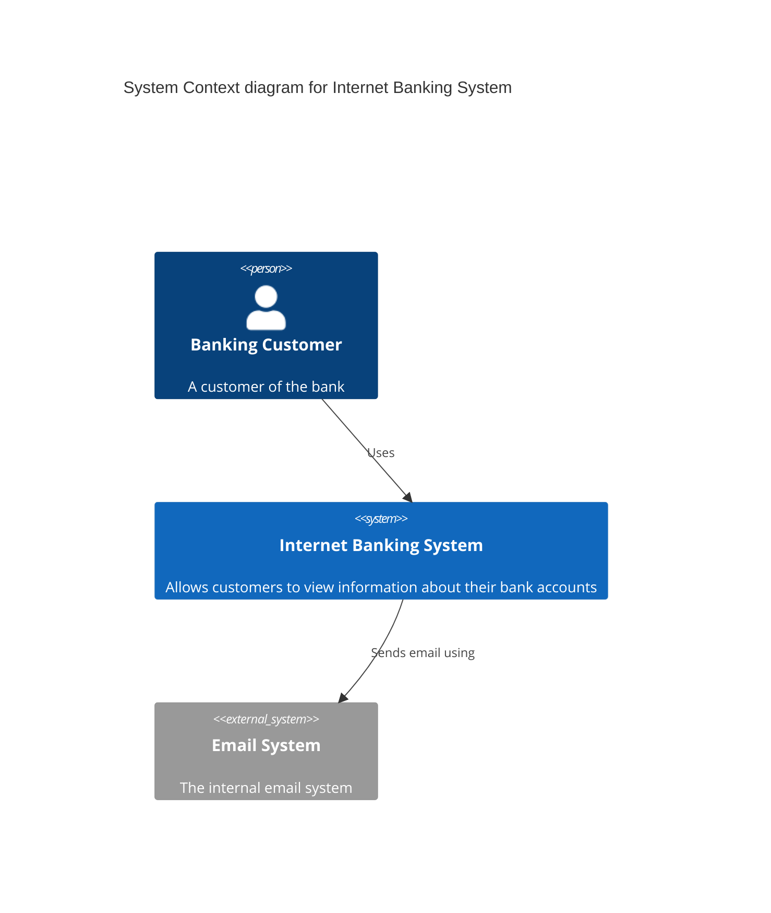
```mermaid
C4Context
    title System Context diagram for Internet Banking System
    
    Person(customer, "Banking Customer", "A customer of the bank")
    System(banking, "Internet Banking System", "Allows customers to view information about their bank accounts")
    System_Ext(email, "Email System", "The internal email system")
    
    Rel(customer, banking, "Uses")
    Rel(banking, email, "Sends email using")
```

### Elements

**Person:**
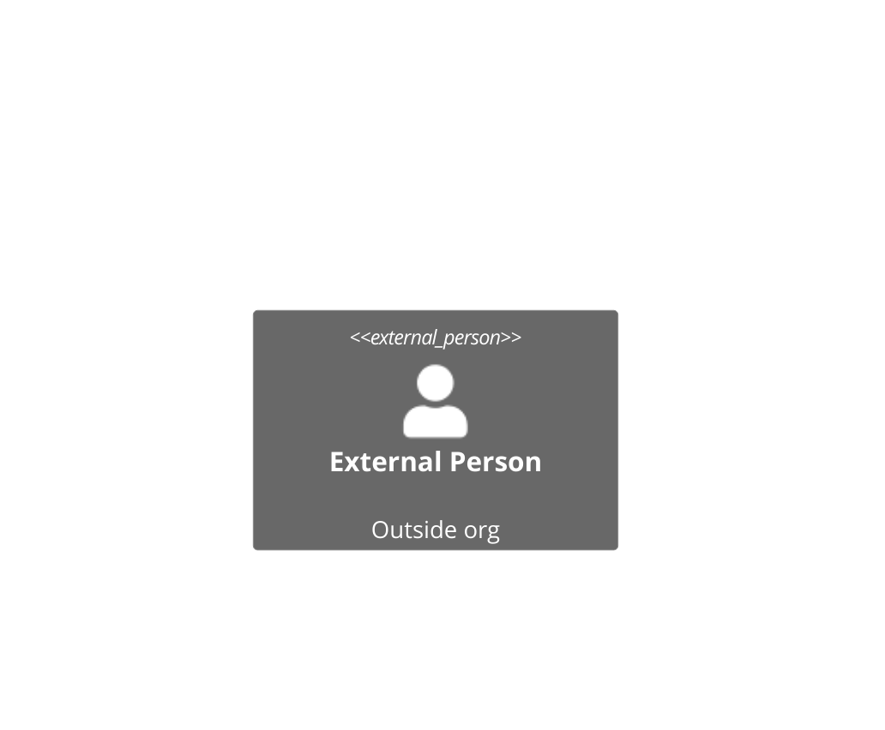
```mermaid
C4Context
    Person(alias, "Label", "Description")
    Person_Ext(alias, "External Person", "Outside org")
```

**System:**
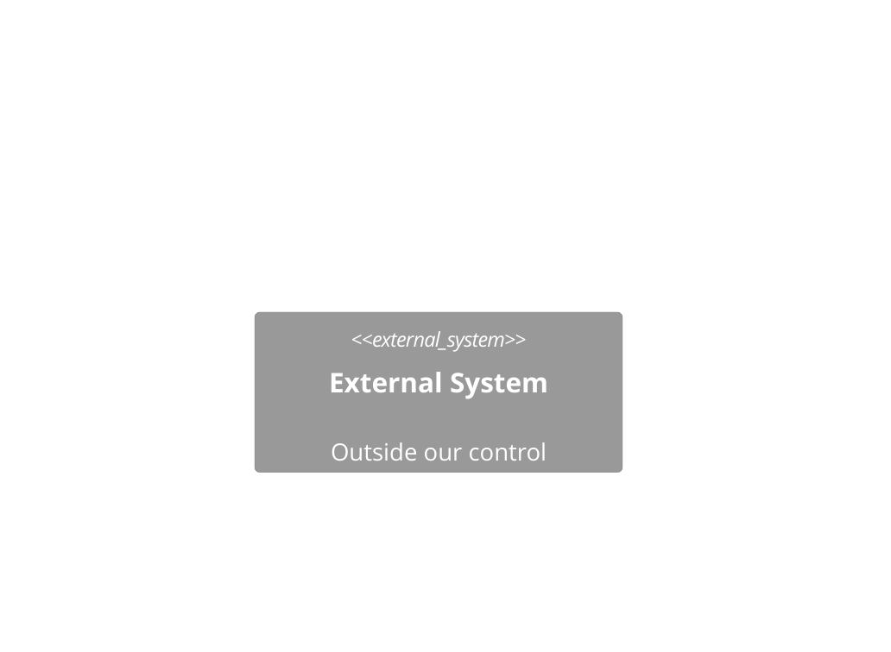
```mermaid
C4Context
    System(alias, "System Name", "Description")
    System_Ext(alias, "External System", "Outside our control")
```

**Enterprise/System Boundary:**
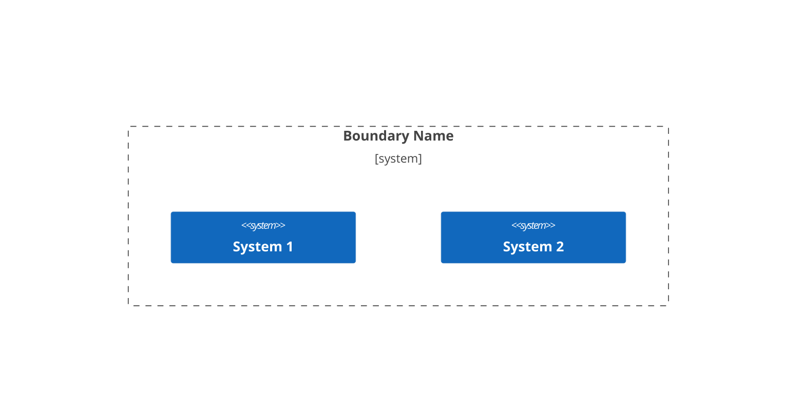
```mermaid
C4Context
    Boundary(b1, "Boundary Name") {
        System(sys1, "System 1")
        System(sys2, "System 2")
    }
```

## Container Diagram (Level 2)

Shows the containers (applications, databases) that make up a system.

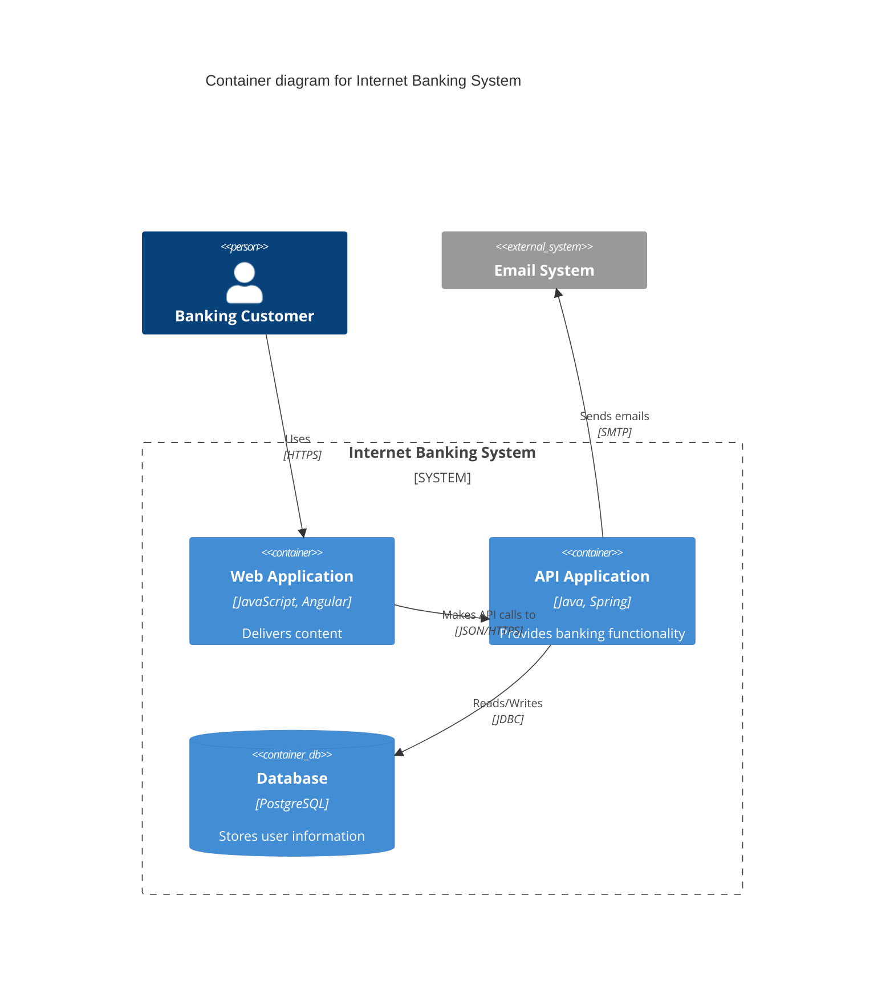
```mermaid
C4Container
    title Container diagram for Internet Banking System
    
    Person(customer, "Banking Customer")
    
    System_Boundary(c1, "Internet Banking System") {
        Container(web, "Web Application", "JavaScript, Angular", "Delivers content")
        Container(api, "API Application", "Java, Spring", "Provides banking functionality")
        ContainerDb(db, "Database", "PostgreSQL", "Stores user information")
    }
    
    System_Ext(email, "Email System")
    
    Rel(customer, web, "Uses", "HTTPS")
    Rel(web, api, "Makes API calls to", "JSON/HTTPS")
    Rel(api, db, "Reads/Writes", "JDBC")
    Rel(api, email, "Sends emails", "SMTP")
```

### Container Elements

```mermaid
C4Container
    Container(alias, "Name", "Technology", "Description")
    ContainerDb(alias, "Database Name", "Technology", "Description")
    ContainerQueue(alias, "Queue Name", "Technology", "Description")
    Container_Ext(alias, "External Container", "Tech", "Desc")
```

## Component Diagram (Level 3)

Shows components within a container.

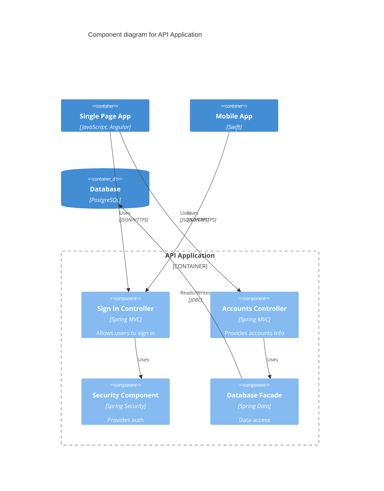
```mermaid
C4Component
    title Component diagram for API Application
    
    Container(spa, "Single Page App", "JavaScript, Angular")
    Container(mobile, "Mobile App", "Swift")
    ContainerDb(db, "Database", "PostgreSQL")
    
    Container_Boundary(api, "API Application") {
        Component(signin, "Sign In Controller", "Spring MVC", "Allows users to sign in")
        Component(accounts, "Accounts Controller", "Spring MVC", "Provides accounts info")
        Component(security, "Security Component", "Spring Security", "Provides auth")
        Component(database, "Database Facade", "Spring Data", "Data access")
    }
    
    Rel(spa, signin, "Uses", "JSON/HTTPS")
    Rel(spa, accounts, "Uses", "JSON/HTTPS")
    Rel(mobile, signin, "Uses", "JSON/HTTPS")
    Rel(signin, security, "Uses")
    Rel(accounts, database, "Uses")
    Rel(database, db, "Reads/Writes", "JDBC")
```

### Component Elements

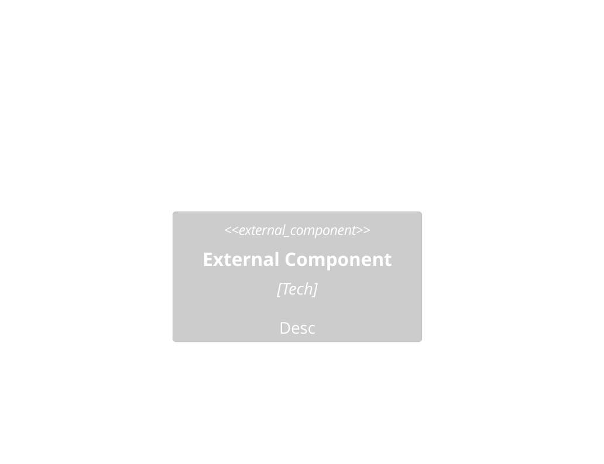
```mermaid
C4Component
    Component(alias, "Name", "Technology", "Description")
    ComponentDb(alias, "Database Name", "Tech", "Description")
    Component_Ext(alias, "External Component", "Tech", "Desc")
```

## Relationships

### Basic Relationship

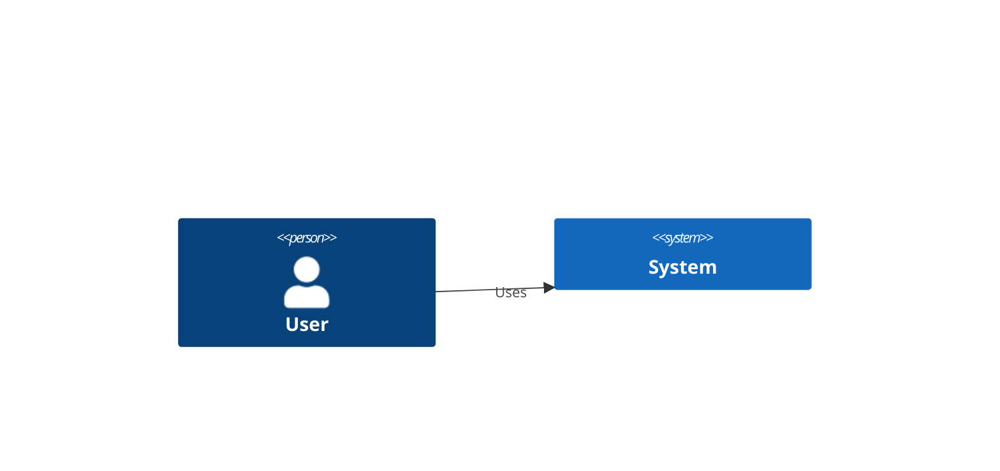
```mermaid
C4Context
    Person(user, "User")
    System(sys, "System")
    
    Rel(user, sys, "Uses")
```

### Relationship with Technology

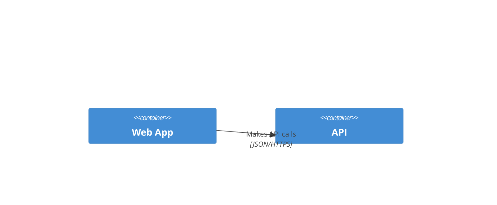
```mermaid
C4Container
    Container(web, "Web App")
    Container(api, "API")
    
    Rel(web, api, "Makes API calls", "JSON/HTTPS")
```

### Bidirectional Relationship

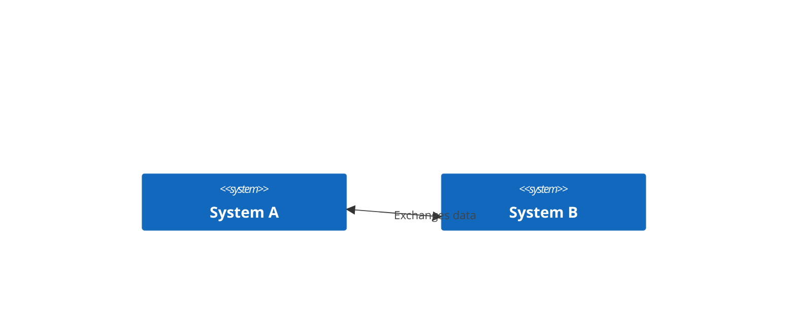
```mermaid
C4Context
    System(a, "System A")
    System(b, "System B")
    
    BiRel(a, b, "Exchanges data")
```

### Relationship Directions

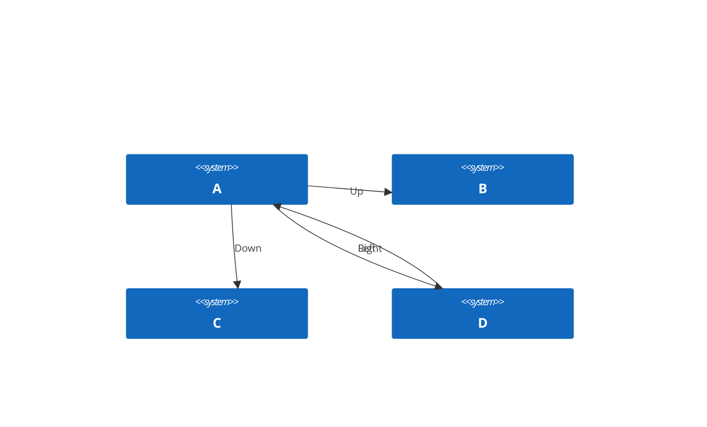
```mermaid
C4Context
    System(a, "A")
    System(b, "B")
    System(c, "C")
    System(d, "D")
    
    Rel_Up(a, b, "Up")
    Rel_Down(a, c, "Down")
    Rel_Left(d, a, "Left")
    Rel_Right(a, d, "Right")
```

### Relationship Styles

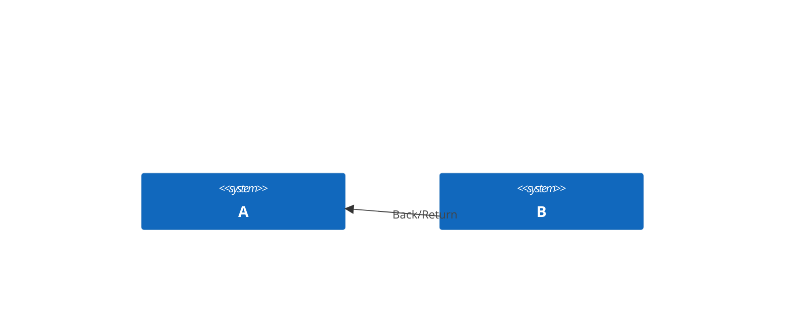
```mermaid
C4Context
    System(a, "A")
    System(b, "B")
    
    Rel(a, b, "Normal")
    Rel_Back(a, b, "Back/Return")
```

## Boundaries

### System Boundary

```mermaid
C4Container
    System_Boundary(b1, "System Name") {
        Container(c1, "Container 1")
        Container(c2, "Container 2")
    }
```

### Enterprise Boundary

```mermaid
C4Context
    Enterprise_Boundary(eb, "Company Name") {
        System(sys1, "System 1")
        System(sys2, "System 2")
    }
```

### Nested Boundaries

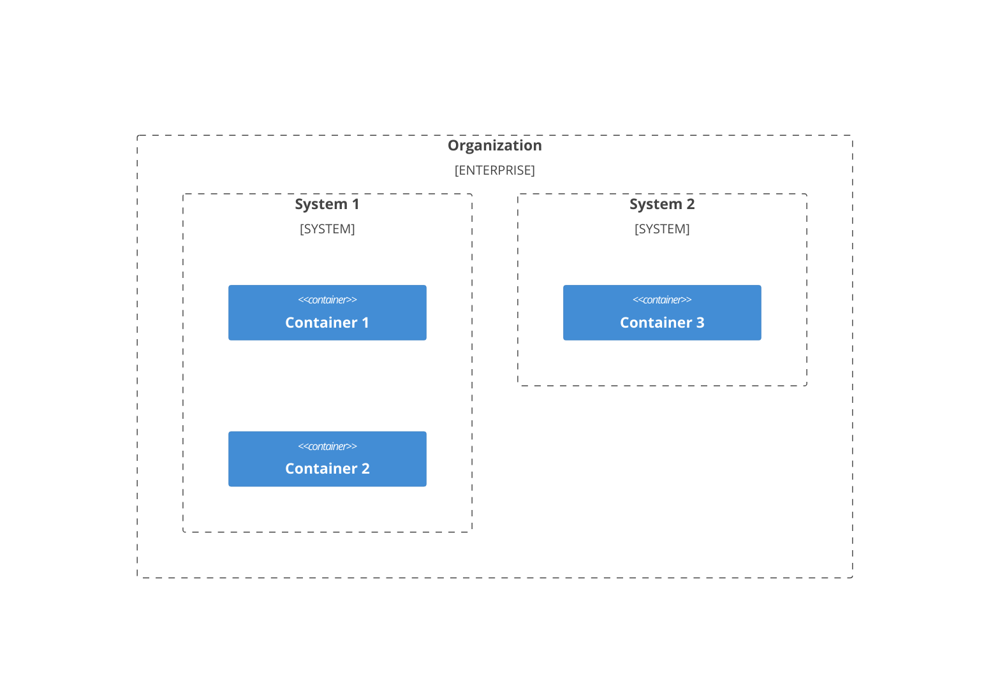
```mermaid
C4Container
    Enterprise_Boundary(enterprise, "Organization") {
        System_Boundary(sys1, "System 1") {
            Container(c1, "Container 1")
            Container(c2, "Container 2")
        }
        
        System_Boundary(sys2, "System 2") {
            Container(c3, "Container 3")
        }
    }
```

## Practical Examples

### E-commerce System Context

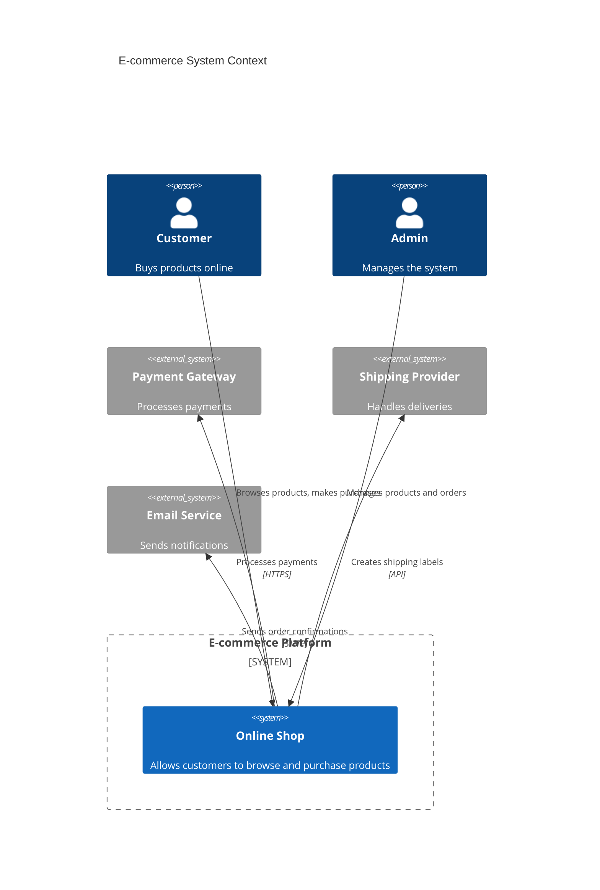
```mermaid
C4Context
    title E-commerce System Context
    
    Person(customer, "Customer", "Buys products online")
    Person(admin, "Admin", "Manages the system")
    
    System_Boundary(b1, "E-commerce Platform") {
        System(shop, "Online Shop", "Allows customers to browse and purchase products")
    }
    
    System_Ext(payment, "Payment Gateway", "Processes payments")
    System_Ext(shipping, "Shipping Provider", "Handles deliveries")
    System_Ext(email, "Email Service", "Sends notifications")
    
    Rel(customer, shop, "Browses products, makes purchases")
    Rel(admin, shop, "Manages products and orders")
    Rel(shop, payment, "Processes payments", "HTTPS")
    Rel(shop, shipping, "Creates shipping labels", "API")
    Rel(shop, email, "Sends order confirmations", "SMTP")
```

### Microservices Container Diagram

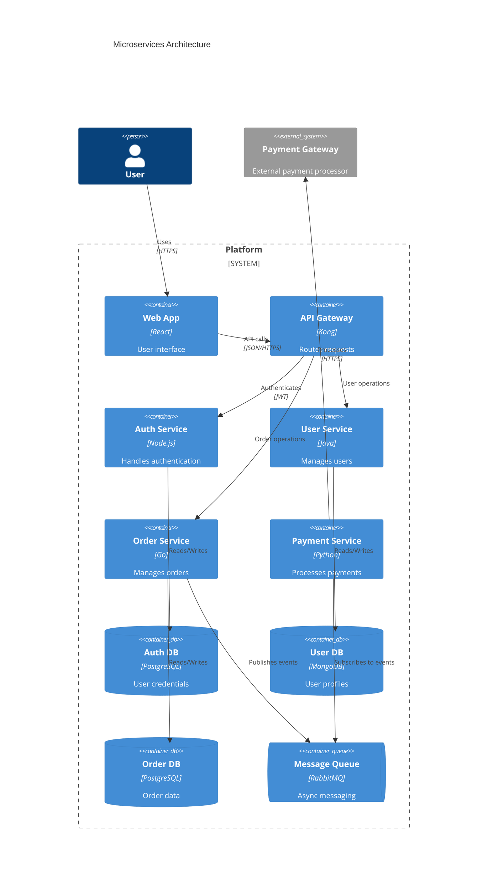
```mermaid
C4Container
    title Microservices Architecture
    
    Person(user, "User")
    
    System_Boundary(platform, "Platform") {
        Container(web, "Web App", "React", "User interface")
        Container(gateway, "API Gateway", "Kong", "Routes requests")
        
        Container(auth, "Auth Service", "Node.js", "Handles authentication")
        Container(user_svc, "User Service", "Java", "Manages users")
        Container(order_svc, "Order Service", "Go", "Manages orders")
        Container(payment_svc, "Payment Service", "Python", "Processes payments")
        
        ContainerDb(auth_db, "Auth DB", "PostgreSQL", "User credentials")
        ContainerDb(user_db, "User DB", "MongoDB", "User profiles")
        ContainerDb(order_db, "Order DB", "PostgreSQL", "Order data")
        
        ContainerQueue(queue, "Message Queue", "RabbitMQ", "Async messaging")
    }
    
    System_Ext(payment_gateway, "Payment Gateway", "External payment processor")
    
    Rel(user, web, "Uses", "HTTPS")
    Rel(web, gateway, "API calls", "JSON/HTTPS")
    
    Rel(gateway, auth, "Authenticates", "JWT")
    Rel(gateway, user_svc, "User operations")
    Rel(gateway, order_svc, "Order operations")
    
    Rel(auth, auth_db, "Reads/Writes")
    Rel(user_svc, user_db, "Reads/Writes")
    Rel(order_svc, order_db, "Reads/Writes")
    
    Rel(order_svc, queue, "Publishes events")
    Rel(payment_svc, queue, "Subscribes to events")
    Rel(payment_svc, payment_gateway, "Processes", "HTTPS")
```

### SaaS Application

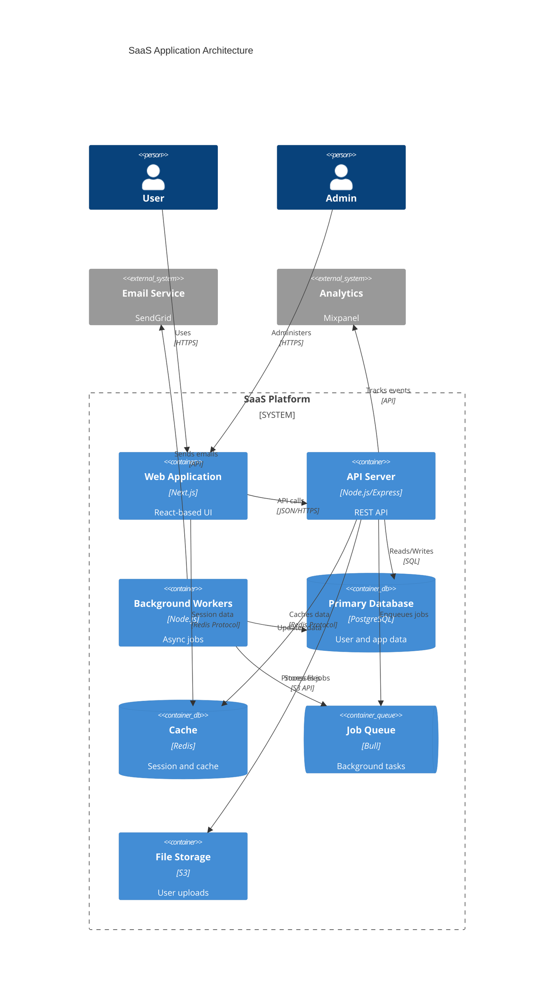
```mermaid
C4Container
    title SaaS Application Architecture
    
    Person(user, "User")
    Person(admin, "Admin")
    
    System_Boundary(saas, "SaaS Platform") {
        Container(web, "Web Application", "Next.js", "React-based UI")
        Container(api, "API Server", "Node.js/Express", "REST API")
        Container(worker, "Background Workers", "Node.js", "Async jobs")
        
        ContainerDb(db, "Primary Database", "PostgreSQL", "User and app data")
        ContainerDb(cache, "Cache", "Redis", "Session and cache")
        ContainerQueue(queue, "Job Queue", "Bull", "Background tasks")
        
        Container(storage, "File Storage", "S3", "User uploads")
    }
    
    System_Ext(email, "Email Service", "SendGrid")
    System_Ext(analytics, "Analytics", "Mixpanel")
    
    Rel(user, web, "Uses", "HTTPS")
    Rel(admin, web, "Administers", "HTTPS")
    
    Rel(web, api, "API calls", "JSON/HTTPS")
    Rel(web, cache, "Session data", "Redis Protocol")
    
    Rel(api, db, "Reads/Writes", "SQL")
    Rel(api, cache, "Caches data", "Redis Protocol")
    Rel(api, queue, "Enqueues jobs")
    Rel(api, storage, "Stores files", "S3 API")
    
    Rel(worker, queue, "Processes jobs")
    Rel(worker, db, "Updates data")
    Rel(worker, email, "Sends emails", "API")
    
    Rel(api, analytics, "Tracks events", "API")
```

### API Component Detail

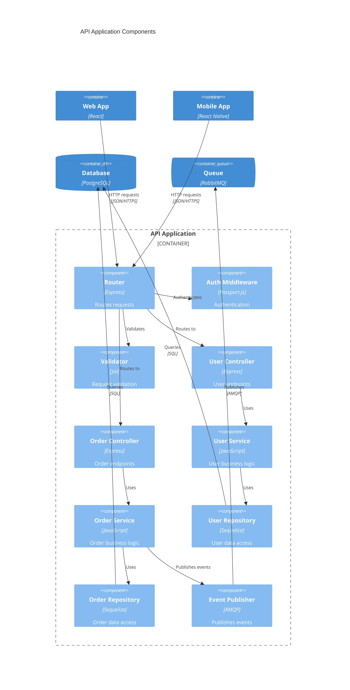
```mermaid
C4Component
    title API Application Components
    
    Container(web, "Web App", "React")
    Container(mobile, "Mobile App", "React Native")
    ContainerDb(db, "Database", "PostgreSQL")
    ContainerQueue(queue, "Queue", "RabbitMQ")
    
    Container_Boundary(api, "API Application") {
        Component(router, "Router", "Express", "Routes requests")
        Component(auth, "Auth Middleware", "Passport.js", "Authentication")
        Component(validator, "Validator", "Joi", "Request validation")
        
        Component(user_ctrl, "User Controller", "Express", "User endpoints")
        Component(order_ctrl, "Order Controller", "Express", "Order endpoints")
        
        Component(user_svc, "User Service", "JavaScript", "User business logic")
        Component(order_svc, "Order Service", "JavaScript", "Order business logic")
        
        Component(user_repo, "User Repository", "Sequelize", "User data access")
        Component(order_repo, "Order Repository", "Sequelize", "Order data access")
        
        Component(event_pub, "Event Publisher", "AMQP", "Publishes events")
    }
    
    Rel(web, router, "HTTP requests", "JSON/HTTPS")
    Rel(mobile, router, "HTTP requests", "JSON/HTTPS")
    
    Rel(router, auth, "Authenticates")
    Rel(router, validator, "Validates")
    Rel(router, user_ctrl, "Routes to")
    Rel(router, order_ctrl, "Routes to")
    
    Rel(user_ctrl, user_svc, "Uses")
    Rel(order_ctrl, order_svc, "Uses")
    
    Rel(user_svc, user_repo, "Uses")
    Rel(order_svc, order_repo, "Uses")
    Rel(order_svc, event_pub, "Publishes events")
    
    Rel(user_repo, db, "Queries", "SQL")
    Rel(order_repo, db, "Queries", "SQL")
    Rel(event_pub, queue, "Publishes", "AMQP")
```

## Dynamic Diagrams

Show runtime behavior:

```mermaid
C4Dynamic
    title User Authentication Flow
    
    Person(user, "User")
    Container(web, "Web App")
    Container(api, "API")
    Container(auth, "Auth Service")
    ContainerDb(db, "Database")
    
    Rel(user, web, "1. Enters credentials")
    Rel(web, api, "2. POST /login")
    Rel(api, auth, "3. Validate credentials")
    Rel(auth, db, "4. Query user")
    Rel(db, auth, "5. User data")
    Rel(auth, api, "6. JWT token")
    Rel(api, web, "7. Token + user info")
    Rel(web, user, "8. Redirect to dashboard")
```

## Deployment Diagram

Show deployment architecture:

```mermaid
C4Deployment
    title Deployment Diagram
    
    Deployment_Node(cdn, "CDN", "CloudFlare") {
        Container(static, "Static Assets")
    }
    
    Deployment_Node(aws, "AWS Cloud") {
        Deployment_Node(alb, "Load Balancer", "AWS ALB") {
            Container(lb, "Load Balancer")
        }
        
        Deployment_Node(ecs, "ECS Cluster") {
            Deployment_Node(task1, "ECS Task") {
                Container(api1, "API Instance 1")
            }
            Deployment_Node(task2, "ECS Task") {
                Container(api2, "API Instance 2")
            }
        }
        
        Deployment_Node(rds, "RDS", "PostgreSQL") {
            ContainerDb(db, "Database")
        }
    }
    
    Rel(cdn, lb, "Forwards API requests")
    Rel(lb, api1, "Routes traffic")
    Rel(lb, api2, "Routes traffic")
    Rel(api1, db, "Queries")
    Rel(api2, db, "Queries")
```

## Best Practices

### 1. Start with Context

Always begin with a context diagram to show the big picture.

### 2. Use Appropriate Level of Detail

- Context: External systems and users
- Container: Major applications and databases
- Component: Internal modules and components

### 3. Be Consistent with Naming

Use consistent naming across all diagram levels.

### 4. Add Technology Details

Include technology stack information:

```mermaid
C4Container
    Container(api, "API Server", "Node.js/Express", "REST API endpoints")
```

### 5. Show Data Flow

Use relationship labels to show what data flows:

```mermaid
C4Container
    Rel(web, api, "Makes API calls", "JSON/HTTPS")
```

### 6. Group Related Components

Use boundaries to show logical grouping:

```mermaid
C4Container
    System_Boundary(backend, "Backend Services") {
        Container(api, "API")
        Container(worker, "Worker")
    }
```

## Common Patterns

### Layered Architecture

```mermaid
C4Component
    Container_Boundary(api, "Application") {
        Component(presentation, "Presentation Layer", "Controllers")
        Component(business, "Business Layer", "Services")
        Component(data, "Data Layer", "Repositories")
    }
    
    ContainerDb(db, "Database")
    
    Rel(presentation, business, "Uses")
    Rel(business, data, "Uses")
    Rel(data, db, "Queries")
```

### Event-Driven Architecture

```mermaid
C4Container
    Container(producer, "Event Producer")
    ContainerQueue(bus, "Event Bus", "Kafka")
    Container(consumer1, "Consumer 1")
    Container(consumer2, "Consumer 2")
    
    Rel(producer, bus, "Publishes events")
    Rel(bus, consumer1, "Subscribes")
    Rel(bus, consumer2, "Subscribes")
```

## Syntax Quick Reference

```mermaid
C4Context
    title Diagram Title
    
    %% People
    Person(alias, "Name", "Description")
    Person_Ext(alias, "External Person", "Desc")
    
    %% Systems
    System(alias, "Name", "Description")
    System_Ext(alias, "External System", "Desc")
    
    %% Containers (in C4Container)
    Container(alias, "Name", "Tech", "Desc")
    ContainerDb(alias, "DB", "Tech", "Desc")
    ContainerQueue(alias, "Queue", "Tech", "Desc")
    
    %% Components (in C4Component)
    Component(alias, "Name", "Tech", "Desc")
    
    %% Relationships
    Rel(from, to, "Label")
    Rel(from, to, "Label", "Technology")
    BiRel(a, b, "Label")
    Rel_Up(from, to, "Label")
    Rel_Down(from, to, "Label")
    Rel_Left(from, to, "Label")
    Rel_Right(from, to, "Label")
    
    %% Boundaries
    System_Boundary(id, "Name") {
        %% Elements
    }
    
    Enterprise_Boundary(id, "Name") {
        %% Elements
    }
```

## When to Use C4 Diagrams

- Documenting software architecture
- Onboarding new team members
- Architecture decision records
- System design reviews
- Technical documentation
- Stakeholder communication
