# Class Diagram Syntax Reference

Complete reference for Mermaid class diagram syntax.

## Basic Syntax

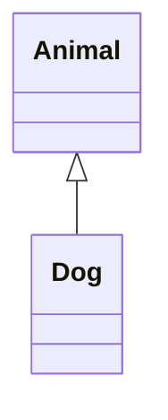

## Class Definition

### Simple Class

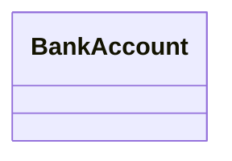

### Class with Members

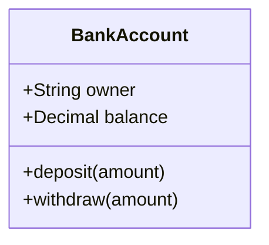

### Multiline Definition

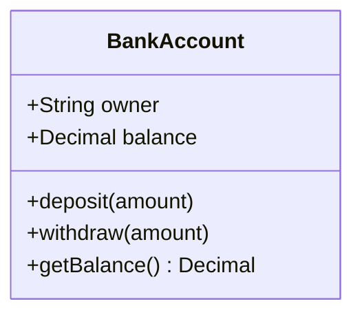

## Visibility Modifiers

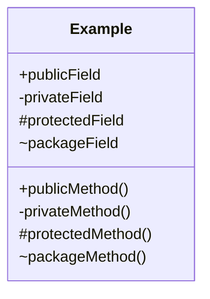

**Modifiers:**
- `+` Public
- `-` Private
- `#` Protected
- `~` Package/Internal

## Field and Method Types

### Fields with Types

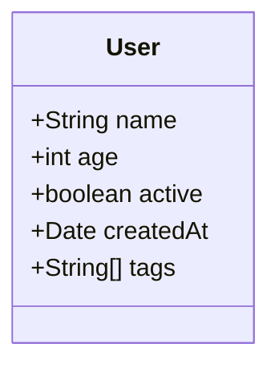

### Methods with Return Types

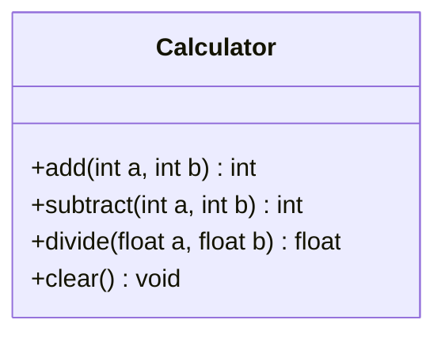

### Methods with Parameters

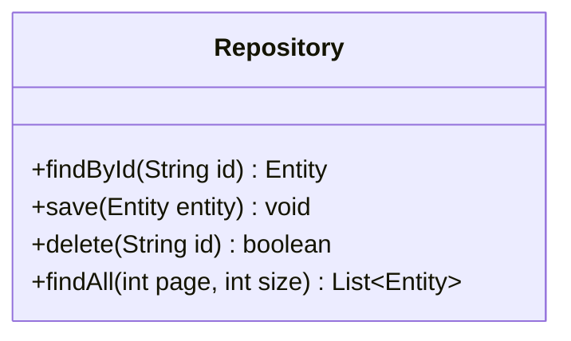

### Static Members

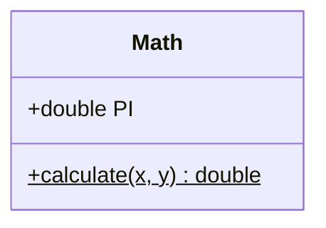

**Use `$` after method name for static methods**

### Abstract Members

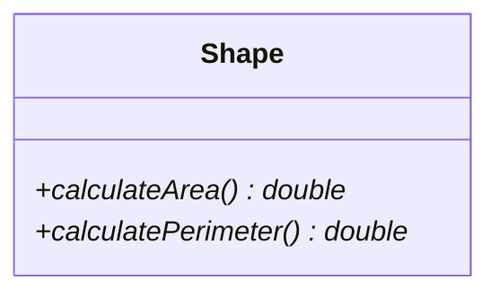

**Use `*` after method name for abstract methods**

## Generics

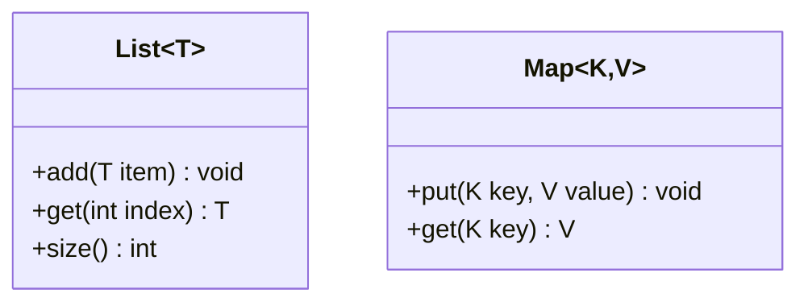

## Relationships

### Inheritance (Extension)

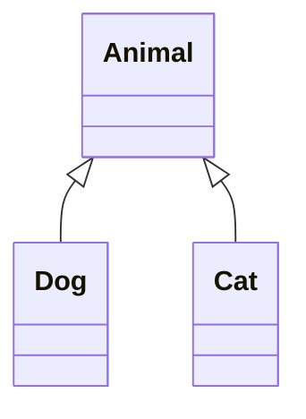

**Syntax:** `ParentClass <|-- ChildClass`

### Composition

Strong "has-a" relationship (existence dependent):

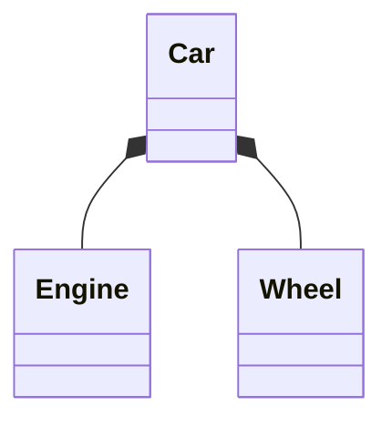

**Syntax:** `Whole *-- Part`

### Aggregation

Weak "has-a" relationship (existence independent):

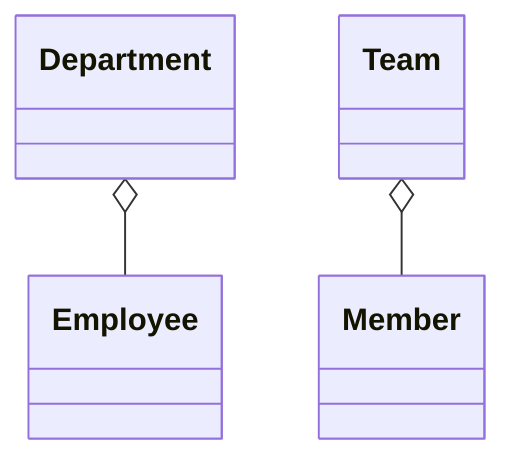

**Syntax:** `Container o-- Component`

### Association

General relationship:

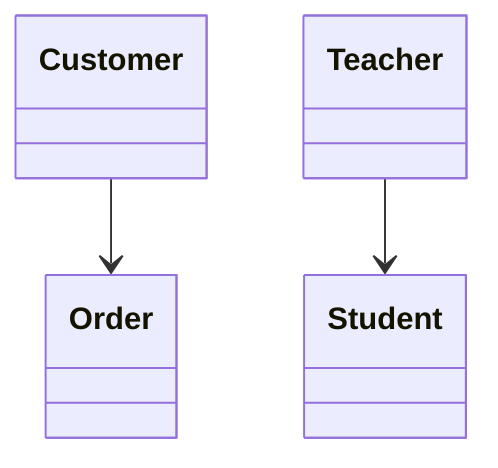

**Syntax:** `ClassA --> ClassB`

### Dependency

"Uses" relationship:

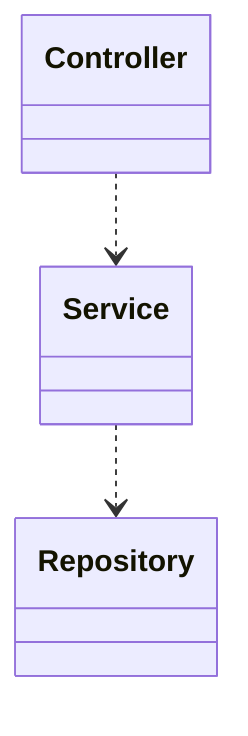

**Syntax:** `Client ..> Dependency`

### Realization (Interface Implementation)

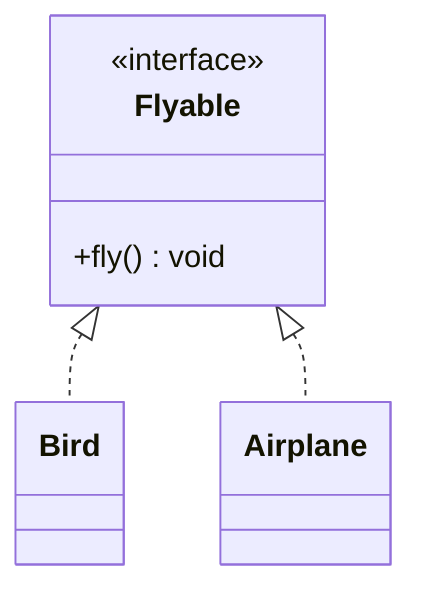

**Syntax:** `Interface <|.. Implementation`

## Relationship Summary

| Syntax | Relationship | Meaning |
|--------|-------------|---------|
| `<\|--` | Inheritance | "is-a" |
| `*--` | Composition | Strong "has-a" |
| `o--` | Aggregation | Weak "has-a" |
| `-->` | Association | Related to |
| `..>` | Dependency | Uses |
| `<\|..` | Realization | Implements |

## Cardinality

Add cardinality to relationships:

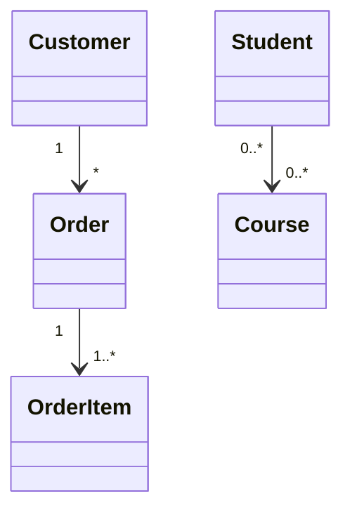

**Common cardinality:**
- `1` - Exactly one
- `0..1` - Zero or one
- `1..*` - One or more
- `*` or `0..*` - Zero or more
- `n` - Specific number

## Relationship Labels

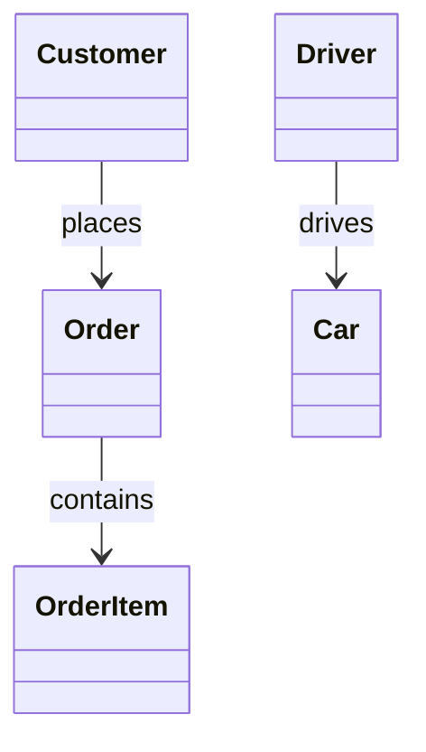

**With cardinality:**

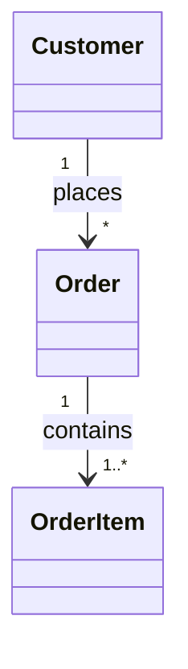

## Bidirectional Relationships

```mermaid
classDiagram
    Teacher "1" --> "0..*" Student : teaches
    Student "0..*" --> "1..*" Teacher : learns from
```

Or using double arrows:

```mermaid
classDiagram
    Person "*" <--> "*" Person : knows
```

## Annotations and Stereotypes

### Interface

```mermaid
classDiagram
    class Serializable {
        <<interface>>
        +serialize() String
    }
```

### Abstract Class

```mermaid
classDiagram
    class Shape {
        <<abstract>>
        +calculateArea()* double
    }
```

### Enumeration

```mermaid
classDiagram
    class Status {
        <<enumeration>>
        PENDING
        ACTIVE
        COMPLETED
        CANCELLED
    }
```

### Service/Controller/etc

```mermaid
classDiagram
    class UserController {
        <<controller>>
        +getUser()
        +createUser()
    }
    
    class UserService {
        <<service>>
        +findUser()
        +saveUser()
    }
```

## Namespaces

Group classes into namespaces:

```mermaid
classDiagram
    namespace Domain {
        class User
        class Order
    }
    
    namespace Infrastructure {
        class Database
        class Cache
    }
    
    User --> Database
```

## Notes

Add notes to classes:

```mermaid
classDiagram
    class User {
        +String name
        +int age
    }
    
    note for User "This represents a system user"
```

## Clickable Links

```mermaid
classDiagram
    class User {
        +name
        +age
    }
    
    link User "https://example.com/user" "User documentation"
    click User href "https://example.com/user"
```

## Callbacks

Trigger JavaScript functions:

```mermaid
classDiagram
    class Button {
        +click()
    }
    
    callback Button "handleClick" "Click handler"
```

## Practical Patterns

### Repository Pattern

```mermaid
classDiagram
    class IRepository {
        <<interface>>
        +findById(id) Entity
        +save(entity) void
        +delete(id) void
        +findAll() List~Entity~
    }
    
    class UserRepository {
        -Database db
        +findById(id) User
        +save(user) void
        +delete(id) void
        +findAll() List~User~
    }
    
    class User {
        +String id
        +String name
        +String email
    }
    
    IRepository <|.. UserRepository
    UserRepository --> User : manages
```

### MVC Pattern

```mermaid
classDiagram
    class Model {
        -data
        +getData()
        +setData()
        +notify()
    }
    
    class View {
        -model
        +render()
        +update()
    }
    
    class Controller {
        -model
        -view
        +handleInput()
        +updateModel()
    }
    
    Controller --> Model : updates
    Controller --> View : updates
    View --> Model : observes
```

### Strategy Pattern

```mermaid
classDiagram
    class Strategy {
        <<interface>>
        +execute()*
    }
    
    class ConcreteStrategyA {
        +execute()
    }
    
    class ConcreteStrategyB {
        +execute()
    }
    
    class Context {
        -Strategy strategy
        +setStrategy(Strategy s)
        +executeStrategy()
    }
    
    Strategy <|.. ConcreteStrategyA
    Strategy <|.. ConcreteStrategyB
    Context --> Strategy : uses
```

### Factory Pattern

```mermaid
classDiagram
    class Product {
        <<interface>>
        +operation()*
    }
    
    class ConcreteProductA {
        +operation()
    }
    
    class ConcreteProductB {
        +operation()
    }
    
    class Factory {
        +createProduct(type)$ Product
    }
    
    Product <|.. ConcreteProductA
    Product <|.. ConcreteProductB
    Factory ..> Product : creates
```

### Observer Pattern

```mermaid
classDiagram
    class Subject {
        -List~Observer~ observers
        +attach(Observer o)
        +detach(Observer o)
        +notify()
    }
    
    class Observer {
        <<interface>>
        +update()*
    }
    
    class ConcreteObserver {
        +update()
    }
    
    Subject --> Observer : notifies
    Observer <|.. ConcreteObserver
```

### Dependency Injection

```mermaid
classDiagram
    class IService {
        <<interface>>
        +execute()*
    }
    
    class EmailService {
        +execute()
    }
    
    class SMSService {
        +execute()
    }
    
    class Client {
        -IService service
        +Client(IService service)
        +doWork()
    }
    
    IService <|.. EmailService
    IService <|.. SMSService
    Client --> IService : depends on
```

### Domain Model

```mermaid
classDiagram
    class Order {
        -String id
        -Customer customer
        -List~OrderItem~ items
        -OrderStatus status
        +addItem(Product p, int qty)
        +removeItem(String id)
        +calculateTotal() Money
        +submit()
    }
    
    class Customer {
        -String id
        -String name
        -String email
    }
    
    class OrderItem {
        -String id
        -Product product
        -int quantity
        -Money price
    }
    
    class Product {
        -String id
        -String name
        -Money price
    }
    
    class OrderStatus {
        <<enumeration>>
        DRAFT
        SUBMITTED
        CONFIRMED
        SHIPPED
        DELIVERED
    }
    
    class Money {
        -Decimal amount
        -String currency
        +add(Money m) Money
    }
    
    Order "1" *-- "*" OrderItem
    Order --> Customer
    Order --> OrderStatus
    OrderItem --> Product
    OrderItem --> Money
```

### Hexagonal Architecture

```mermaid
classDiagram
    namespace Domain {
        class User {
            +String id
            +String name
        }
        
        class IUserRepository {
            <<interface>>
            +save(User)*
            +findById(String)*
        }
    }
    
    namespace Application {
        class UserService {
            -IUserRepository repo
            +createUser(String name)
            +getUser(String id)
        }
    }
    
    namespace Infrastructure {
        class PostgresUserRepository {
            +save(User)
            +findById(String)
        }
    }
    
    UserService --> IUserRepository : uses
    IUserRepository <|.. PostgresUserRepository
    UserService ..> User : creates/reads
    PostgresUserRepository ..> User : persists
```

## Best Practices

### 1. Keep Classes Focused

```mermaid
%% ✅ GOOD - Single responsibility
classDiagram
    class User {
        +String id
        +String name
        +String email
    }
    
    class UserValidator {
        +validateEmail(String) boolean
        +validateName(String) boolean
    }
    
    class UserRepository {
        +save(User) void
        +find(String id) User
    }
```

### 2. Show Key Relationships Only

Don't show every relationship - focus on important ones:

```mermaid
%% ✅ GOOD - Clear key relationships
classDiagram
    Order *-- OrderItem
    Order --> Customer
    
    %% Avoid showing everything
    %% Order --> Database
    %% Order --> Logger
    %% Order --> EventBus
```

### 3. Use Appropriate Relationship Types

```mermaid
classDiagram
    %% Composition - strong ownership
    Car *-- Engine
    
    %% Aggregation - weak association
    Department o-- Employee
    
    %% Association - related
    Customer --> Order
    
    %% Dependency - uses
    Controller ..> Service
```

### 4. Group Related Classes

```mermaid
classDiagram
    namespace Model {
        class User
        class Order
    }
    
    namespace Service {
        class UserService
        class OrderService
    }
    
    UserService --> User
    OrderService --> Order
```

### 5. Use Annotations

```mermaid
classDiagram
    class IService {
        <<interface>>
        +process()*
    }
    
    class ServiceImpl {
        <<service>>
        +process()
    }
    
    class Status {
        <<enumeration>>
        ACTIVE
        INACTIVE
    }
```

### 6. Comment Complex Structures

```mermaid
classDiagram
    %% Core domain entities
    class User
    class Order
    
    %% Infrastructure
    class Database
    
    User --> Order : places
    Order --> Database : persisted in
```

## Common Use Cases

### API Layer

```mermaid
classDiagram
    class Controller {
        <<controller>>
        -Service service
        +GET() Response
        +POST() Response
    }
    
    class Service {
        <<service>>
        -Repository repo
        +process() Result
    }
    
    class Repository {
        <<repository>>
        +save(Entity)
        +find(String)
    }
    
    class Entity {
        +String id
        +String data
    }
    
    Controller --> Service
    Service --> Repository
    Repository --> Entity
```

### Authentication System

```mermaid
classDiagram
    class IAuthenticator {
        <<interface>>
        +authenticate(credentials)*
        +authorize(token)*
    }
    
    class JWTAuthenticator {
        -String secret
        +authenticate(credentials)
        +authorize(token)
        -generateToken()
        -validateToken()
    }
    
    class User {
        +String id
        +String username
        +String passwordHash
        +List~Role~ roles
    }
    
    class Role {
        <<enumeration>>
        ADMIN
        USER
        GUEST
    }
    
    class Credentials {
        +String username
        +String password
    }
    
    IAuthenticator <|.. JWTAuthenticator
    JWTAuthenticator ..> User
    JWTAuthenticator ..> Credentials
    User --> Role
```

## Syntax Quick Reference

```mermaid
classDiagram
    %% Class definition
    class MyClass {
        +public
        -private
        #protected
        ~package
        
        +method()
        +staticMethod()$
        +abstractMethod()*
        +methodWithReturn() String
    }
    
    %% Relationships
    Parent <|-- Child
    Whole *-- Part
    Container o-- Component
    ClassA --> ClassB
    Client ..> Dependency
    Interface <|.. Implementation
    
    %% Cardinality
    A "1" --> "*" B
    
    %% Annotations
    class Service {
        <<interface>>
    }
    
    %% Generics
    class List~T~
```
