# Entity-Relationship Diagram Syntax Reference

Complete reference for Mermaid ER diagram syntax.

## Basic Syntax

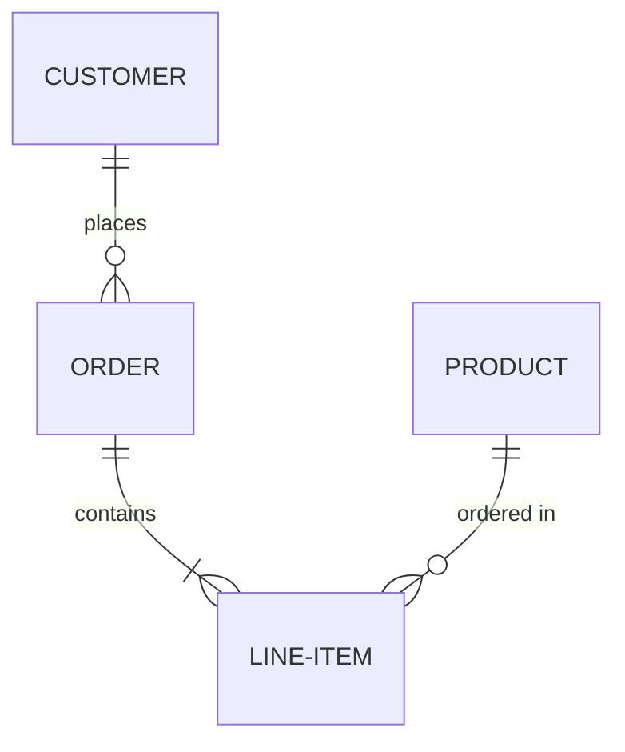

## Entity Declaration

### Simple Entities

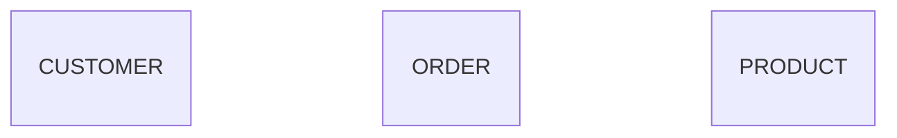

### Entities with Attributes

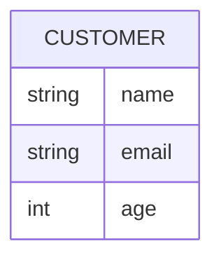

## Attribute Types

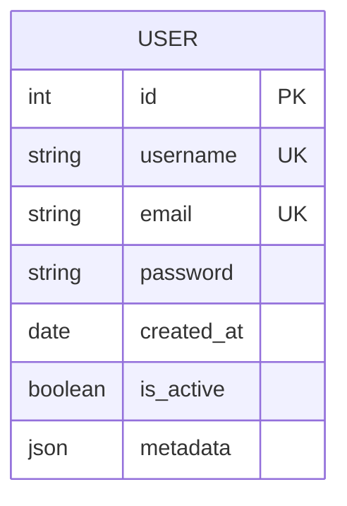

**Common types:**
- `int`, `integer`
- `string`, `varchar`
- `text`
- `date`, `datetime`, `timestamp`
- `boolean`, `bool`
- `float`, `double`, `decimal`
- `json`, `jsonb`
- `uuid`
- `blob`, `binary`

## Attribute Modifiers

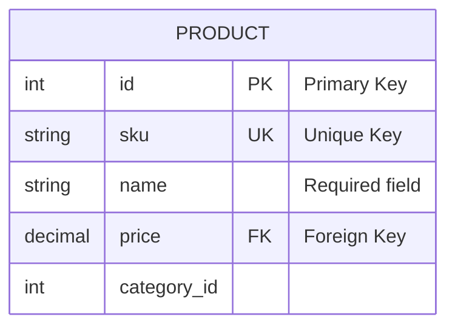

**Key modifiers:**
- `PK` - Primary Key
- `FK` - Foreign Key
- `UK` - Unique Key

Add descriptions with quotes after the modifier.

## Relationships

### Relationship Syntax

Format: `Entity1 Relationship Cardinality Entity2 : "label"`


### Cardinality Markers

**Left side of relationship:**
- `||` - Exactly one
- `|o` - Zero or one
- `}|` - One or more
- `}o` - Zero or more

**Right side of relationship:**
- `||` - Exactly one
- `o|` - Zero or one
- `|{` - One or more
- `o{` - Zero or more

### Relationship Types

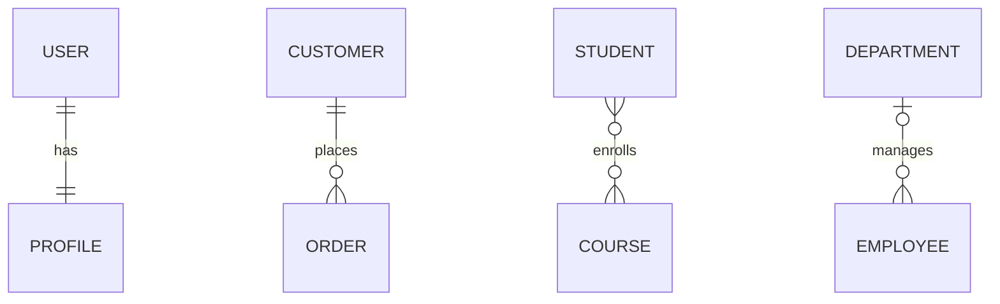

## Cardinality Examples

### One-to-One

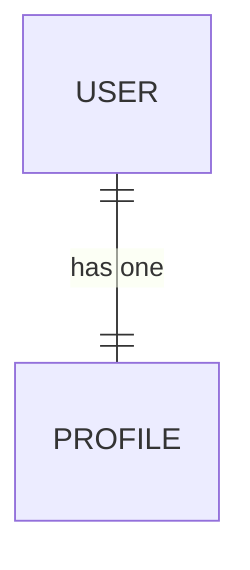

### One-to-Many

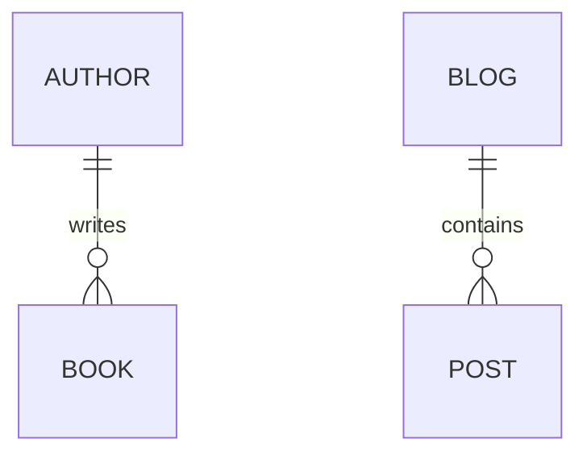

### Many-to-Many

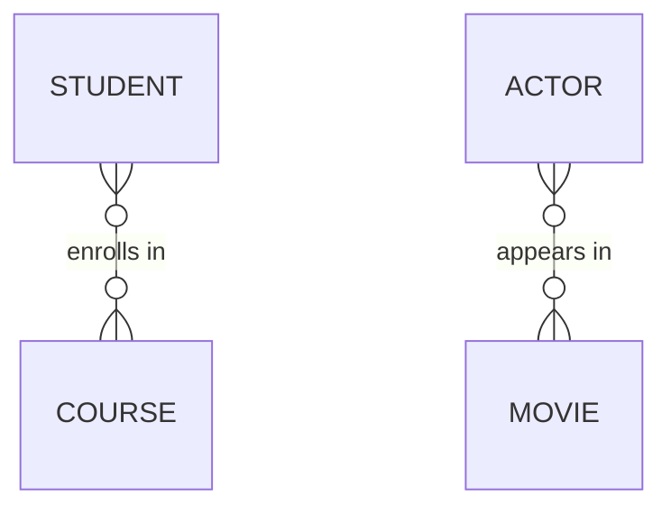

### Optional Relationships

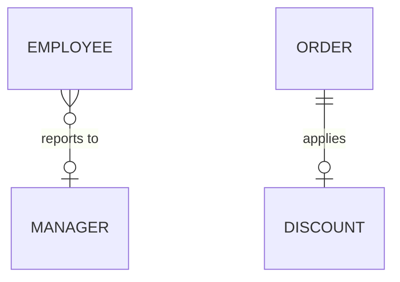

## Complex Example

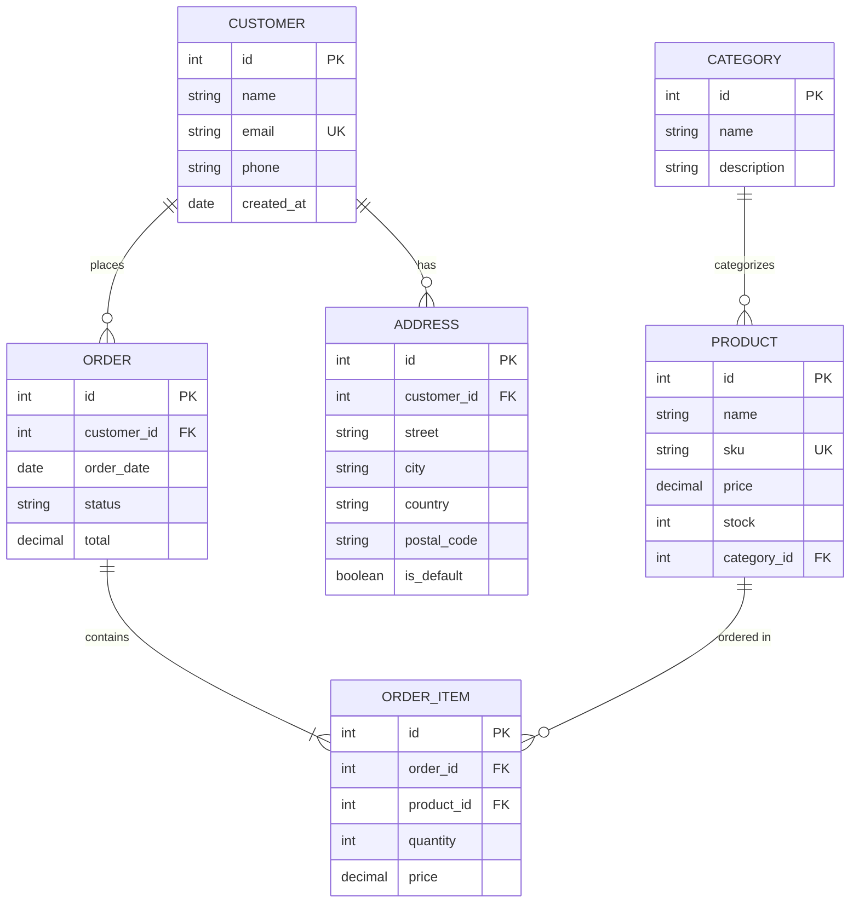

## Practical Patterns

### E-commerce Database

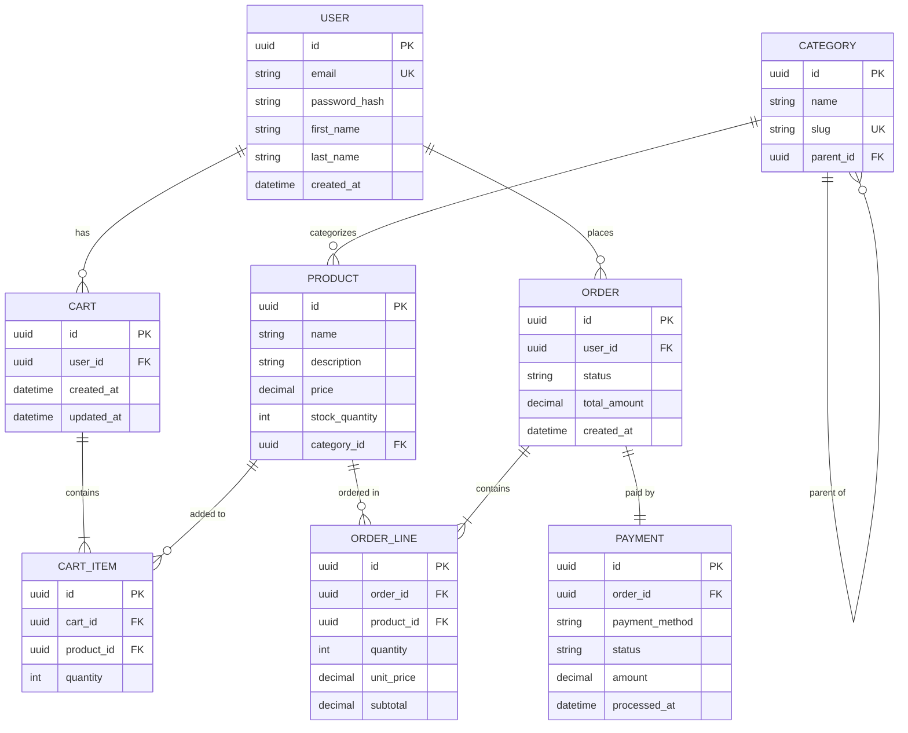

### Blog System

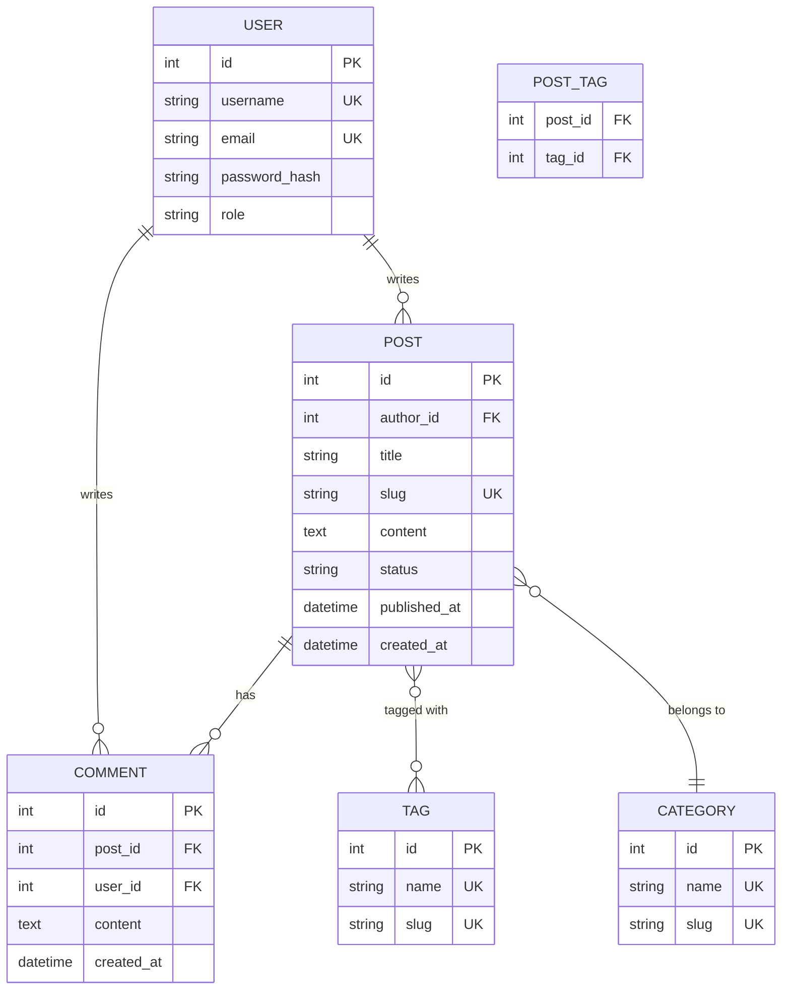

### Social Network

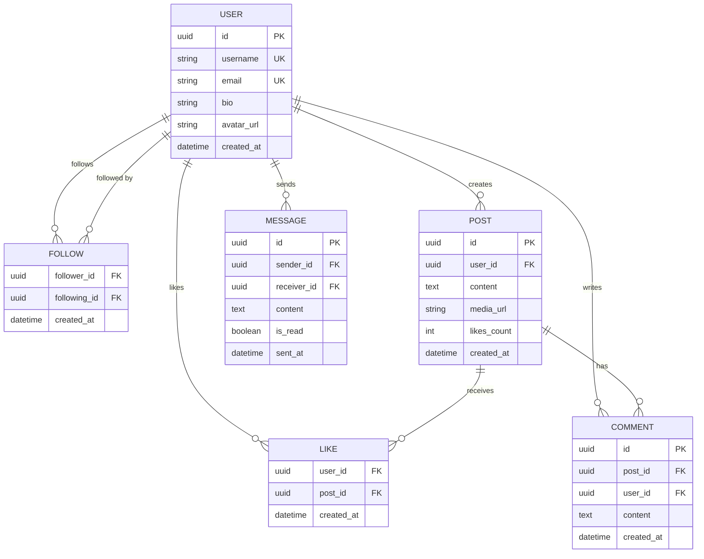

### SaaS Application

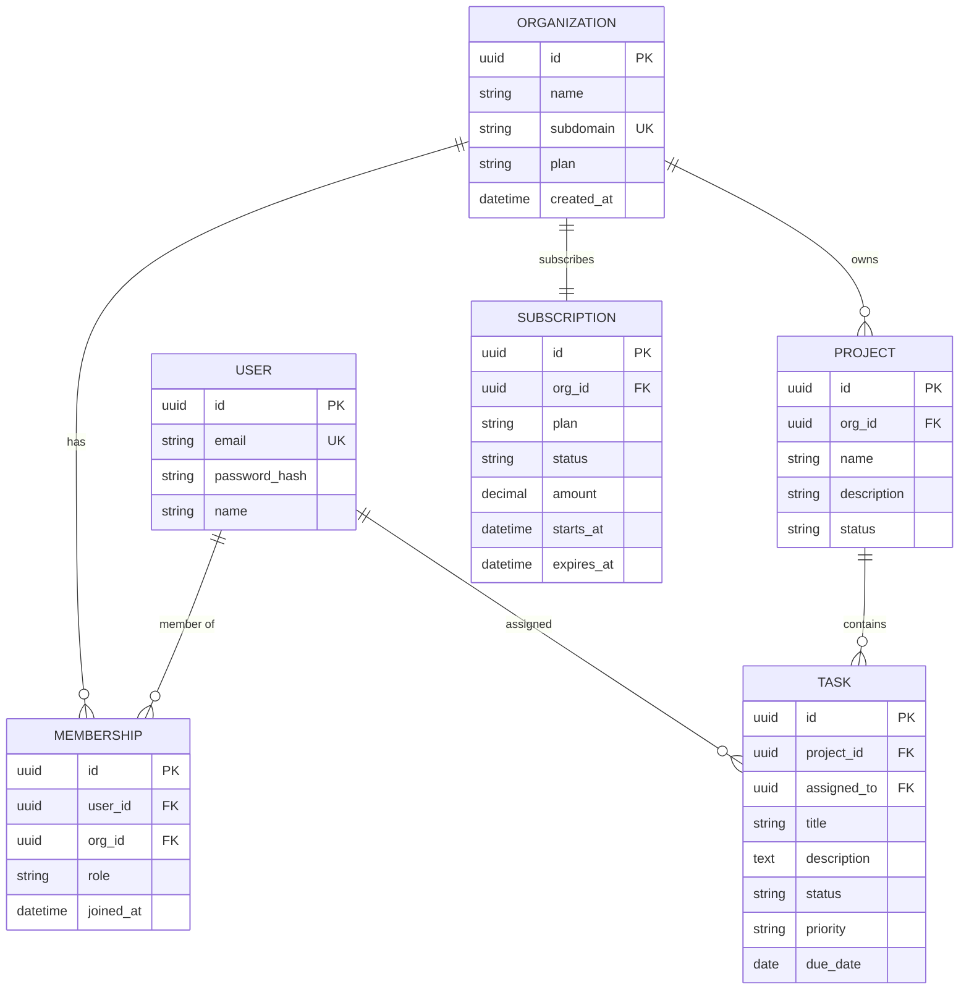

## Best Practices

### 1. Use Consistent Naming

```mermaid
%% ✅ GOOD - Consistent naming
erDiagram
    USER {
        int id PK
        string first_name
        string last_name
    }
    
    USER_PROFILE {
        int id PK
        int user_id FK
    }

%% ❌ BAD - Inconsistent
erDiagram
    users {
        int ID
        string FirstName
    }
    
    UserProfiles {
        int profile_id
    }
```

### 2. Define Primary Keys

Always mark primary keys:

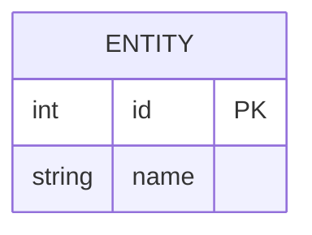

### 3. Show Foreign Key Relationships

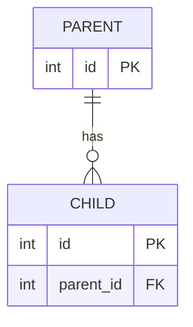

### 4. Use Descriptive Relationship Labels

```mermaid
%% ✅ GOOD
erDiagram
    CUSTOMER ||--o{ ORDER : "places"
    ORDER ||--|{ LINE_ITEM : "contains"

%% ❌ BAD - No labels
erDiagram
    CUSTOMER ||--o{ ORDER : ""
    ORDER ||--|{ LINE_ITEM : ""
```

### 5. Group Related Entities

Keep related entities close together visually:

```mermaid
erDiagram
    %% User domain
    USER {
        int id PK
    }
    
    USER_PROFILE {
        int id PK
        int user_id FK
    }
    
    USER ||--|| USER_PROFILE : has
    
    %% Order domain
    ORDER {
        int id PK
    }
    
    ORDER_ITEM {
        int id PK
        int order_id FK
    }
    
    ORDER ||--|{ ORDER_ITEM : contains
```

### 6. Document Constraints

Use descriptions for important constraints:

```mermaid
erDiagram
    PRODUCT {
        int id PK "Auto-increment"
        string sku UK "Must be unique"
        decimal price "Must be > 0"
        int stock "Cannot be negative"
    }
```

## Common Pitfalls

### Wrong Cardinality Direction

```mermaid
%% ❌ WRONG - Arrows backward
erDiagram
    ORDER o{--|| CUSTOMER : places

%% ✅ CORRECT
erDiagram
    CUSTOMER ||--o{ ORDER : places
```

### Missing Relationship Labels

```mermaid
%% ❌ BAD - No labels
erDiagram
    A ||--o{ B : ""

%% ✅ GOOD - Clear labels
erDiagram
    A ||--o{ B : "relationship description"
```

### Inconsistent Entity Names

```mermaid
%% ❌ BAD - Mixed case and style
erDiagram
    users
    Orders
    Product_Items

%% ✅ GOOD - Consistent uppercase
erDiagram
    USER
    ORDER
    PRODUCT_ITEM
```

## Syntax Quick Reference

```mermaid
erDiagram
    %% Entity with attributes
    ENTITY_NAME {
        type attribute_name PK "Description"
        type attribute_name FK
        type attribute_name UK
    }
    
    %% Relationships
    A ||--|| B : "one to one"
    C ||--o{ D : "one to many"
    E }o--o{ F : "many to many"
    G |o--o| H : "zero or one to zero or one"
    
    %% Cardinality markers:
    %% || = exactly one
    %% |o = zero or one
    %% }| = one or more
    %% }o = zero or more
```

## Database Schema Documentation

ER diagrams are perfect for documenting database schemas. Include:

1. All entities (tables)
2. All attributes (columns) with types
3. Primary keys (PK)
4. Foreign keys (FK)
5. Unique constraints (UK)
6. Relationship cardinalities
7. Relationship descriptions

This makes it easy to understand the data model at a glance.
