# Flowchart Syntax Reference

Complete reference for Mermaid flowchart syntax.

## Basic Syntax

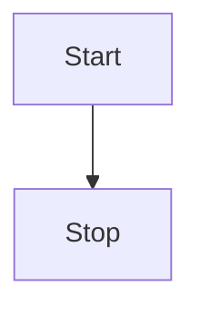

## Graph Direction

Specify direction after `flowchart` keyword:

- `TB` or `TD` - Top to Bottom (default)
- `BT` - Bottom to Top
- `LR` - Left to Right
- `RL` - Right to Left

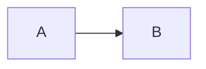

## Node Shapes

### Basic Shapes

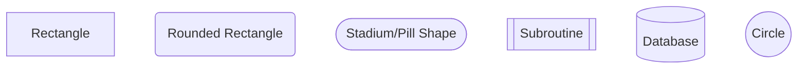

### Process Shapes

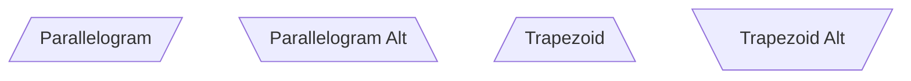

### Decision and Special Shapes

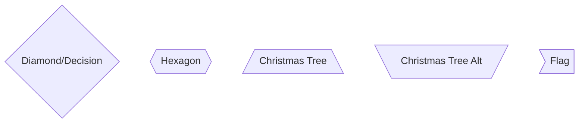

### Complex Shapes

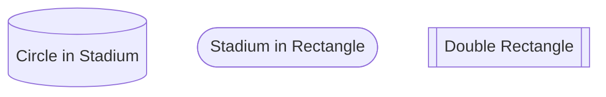

## Node Text and Labels

### Simple Labels

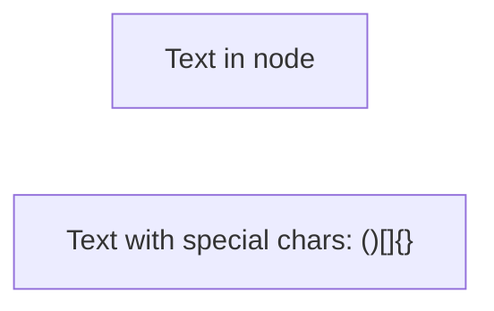

### Multiline Labels

Use `<br>` or `<br/>` for line breaks:

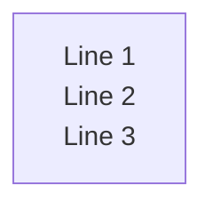

### Unicode and HTML Entities

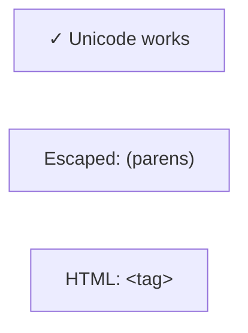

## Links and Arrows

### Arrow Types

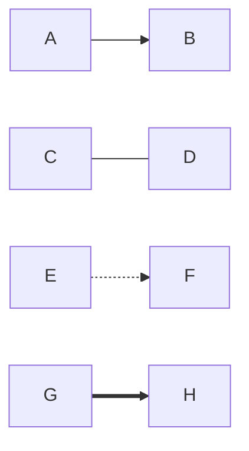

**Types:**
- `-->` Solid arrow
- `---` Solid line (no arrow)
- `-.->` Dotted arrow
- `==>` Thick arrow

### Arrow Length

More dashes = visually longer:

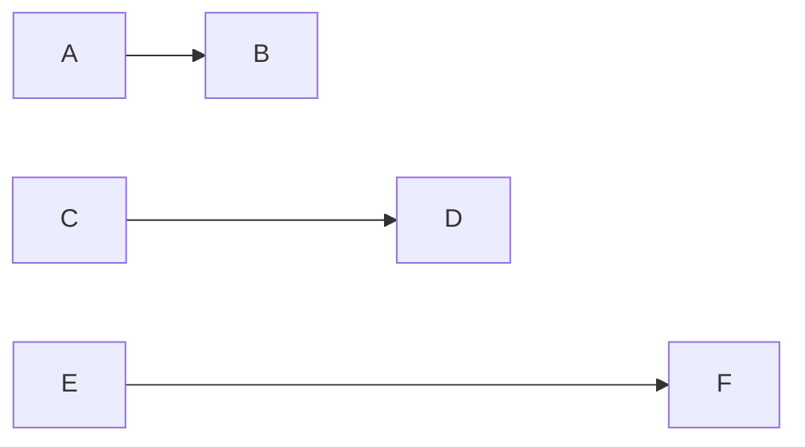

### Link Labels

```mermaid
flowchart LR
    A -->|Label| B
    C --|Label|-> D
    E -- Label --> F
```

### Multiple Links

Chain connections:

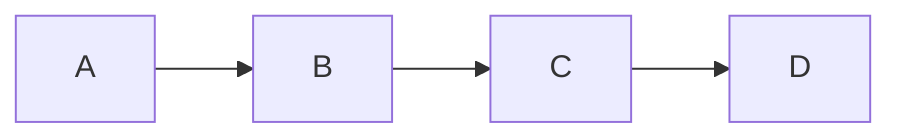

Connect one to many:

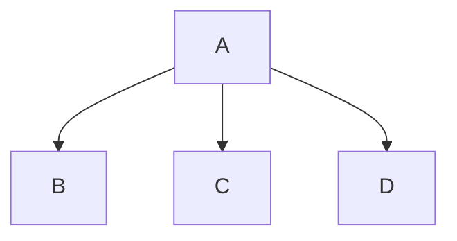

Connect many to one:

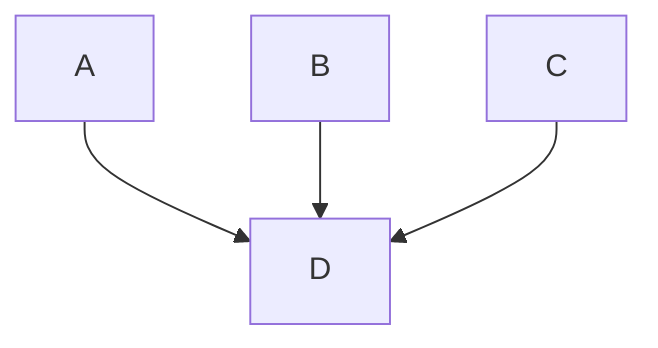

Connect many to many:

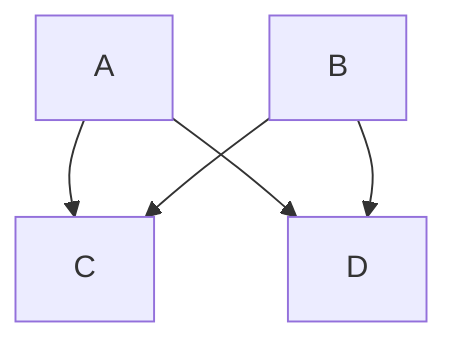

### Bidirectional Links

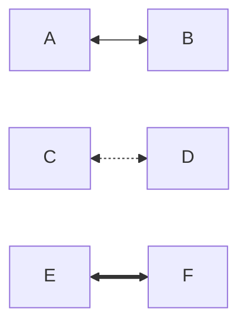

### Circular Links

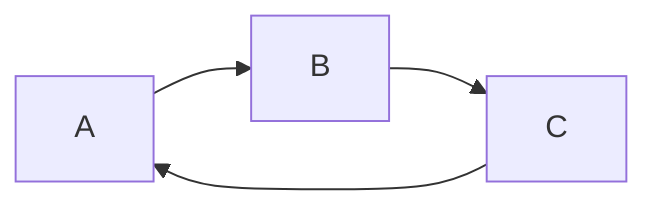

## Subgraphs

### Basic Subgraph

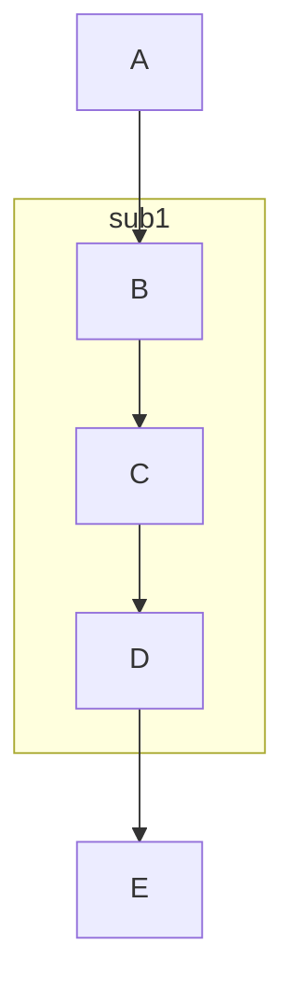

### Subgraph with Title

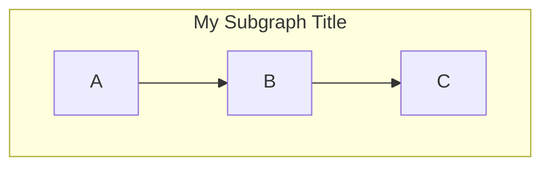

### Nested Subgraphs

```mermaid
flowchart TB
    subgraph outer
        A --> B
        
        subgraph inner
            B --> C
            C --> D
        end
        
        D --> E
    end
```

### Subgraph Direction

```mermaid
flowchart LR
    subgraph sub1
        direction TB
        A --> B --> C
    end
```

### Connecting Subgraphs

```mermaid
flowchart TB
    subgraph sub1
        A --> B
    end
    
    subgraph sub2
        C --> D
    end
    
    sub1 --> sub2
    B --> C
```

## Advanced Features

### Click Events

Add clickable links to nodes:

```mermaid
flowchart LR
    A[Click me]
    B[Also click me]
    
    click A "https://example.com" "Tooltip text"
    click B href "https://example.com" "Open in new tab" _blank
```

### Callbacks

Trigger JavaScript functions:

```mermaid
flowchart LR
    A[Button]
    
    click A call myFunction() "Tooltip"
```

### Comments

```mermaid
flowchart LR
    %% This is a comment
    A --> B %% Inline comment
    
    %% Multi-line comments
    %% can span multiple lines
    C --> D
```

### Markdown Strings

Use backticks for markdown in labels:

```mermaid
flowchart LR
    A["`**Bold** text`"]
    B["`_Italic_ text`"]
    C["`**Bold** and _italic_`"]
```

## Practical Patterns

### Decision Tree

```mermaid
flowchart TD
    Start[Start Process]
    Decision{Check Condition}
    ProcessA[Process A]
    ProcessB[Process B]
    End[End]
    
    Start --> Decision
    Decision -->|Yes| ProcessA
    Decision -->|No| ProcessB
    ProcessA --> End
    ProcessB --> End
```

### Parallel Processing

```mermaid
flowchart TB
    Start[Start]
    Split{Split}
    Process1[Process 1]
    Process2[Process 2]
    Process3[Process 3]
    Join{Join}
    End[End]
    
    Start --> Split
    Split --> Process1
    Split --> Process2
    Split --> Process3
    Process1 --> Join
    Process2 --> Join
    Process3 --> Join
    Join --> End
```

### Error Handling Flow

```mermaid
flowchart TB
    Start[Start]
    Try[Try Operation]
    Success{Success?}
    HandleError[Handle Error]
    LogError[Log Error]
    Retry{Retry?}
    Complete[Complete]
    
    Start --> Try
    Try --> Success
    Success -->|Yes| Complete
    Success -->|No| HandleError
    HandleError --> LogError
    LogError --> Retry
    Retry -->|Yes| Try
    Retry -->|No| Complete
```

### State Machine

```mermaid
flowchart LR
    Idle --> Processing
    Processing --> Success
    Processing --> Failed
    Failed --> Retry
    Retry --> Processing
    Success --> Idle
    Failed --> Idle
```

### Approval Workflow

```mermaid
flowchart TB
    Submit[Submit Request]
    Review{Review}
    Approve[Approved]
    Reject[Rejected]
    Revise[Revise]
    Complete[Complete]
    
    Submit --> Review
    Review -->|Accept| Approve
    Review -->|Reject| Reject
    Review -->|Request Changes| Revise
    Approve --> Complete
    Reject --> Complete
    Revise --> Submit
```

## Best Practices

### 1. Use Descriptive IDs

```mermaid
%% ✅ GOOD
flowchart LR
    user_input[User Input]
    validate_data[Validate]
    save_to_db[Save to DB]
    
    user_input --> validate_data --> save_to_db

%% ❌ BAD
flowchart LR
    a[User Input]
    b[Validate]
    c[Save to DB]
    
    a --> b --> c
```

### 2. Keep Direction Consistent

Choose one direction for the whole diagram:

```mermaid
%% ✅ GOOD - Consistent LR
flowchart LR
    A --> B --> C
    D --> E --> F
```

### 3. Group Related Nodes

Use subgraphs for logical grouping:

```mermaid
flowchart TB
    Input[User Input]
    
    subgraph validation[Validation Layer]
        V1[Check Format]
        V2[Check Business Rules]
    end
    
    subgraph processing[Processing Layer]
        P1[Transform Data]
        P2[Apply Logic]
    end
    
    Input --> validation
    validation --> processing
```

### 4. Comment Complex Logic

```mermaid
flowchart TB
    %% User authentication flow
    Login[Login Page]
    
    %% Credential validation
    Check{Valid?}
    
    %% Success path
    Dashboard[Dashboard]
    
    %% Error path
    Error[Error Message]
    
    Login --> Check
    Check -->|Yes| Dashboard
    Check -->|No| Error
```

### 5. Use Meaningful Labels

```mermaid
flowchart TB
    Start[User Clicks Submit]
    Process[Validate Form Data]
    Check{All Fields Valid?}
    Success[Save to Database]
    Error[Show Error Message]
    
    Start --> Process
    Process --> Check
    Check -->|Yes| Success
    Check -->|No| Error
```

### 6. Limit Complexity

For complex flows, break into multiple diagrams:

```mermaid
%% High-level overview
flowchart LR
    Input --> Validation
    Validation --> Processing
    Processing --> Output
    
    %% Link to detailed diagrams
    click Validation href "#validation-detail"
    click Processing href "#processing-detail"
```

## Common Use Cases

### API Request Flow

```mermaid
flowchart TB
    Client[Client]
    API[API Gateway]
    Auth{Authenticated?}
    Service[Business Service]
    DB[(Database)]
    Response[Return Response]
    Error[Return Error]
    
    Client --> API
    API --> Auth
    Auth -->|Yes| Service
    Auth -->|No| Error
    Service --> DB
    DB --> Response
    Response --> Client
    Error --> Client
```

### CI/CD Pipeline

```mermaid
flowchart LR
    Code[Code Commit]
    Build[Build]
    Test[Run Tests]
    TestResult{Tests Pass?}
    Deploy[Deploy]
    Notify[Notify Team]
    
    Code --> Build
    Build --> Test
    Test --> TestResult
    TestResult -->|Yes| Deploy
    TestResult -->|No| Notify
    Deploy --> Notify
```

### User Registration Flow

```mermaid
flowchart TB
    Start[Start Registration]
    Form[Fill Registration Form]
    Submit[Submit Form]
    Validate{Valid?}
    CheckEmail{Email Exists?}
    CreateAccount[Create Account]
    SendEmail[Send Verification Email]
    ShowError[Show Error]
    Complete[Registration Complete]
    
    Start --> Form
    Form --> Submit
    Submit --> Validate
    Validate -->|No| ShowError
    Validate -->|Yes| CheckEmail
    CheckEmail -->|Yes| ShowError
    CheckEmail -->|No| CreateAccount
    CreateAccount --> SendEmail
    SendEmail --> Complete
    ShowError --> Form
```

### Payment Processing

```mermaid
flowchart TB
    Start[Initiate Payment]
    GetDetails[Collect Payment Details]
    Validate{Valid Details?}
    ProcessPayment[Process with Gateway]
    CheckStatus{Payment Success?}
    SaveTransaction[Save Transaction]
    SendReceipt[Send Receipt]
    HandleFailure[Handle Failure]
    Retry{Retry?}
    Complete[Complete]
    
    Start --> GetDetails
    GetDetails --> Validate
    Validate -->|No| GetDetails
    Validate -->|Yes| ProcessPayment
    ProcessPayment --> CheckStatus
    CheckStatus -->|Success| SaveTransaction
    CheckStatus -->|Failure| HandleFailure
    SaveTransaction --> SendReceipt
    SendReceipt --> Complete
    HandleFailure --> Retry
    Retry -->|Yes| ProcessPayment
    Retry -->|No| Complete
```

## Syntax Quick Reference

```mermaid
flowchart TD
    %% Directions: TD, TB, BT, LR, RL
    
    %% Nodes
    rect[Rectangle]
    round(Rounded)
    stadium([Stadium])
    subr[[Subroutine]]
    db[(Database)]
    circle((Circle))
    diamond{Diamond}
    hex{{Hexagon}}
    
    %% Links
    A1 --> A2
    B1 --- B2
    C1 -.-> C2
    D1 ==> D2
    
    %% Link Labels
    E1 -->|label| E2
    
    %% Multiple connections
    F1 --> F2 & F3 & F4
```
