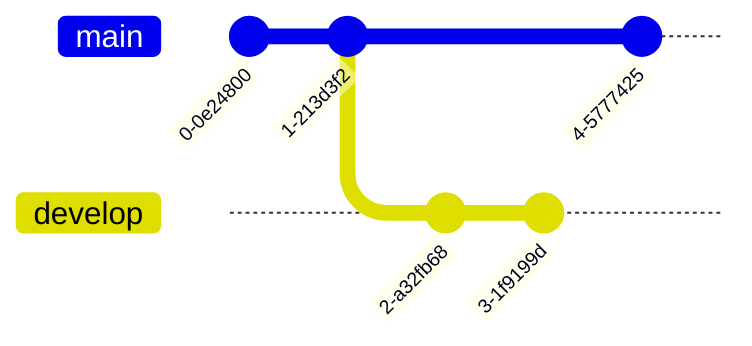
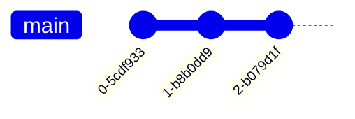
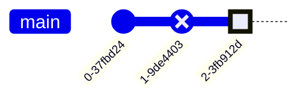
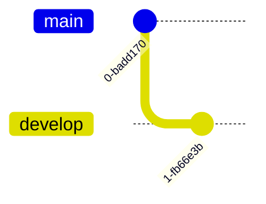
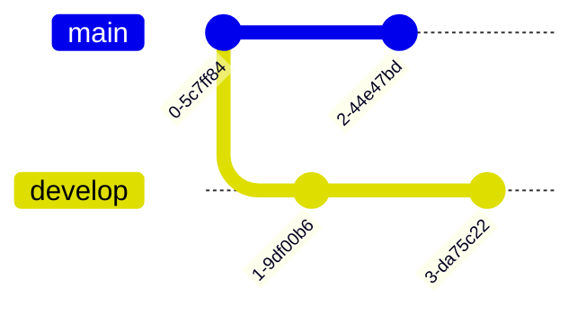
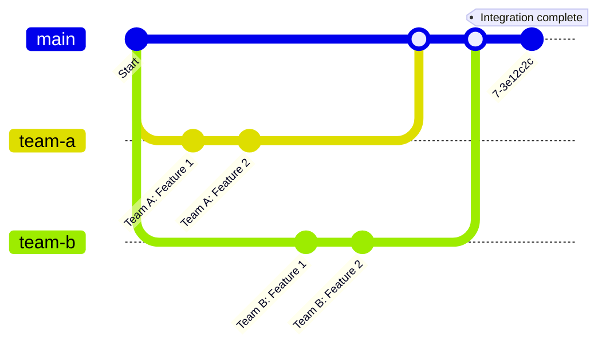

# Git Graph Syntax Reference

Complete reference for Mermaid git graph diagrams.

## Basic Syntax



## Commits

### Simple Commit



### Commit with ID


### Commit with Tag


### Commit with Type



**Commit types:**
- `NORMAL` - Standard commit (default)
- `REVERSE` - Merge commit or revert
- `HIGHLIGHT` - Important commit

### Commit with ID and Tag


## Branches

### Create Branch



### Checkout Branch



### Multiple Branches


## Merging

### Basic Merge


### Merge with ID


### Merge with Tag


## Cherry-pick


## Practical Patterns

### Gitflow Workflow


### Hotfix Workflow


### Feature Branch Workflow


### Release Workflow


### Trunk-Based Development


### Parallel Development



### Rebase Workflow


### Long-Running Branches

```mermaid
gitGraph
    commit id: "Init"
    
    branch develop
    branch staging
    
    checkout develop
    commit id: "Dev 1"
    commit id: "Dev 2"
    
    checkout staging
    merge develop
    commit id: "Staging tests"
    
    checkout main
    merge staging tag: "v1.0"
    
    checkout develop
    commit id: "Dev 3"
    commit id: "Dev 4"
    
    checkout staging
    merge develop
    commit id: "More tests"
    
    checkout main
    merge staging tag: "v1.1"
```

### Cherry-Pick Scenario

```mermaid
gitGraph
    commit id: "A"
    
    branch develop
    commit id: "B"
    commit id: "C - Critical fix"
    commit id: "D"
    
    checkout main
    cherry-pick id: "C - Critical fix"
    commit tag: "v1.0.1"
    
    checkout develop
    commit id: "E"
```

### Multiple Releases

```mermaid
gitGraph
    commit
    branch develop
    
    checkout develop
    commit id: "Feature 1"
    commit id: "Feature 2"
    
    branch release/1.0
    checkout release/1.0
    commit id: "RC1"
    checkout main
    merge release/1.0 tag: "v1.0"
    
    checkout develop
    merge release/1.0
    commit id: "Feature 3"
    commit id: "Feature 4"
    
    branch release/2.0
    checkout release/2.0
    commit id: "RC1"
    checkout main
    merge release/2.0 tag: "v2.0"
```

### Experimental Branch

```mermaid
gitGraph
    commit
    branch develop
    commit
    
    branch experimental
    checkout experimental
    commit id: "Try new approach"
    commit id: "Experiment more"
    commit id: "Looks promising"
    
    checkout develop
    commit id: "Regular work"
    
    %% Decide to merge experimental
    merge experimental id: "Adopt experimental feature"
    
    commit
    checkout main
    merge develop tag: "v2.0"
```

## Best Practices

### 1. Use Descriptive Commit IDs

```mermaid
%% ✅ GOOD
gitGraph
    commit id: "feat: add user authentication"
    commit id: "fix: resolve login timeout"
    commit id: "docs: update API documentation"

%% ❌ BAD
gitGraph
    commit id: "commit 1"
    commit id: "commit 2"
    commit id: "updates"
```

### 2. Tag Important Releases

```mermaid
gitGraph
    commit
    commit
    commit tag: "v1.0.0"
    commit
    commit tag: "v1.1.0"
```

### 3. Show Branch Purpose

```mermaid
gitGraph
    commit
    branch feature/user-profile
    branch hotfix/security-patch
    branch release/2.0
```

### 4. Highlight Important Commits

```mermaid
gitGraph
    commit
    commit
    commit id: "BREAKING CHANGE" type: HIGHLIGHT
    commit
```

### 5. Keep It Simple

Don't try to show every single commit:

```mermaid
%% ✅ GOOD - Show key commits
gitGraph
    commit id: "Start"
    commit id: "Major feature A"
    branch develop
    commit id: "Feature B"
    checkout main
    merge develop
    commit id: "Release" tag: "v1.0"

%% ❌ BAD - Too detailed
gitGraph
    commit id: "init"
    commit id: "add file 1"
    commit id: "add file 2"
    commit id: "fix typo"
    commit id: "fix another typo"
    %% ... 50 more commits
```

## Common Workflows Comparison

### Gitflow

```mermaid
gitGraph
    commit
    branch develop
    commit
    
    branch feature
    commit
    checkout develop
    merge feature
    
    branch release
    commit
    
    checkout main
    merge release tag: "v1.0"
    
    checkout develop
    merge release
```

### GitHub Flow

```mermaid
gitGraph
    commit tag: "v1.0"
    
    branch feature
    commit
    commit
    
    checkout main
    merge feature
    commit tag: "v1.1"
```

### GitLab Flow

```mermaid
gitGraph
    commit
    branch develop
    commit
    commit
    
    checkout main
    merge develop
    
    branch production
    checkout production
    merge main tag: "deploy"
```

## Advanced Patterns

### Multi-Team Development

```mermaid
gitGraph
    commit id: "Start sprint"
    
    branch frontend-team
    branch backend-team
    
    checkout frontend-team
    commit id: "UI component"
    commit id: "Styling"
    
    checkout backend-team
    commit id: "API endpoint"
    commit id: "Database schema"
    
    checkout main
    merge frontend-team
    merge backend-team
    commit id: "Integration" tag: "sprint-end"
```

### Version Maintenance

```mermaid
gitGraph
    commit tag: "v1.0"
    
    branch v1-maintenance
    commit
    
    checkout main
    commit tag: "v2.0"
    
    branch v2-maintenance
    commit
    
    checkout main
    commit tag: "v3.0"
    
    %% Bug fix to v1
    checkout v1-maintenance
    commit id: "Fix for v1" tag: "v1.0.1"
    
    %% Bug fix to v2
    checkout v2-maintenance
    commit id: "Fix for v2" tag: "v2.0.1"
```

## Common Pitfalls

### Branch Before Commit

```mermaid
%% ❌ WRONG - Need commit before branch
gitGraph
    branch develop  %% Error: no commits yet

%% ✅ CORRECT
gitGraph
    commit
    branch develop
```

### Checkout Before Merge

```mermaid
%% ✅ CORRECT - Checkout target branch first
gitGraph
    commit
    branch develop
    commit
    checkout main  %% Switch to main
    merge develop  %% Then merge
```

### Clear Branch Names

```mermaid
%% ❌ BAD
gitGraph
    commit
    branch b1
    branch b2

%% ✅ GOOD
gitGraph
    commit
    branch feature/login
    branch hotfix/security
```

## Syntax Quick Reference

```mermaid
gitGraph
    %% Commits
    commit
    commit id: "message"
    commit tag: "v1.0"
    commit type: HIGHLIGHT
    commit id: "message" tag: "v1.0" type: REVERSE
    
    %% Branches
    branch branch-name
    checkout branch-name
    
    %% Merge
    merge branch-name
    merge branch-name id: "merge message"
    merge branch-name tag: "v1.0"
    
    %% Cherry-pick
    cherry-pick id: "commit-id"
```

## When to Use Git Graphs

- Explaining branching strategies
- Documenting workflow processes
- Onboarding new team members
- Architecture decision records
- Release planning documentation
- Git training materials
- Workflow comparison diagrams
