# Sequence Diagram Syntax Reference

Complete reference for Mermaid sequence diagram syntax.

## Basic Syntax

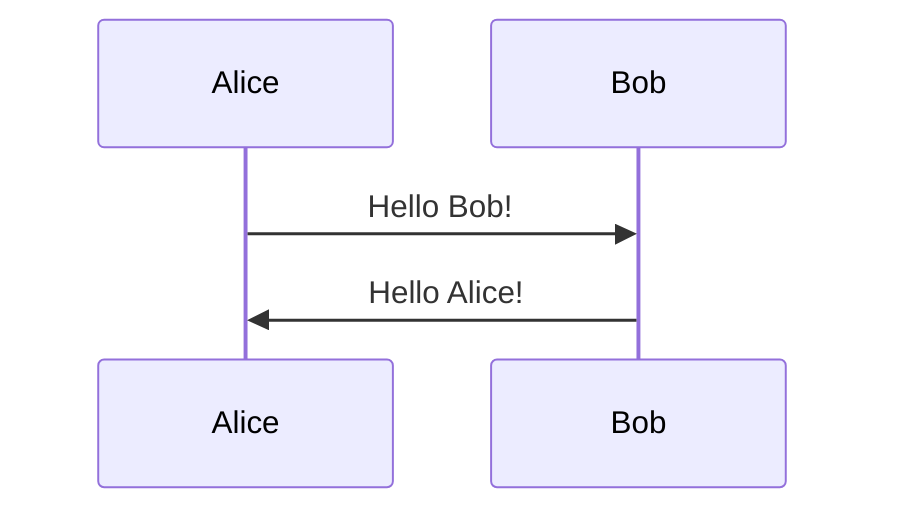

## Participants

### Auto-Declaration

Participants are auto-created on first use:

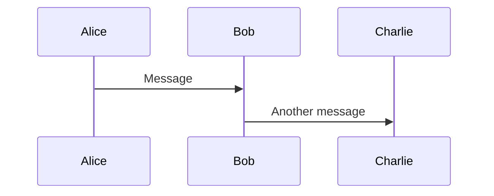

### Explicit Declaration

Control participant order:

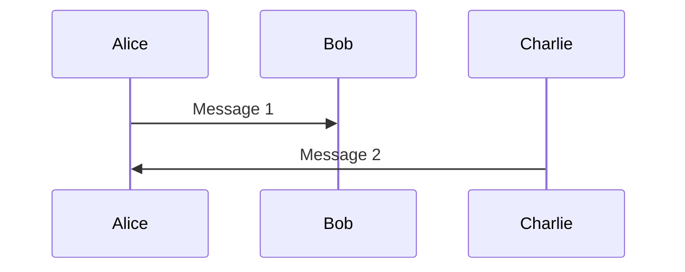

### Actor Notation

Use `actor` keyword for stick figure representation:

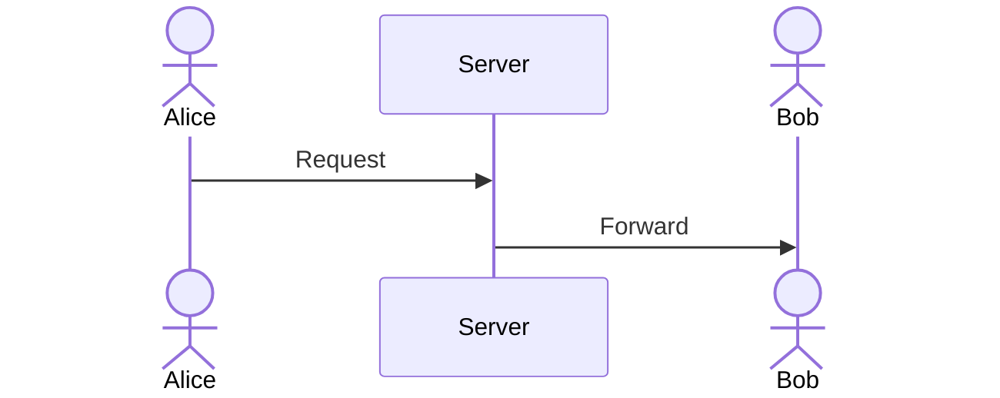

### Aliases

Use short IDs with readable aliases:

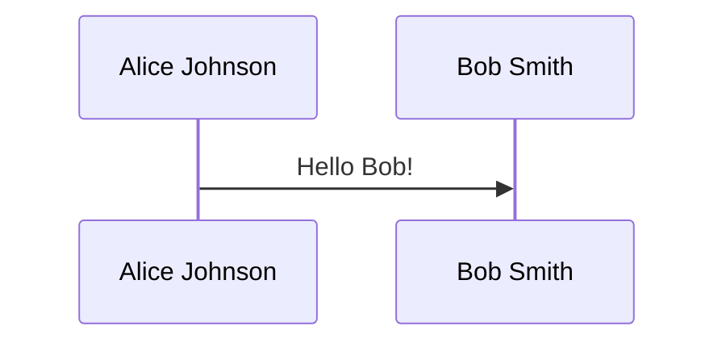

## Message Types

### Solid Arrows

```mermaid
sequenceDiagram
    A->>B: Solid arrow
    A->B: Solid arrow (no head)
    A->>+B: Arrow with activation
    A->>-B: Arrow with deactivation
```

### Dotted Arrows

```mermaid
sequenceDiagram
    A-->>B: Dotted arrow
    A-->B: Dotted arrow (no head)
    A-->>+B: Dotted with activation
    A-->>-B: Dotted with deactivation
```

### Cross Arrows (Async)

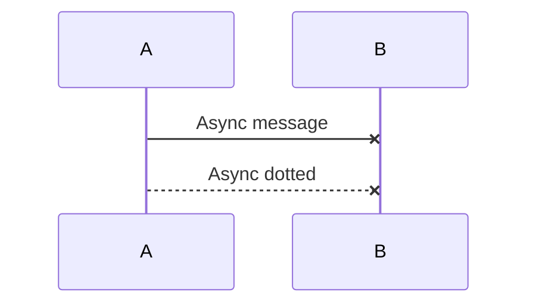

### Open Arrows

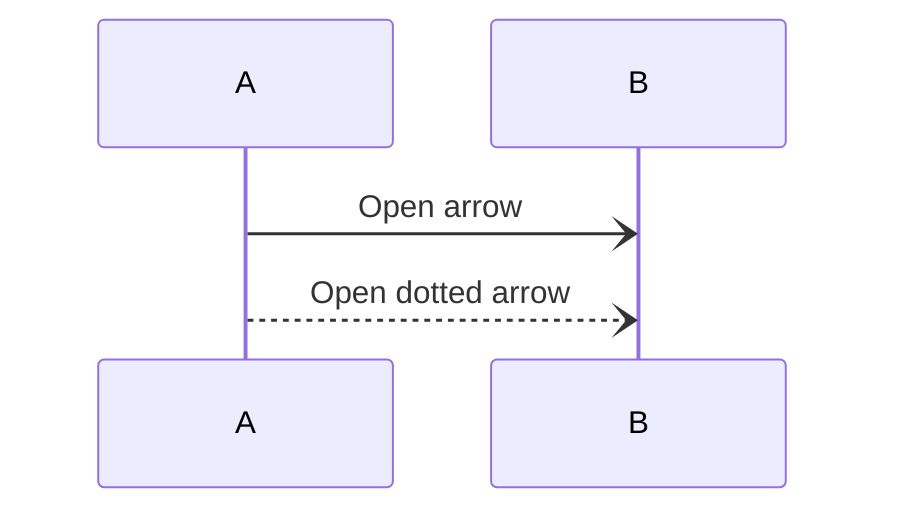

## Arrow Summary

| Syntax | Description |
|--------|-------------|
| `->>` | Solid line with arrowhead |
| `->` | Solid line with no arrowhead |
| `-->>` | Dotted line with arrowhead |
| `-->` | Dotted line with no arrowhead |
| `-x` | Solid line with cross at end |
| `--x` | Dotted line with cross at end |
| `-)` | Solid line with open arrow |
| `--)` | Dotted line with open arrow |

## Activation/Deactivation

### Manual Activation

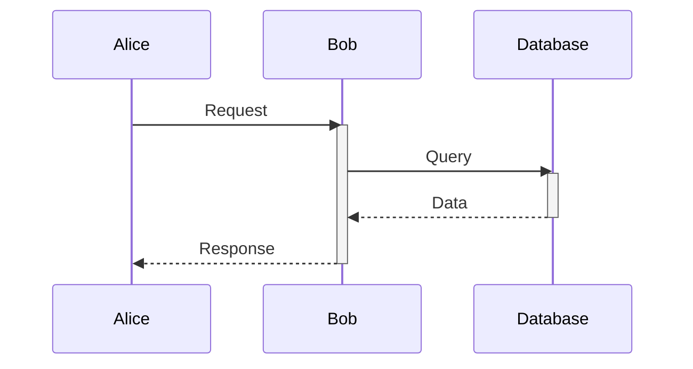

### Shorthand Activation

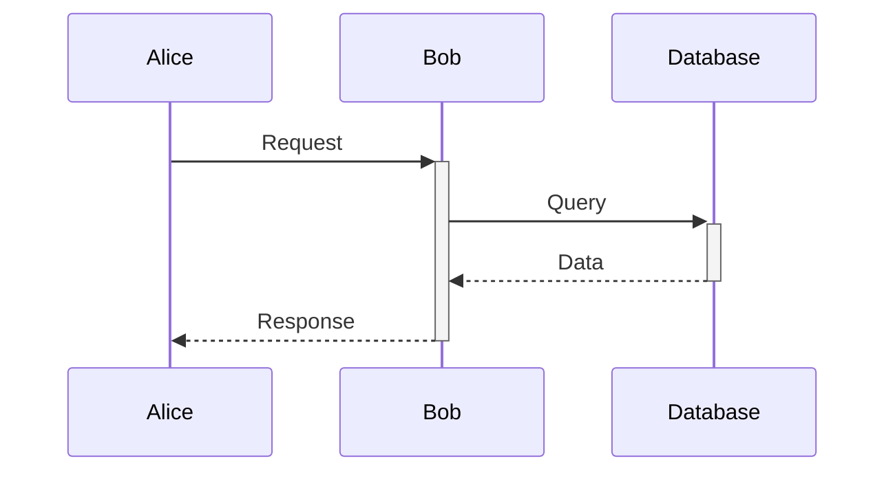

### Nested Activation

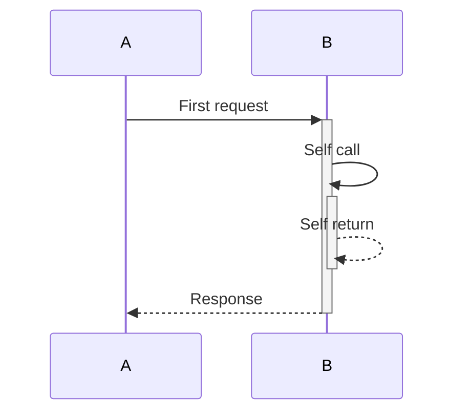

## Notes

### Note Over Single Participant

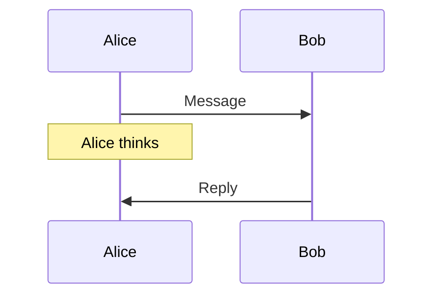

### Note Over Multiple Participants

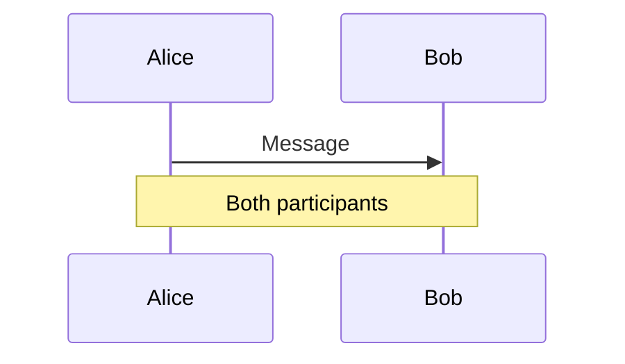

### Note Position

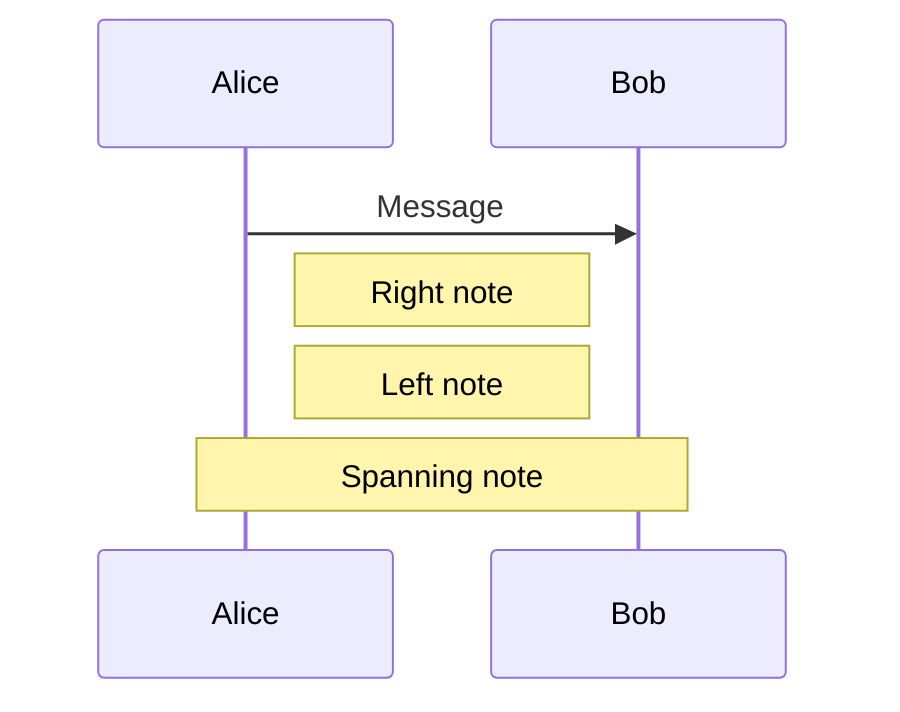

## Loops

### Basic Loop

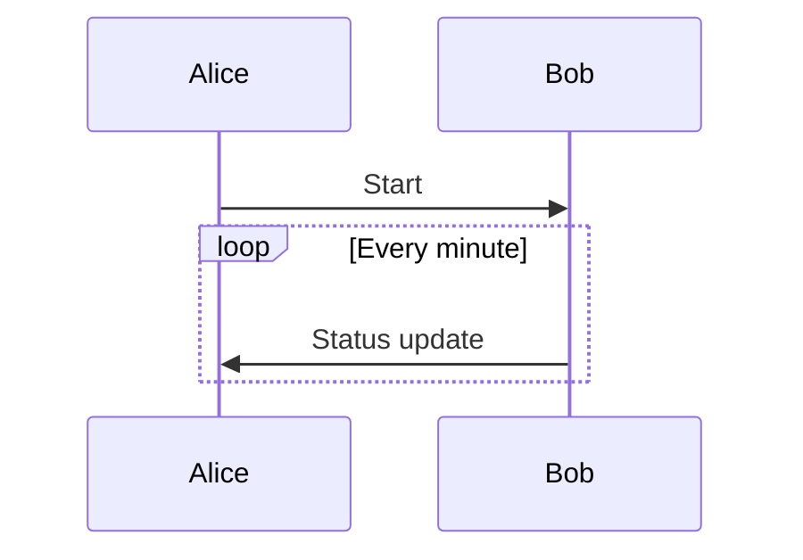

### Loop with Description

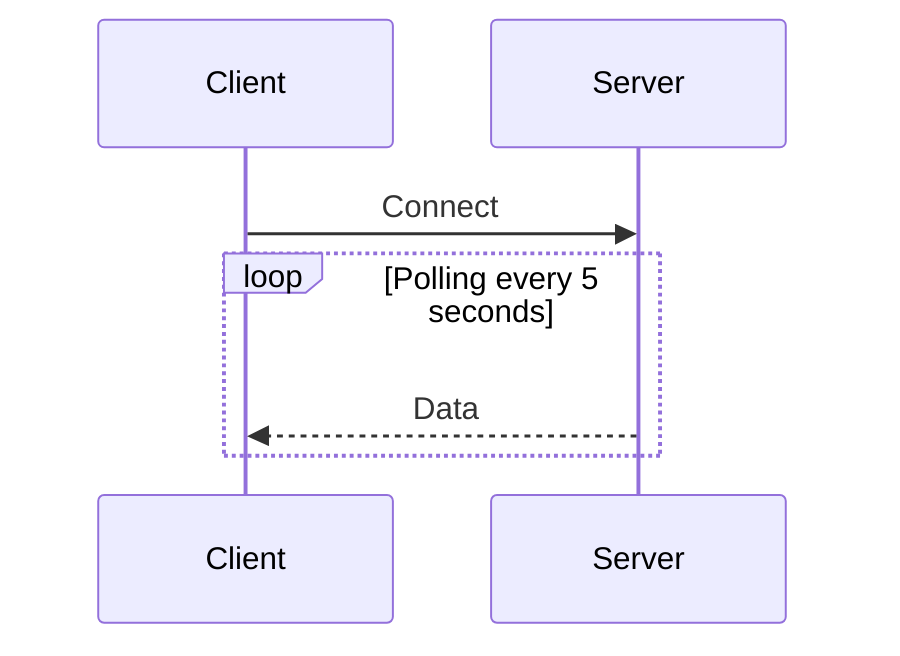

## Alternative Paths (Alt/Else)

### Binary Choice

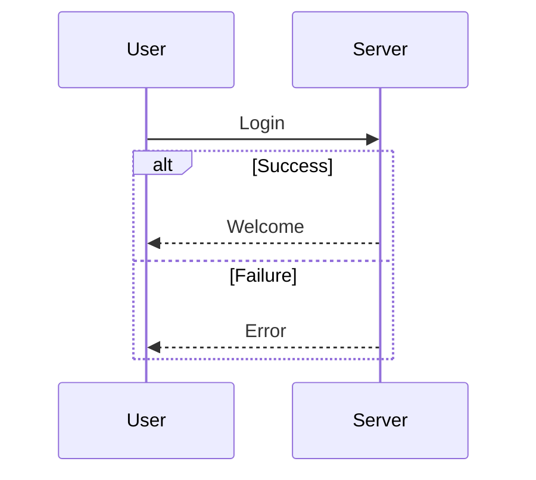

### Multiple Alternatives

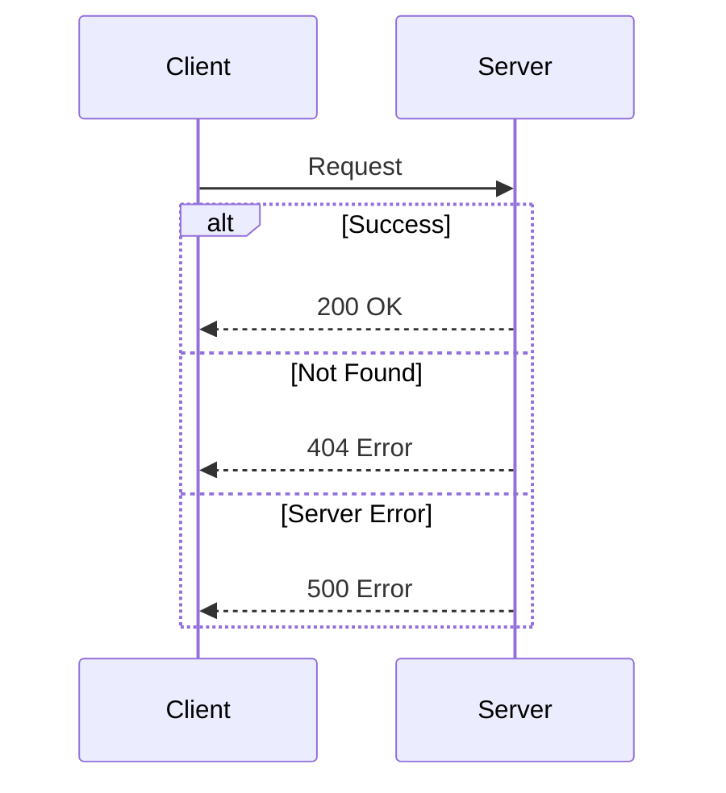

## Optional (Opt)

Execute only if condition is true:

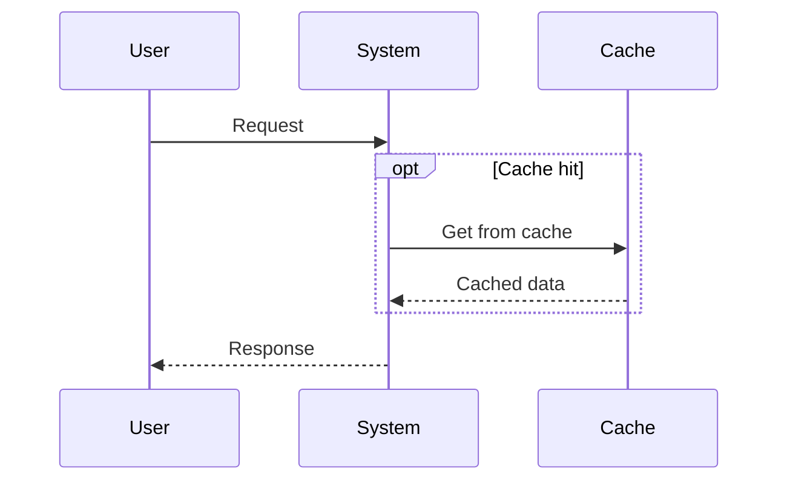

## Parallel (Par)

Show parallel execution:

```mermaid
sequenceDiagram
    User->>Server: Request
    par Parallel processing
        Server->>ServiceA: Call A
        ServiceA-->>Server: Response A
    and
        Server->>ServiceB: Call B
        ServiceB-->>Server: Response B
    and
        Server->>ServiceC: Call C
        ServiceC-->>Server: Response C
    end
    Server-->>User: Combined response
```

## Critical Region

Show critical/atomic section:

```mermaid
sequenceDiagram
    User->>System: Transaction start
    critical Atomic operation
        System->>DB: Lock
        System->>DB: Update
        System->>DB: Unlock
    option Rollback on error
        System->>DB: Rollback
    end
    System-->>User: Complete
```

## Break

Show early exit from flow:

```mermaid
sequenceDiagram
    User->>System: Request
    System->>Validator: Validate
    break Invalid input
        Validator-->>System: Validation error
        System-->>User: Error response
    end
    System->>Processor: Process
    Processor-->>System: Result
    System-->>User: Success
```

## Background Highlighting

Highlight sections with colored backgrounds:

```mermaid
sequenceDiagram
    participant A
    participant B
    
    rect rgb(191, 223, 255)
    note right of A: Phase 1
    A->>B: Message 1
    B->>A: Response 1
    end
    
    rect rgb(200, 255, 200)
    note right of A: Phase 2
    A->>B: Message 2
    B->>A: Response 2
    end
```

### Multiple Colors

```mermaid
sequenceDiagram
    rect rgb(255, 200, 200)
    A->>B: Init
    end
    
    rect rgb(200, 255, 200)
    B->>C: Process
    end
    
    rect rgb(200, 200, 255)
    C->>A: Complete
    end
```

## Sequence Numbers

Add automatic sequence numbers:

```mermaid
sequenceDiagram
    autonumber
    Alice->>Bob: Message 1
    Bob->>Charlie: Message 2
    Charlie->>Alice: Message 3
```

### Custom Start Number

```mermaid
sequenceDiagram
    autonumber 10
    Alice->>Bob: Message 10
    Bob->>Charlie: Message 11
```

### Custom Increment

```mermaid
sequenceDiagram
    autonumber 1 10
    Alice->>Bob: Message 1
    Bob->>Charlie: Message 11
    Charlie->>Alice: Message 21
```

### Turn Off Autonumber

```mermaid
sequenceDiagram
    autonumber
    Alice->>Bob: Message 1
    Bob->>Charlie: Message 2
    autonumber off
    Charlie->>Alice: No number
    autonumber on
    Alice->>Bob: Message 3
```

## Links and Tooltips

Add clickable links:

```mermaid
sequenceDiagram
    participant A as Alice
    link A: Dashboard @ https://dashboard.com
    link A: Profile @ https://profile.com
    
    A->>B: Message
```

Add tooltips:

```mermaid
sequenceDiagram
    participant A as Alice
    participant B as Bob
    links A: {"Tooltip text": "https://example.com"}
    
    A->>B: Message
```

## Practical Patterns

### Authentication Flow

```mermaid
sequenceDiagram
    actor User
    participant Client
    participant Server
    participant Auth
    participant DB
    
    User->>Client: Enter credentials
    Client->>Server: POST /login
    activate Server
    Server->>Auth: Validate credentials
    activate Auth
    Auth->>DB: Check user
    activate DB
    DB-->>Auth: User data
    deactivate DB
    
    alt Valid credentials
        Auth-->>Server: Token
        deactivate Auth
        Server-->>Client: 200 OK + Token
        deactivate Server
        Client-->>User: Success
    else Invalid credentials
        Auth-->>Server: Invalid
        deactivate Auth
        Server-->>Client: 401 Unauthorized
        deactivate Server
        Client-->>User: Error
    end
```

### API Call with Retry

```mermaid
sequenceDiagram
    participant Client
    participant Server
    participant DB
    
    Client->>Server: API Request
    activate Server
    
    loop Max 3 retries
        Server->>DB: Query
        activate DB
        alt Success
            DB-->>Server: Data
            deactivate DB
            Server-->>Client: Response
            deactivate Server
        else Failure
            DB--xServer: Error
            deactivate DB
            Note over Server: Wait and retry
        end
    end
```

### Microservice Communication

```mermaid
sequenceDiagram
    actor User
    participant Gateway
    participant AuthService
    participant UserService
    participant OrderService
    participant DB
    
    User->>Gateway: GET /orders
    Gateway->>AuthService: Verify token
    activate AuthService
    AuthService-->>Gateway: Valid
    deactivate AuthService
    
    Gateway->>UserService: Get user info
    activate UserService
    UserService->>DB: Query user
    DB-->>UserService: User data
    UserService-->>Gateway: User info
    deactivate UserService
    
    Gateway->>OrderService: Get orders
    activate OrderService
    OrderService->>DB: Query orders
    DB-->>OrderService: Orders
    OrderService-->>Gateway: Order list
    deactivate OrderService
    
    Gateway-->>User: Combined response
```

### Event-Driven Flow

```mermaid
sequenceDiagram
    participant Publisher
    participant EventBus
    participant Subscriber1
    participant Subscriber2
    
    Publisher->>EventBus: Publish event
    activate EventBus
    
    par Broadcast to subscribers
        EventBus->>Subscriber1: Event notification
        activate Subscriber1
        Subscriber1->>Subscriber1: Process event
        Subscriber1-->>EventBus: Ack
        deactivate Subscriber1
    and
        EventBus->>Subscriber2: Event notification
        activate Subscriber2
        Subscriber2->>Subscriber2: Process event
        Subscriber2-->>EventBus: Ack
        deactivate Subscriber2
    end
    
    EventBus-->>Publisher: Published
    deactivate EventBus
```

### Database Transaction

```mermaid
sequenceDiagram
    participant App
    participant DB
    
    App->>DB: BEGIN TRANSACTION
    activate DB
    
    critical Atomic operations
        App->>DB: INSERT user
        App->>DB: INSERT profile
        App->>DB: INSERT preferences
        
        alt All successful
            App->>DB: COMMIT
            DB-->>App: Success
        else Any failure
            App->>DB: ROLLBACK
            DB-->>App: Rolled back
        end
    end
    
    deactivate DB
```

### Websocket Communication

```mermaid
sequenceDiagram
    actor Client
    participant Server
    
    Client->>Server: Connect
    Server-->>Client: Connected
    
    loop Real-time updates
        Client->>Server: Subscribe to channel
        Server-->>Client: Subscribed
        
        Note over Server: Event occurs
        Server-->>Client: Push update
        
        Client->>Server: Acknowledge
    end
    
    Client->>Server: Disconnect
    Server-->>Client: Disconnected
```

## Best Practices

### 1. Declare Participants Explicitly

```mermaid
%% ✅ GOOD - Clear order and readable names
sequenceDiagram
    participant Client
    participant API as API Gateway
    participant Auth as Auth Service
    participant DB as Database
    
    Client->>API: Request
    API->>Auth: Validate
    Auth->>DB: Check credentials

%% ❌ BAD - Auto-declared, unclear order
sequenceDiagram
    C->>A: Request
    A->>AS: Validate
    AS->>D: Check credentials
```

### 2. Use Activation Boxes

Show when services are processing:

```mermaid
sequenceDiagram
    Client->>+Server: Request
    Server->>+Database: Query
    Database-->>-Server: Result
    Server-->>-Client: Response
```

### 3. Group Related Operations

Use loops, alt, or rect to show logical grouping:

```mermaid
sequenceDiagram
    User->>System: Start
    
    rect rgb(200, 220, 255)
    note right of System: Initialization Phase
    System->>Database: Setup
    Database-->>System: Ready
    end
    
    rect rgb(200, 255, 220)
    note right of System: Processing Phase
    loop Process items
        System->>Worker: Process
        Worker-->>System: Done
    end
    end
```

### 4. Add Descriptive Notes

Explain complex logic:

```mermaid
sequenceDiagram
    Client->>Server: Request
    Note over Server: Check cache first<br/>to reduce DB load
    
    opt Cache miss
        Server->>DB: Query
        DB-->>Server: Data
        Note over Server: Store in cache<br/>for 5 minutes
    end
    
    Server-->>Client: Response
```

### 5. Use Sequence Numbers for Complex Flows

```mermaid
sequenceDiagram
    autonumber
    participant A
    participant B
    participant C
    
    A->>B: Step 1
    B->>C: Step 2
    C->>B: Step 3
    B->>A: Step 4
```

### 6. Show Error Paths

Always include error handling:

```mermaid
sequenceDiagram
    Client->>Server: Request
    
    alt Validation passes
        Server->>DB: Query
        DB-->>Server: Data
        Server-->>Client: 200 OK
    else Validation fails
        Server-->>Client: 400 Bad Request
    else Server error
        Server-->>Client: 500 Internal Error
    end
```

## Common Pitfalls

### Unbalanced Activation

```mermaid
%% ❌ BAD - Activation not deactivated
sequenceDiagram
    A->>+B: Request
    B-->>A: Response
    %% Missing deactivate B

%% ✅ GOOD
sequenceDiagram
    A->>+B: Request
    B-->>-A: Response
```

### Unclosed Blocks

```mermaid
%% ❌ BAD
sequenceDiagram
    loop Forever
        A->>B: Message
    %% Missing end

%% ✅ GOOD
sequenceDiagram
    loop Forever
        A->>B: Message
    end
```

### Too Many Participants

Break into multiple diagrams if you have more than 6-7 participants.

## Syntax Quick Reference

```mermaid
sequenceDiagram
    %% Participants
    actor A
    participant B as Bob
    
    %% Messages
    A->>B: Solid
    A-->>B: Dotted
    A-)B: Open
    A-xB: Cross
    
    %% Activation
    A->>+B: Activate
    B-->>-A: Deactivate
    
    %% Notes
    Note right of A: Note
    Note over A,B: Spanning
    
    %% Control flow
    loop Condition
        A->>B: Loop
    end
    
    alt Case 1
        A->>B: Alt
    else Case 2
        B->>A: Else
    end
    
    opt Condition
        A->>B: Optional
    end
    
    par Parallel
        A->>B: Task 1
    and
        B->>A: Task 2
    end
    
    %% Numbering
    autonumber
```
