# State Diagram Syntax Reference

Complete reference for Mermaid state diagram syntax (v2).

## Basic Syntax

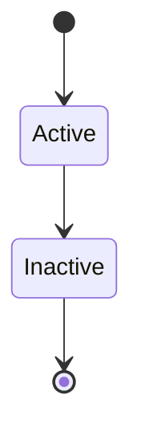

**Note:** Always use `stateDiagram-v2` for the latest syntax.

## States

### Simple States

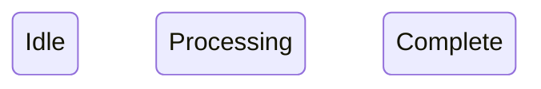

### Start and End States

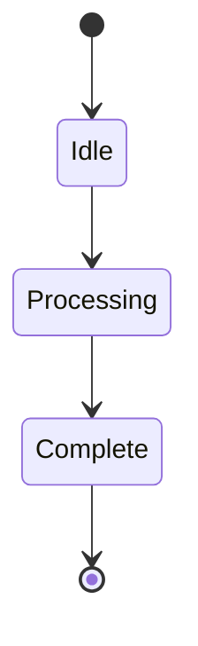

**`[*]` represents start/end states**

### State with Description

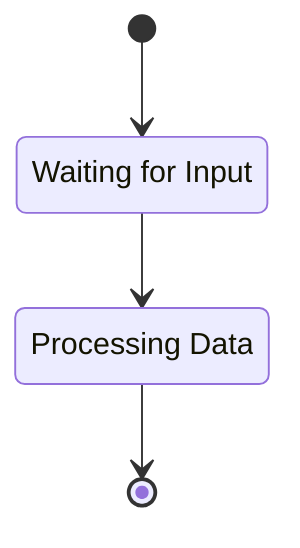

## Transitions

### Simple Transitions

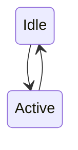

### Transitions with Labels

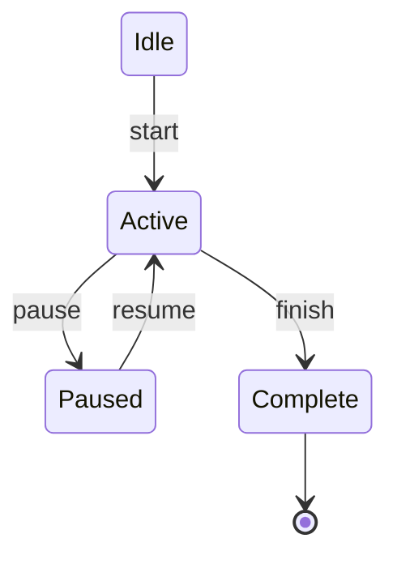

### Self-Transitions

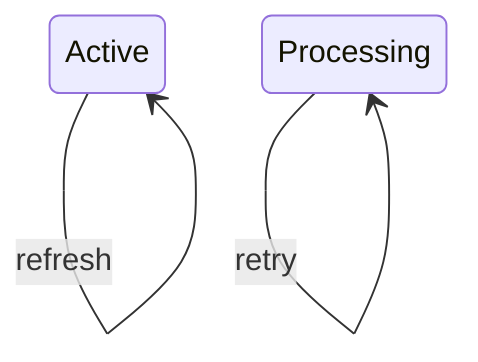

## Composite States

### State with Substates

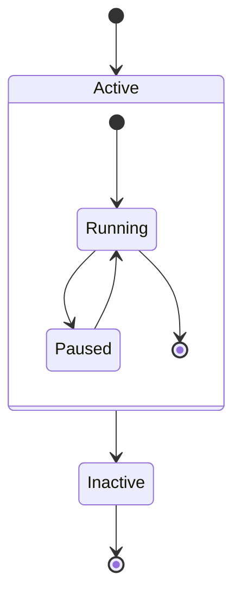

### Nested Composite States

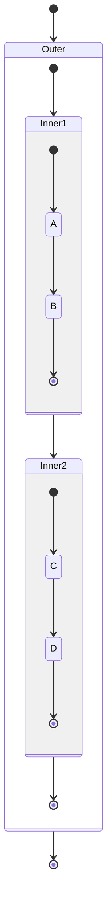

## Choice (Conditional)

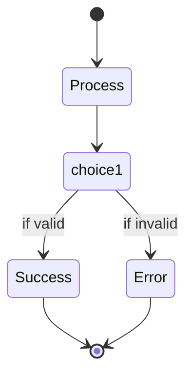

## Fork and Join

### Fork (Parallel States)

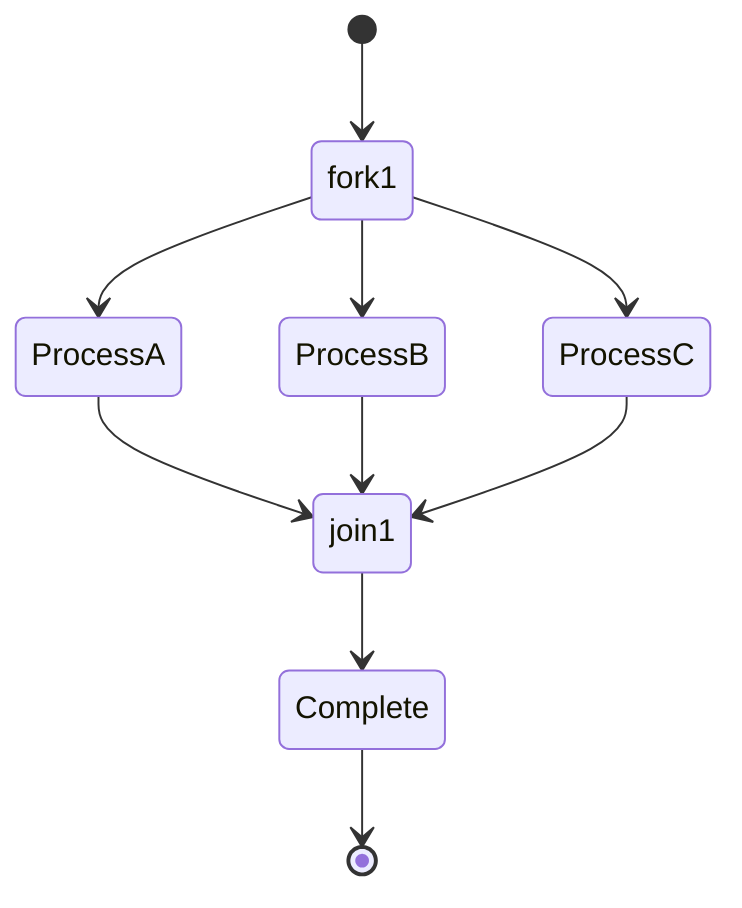

### Concurrent States

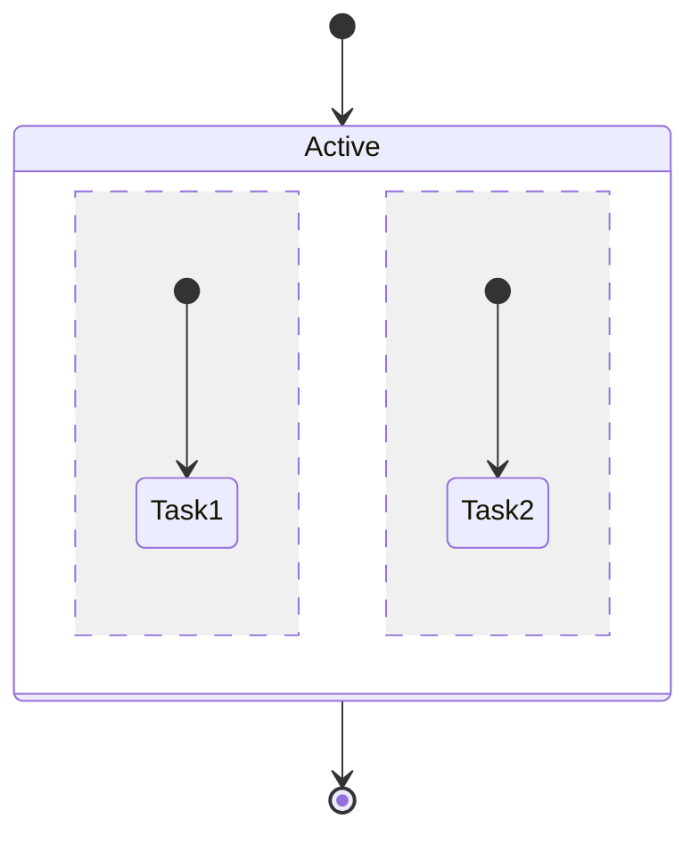

**Use `--` to separate concurrent regions**

## Notes

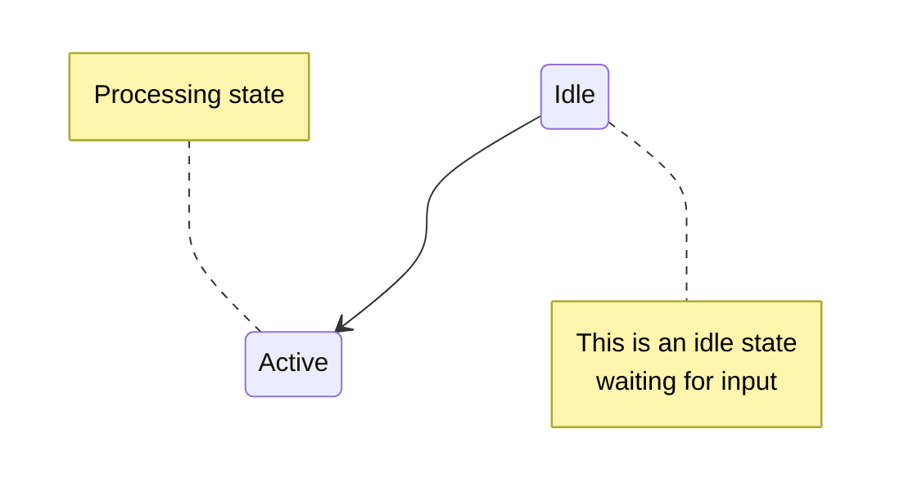

## Direction

### Horizontal Layout

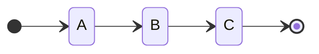

**Directions:**
- `LR` - Left to Right
- `RL` - Right to Left
- `TB` - Top to Bottom (default)
- `BT` - Bottom to Top

## State Descriptions

Add descriptions to states:

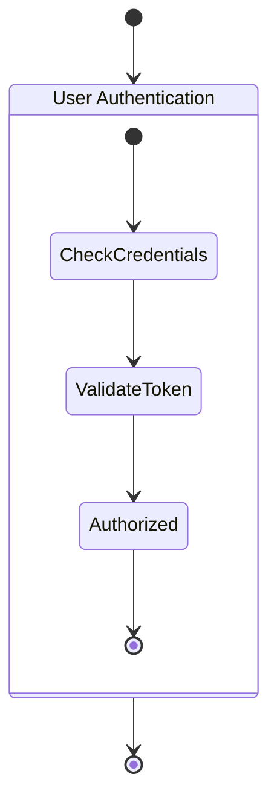

## Practical Patterns

### User Authentication Flow

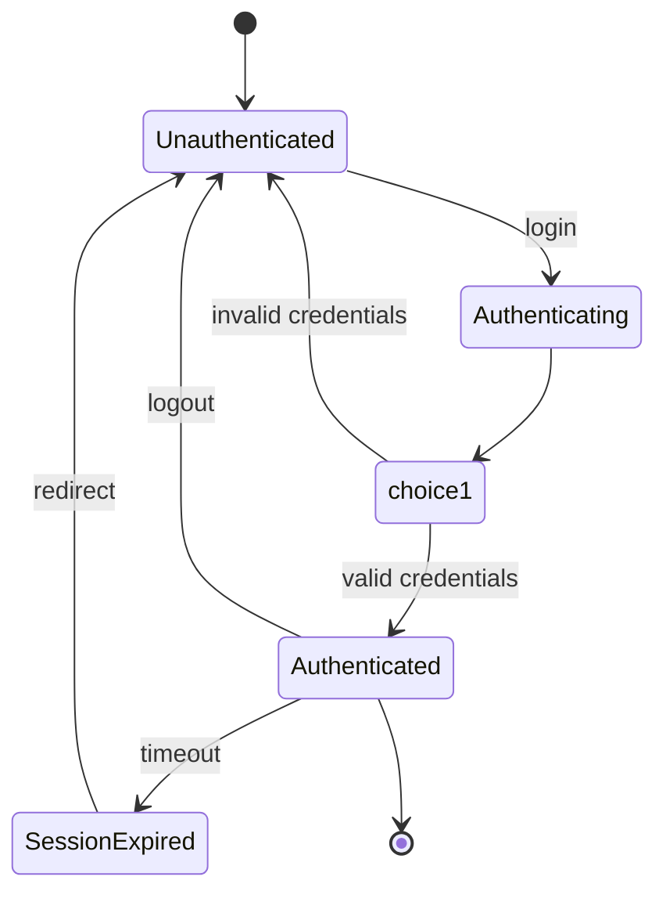

### Order Processing

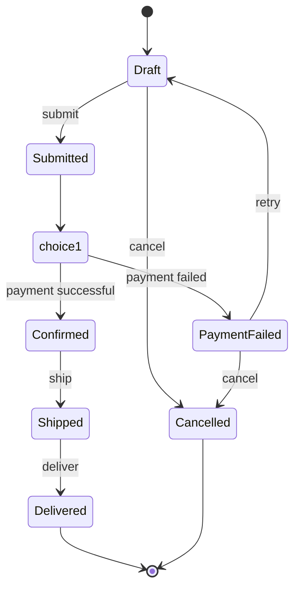

### Connection States

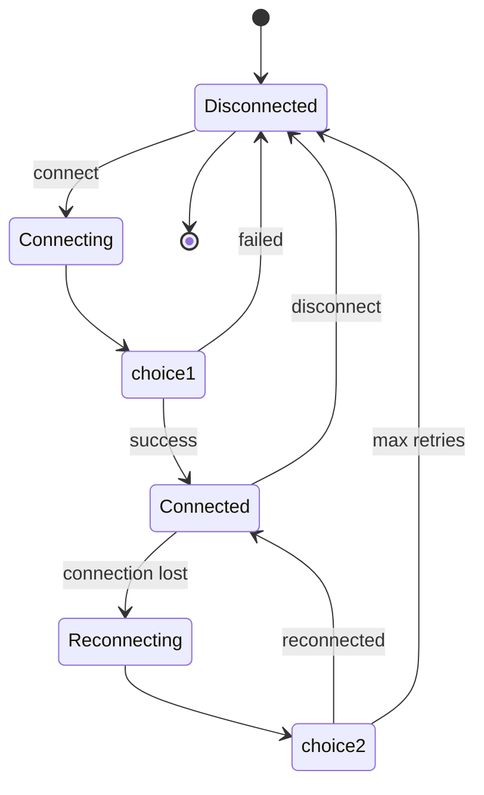

### Payment Processing

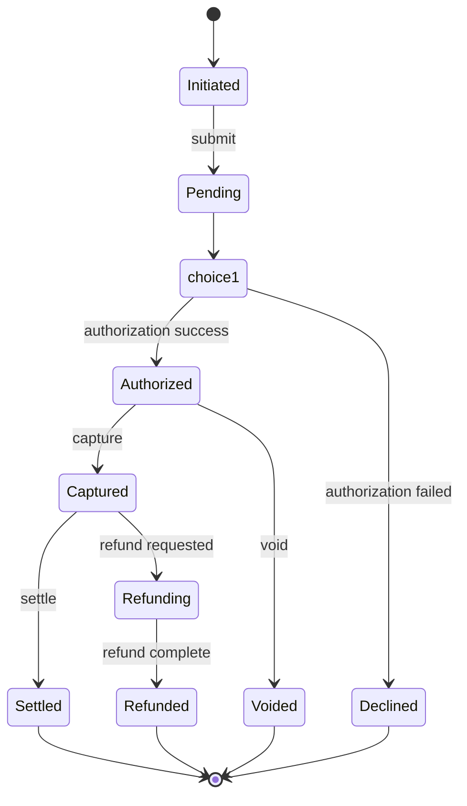

### Task Lifecycle

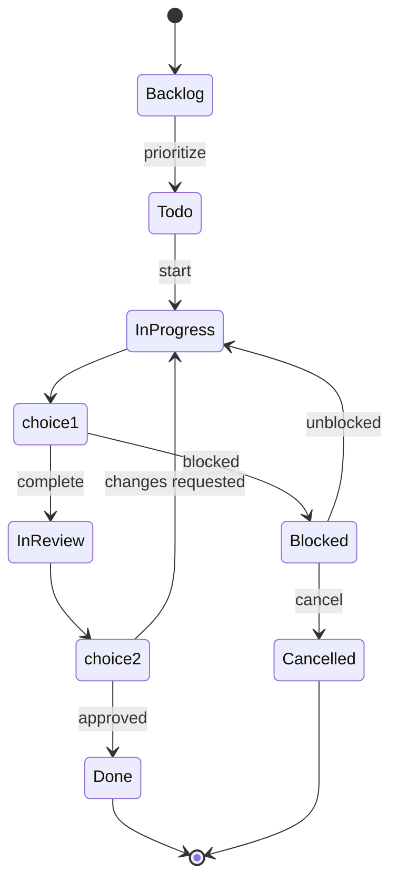

### File Upload

```mermaid
stateDiagram-v2
    [*] --> Idle
    
    Idle --> Uploading: start upload
    
    state Uploading {
        [*] --> Transferring
        Transferring --> Transferring: progress
        Transferring --> [*]
    }
    
    Uploading --> choice1
    state choice1 <<choice>>
    choice1 --> Processing: upload complete
    choice1 --> Failed: upload error
    choice1 --> Paused: pause
    
    Paused --> Uploading: resume
    Paused --> Cancelled: cancel
    
    Processing --> Complete: processing done
    Processing --> Failed: processing error
    
    Failed --> Idle: retry
    Failed --> [*]: abandon
    
    Complete --> [*]
    Cancelled --> [*]
```

### Background Job

```mermaid
stateDiagram-v2
    [*] --> Queued
    
    Queued --> Running: dequeue
    
    Running --> choice1
    state choice1 <<choice>>
    choice1 --> Completed: success
    choice1 --> Failed: error
    
    Failed --> choice2
    state choice2 <<choice>>
    choice2 --> Queued: retry
    choice2 --> Dead: max retries exceeded
    
    Completed --> [*]
    Dead --> [*]
```

### Game State Machine

```mermaid
stateDiagram-v2
    [*] --> Menu
    
    Menu --> Playing: start game
    Menu --> Settings: open settings
    Settings --> Menu: back
    
    state Playing {
        [*] --> Running
        
        Running --> Paused: pause
        Paused --> Running: resume
        
        Running --> choice1
        state choice1 <<choice>>
        choice1 --> GameOver: player dies
        choice1 --> Victory: level complete
        
        GameOver --> [*]
        Victory --> [*]
    }
    
    Playing --> Menu: quit
    Menu --> [*]: exit
```

### HTTP Request States

```mermaid
stateDiagram-v2
    [*] --> Idle
    
    Idle --> Pending: send request
    
    Pending --> choice1
    state choice1 <<choice>>
    choice1 --> Success: 2xx response
    choice1 --> ClientError: 4xx response
    choice1 --> ServerError: 5xx response
    choice1 --> NetworkError: network failure
    
    NetworkError --> choice2
    state choice2 <<choice>>
    choice2 --> Pending: retry
    choice2 --> Failed: max retries
    
    ServerError --> choice3
    state choice3 <<choice>>
    choice3 --> Pending: retry
    choice3 --> Failed: max retries
    
    Success --> Idle: reset
    ClientError --> Idle: reset
    Failed --> Idle: reset
    
    Idle --> [*]
```

## Complex Example: Media Player

```mermaid
stateDiagram-v2
    [*] --> Stopped
    
    Stopped --> Loading: load media
    
    Loading --> choice1
    state choice1 <<choice>>
    choice1 --> Ready: loaded
    choice1 --> Error: load failed
    
    Ready --> Playing: play
    
    state Playing {
        [*] --> Buffering
        Buffering --> Active: buffer full
        Active --> Buffering: buffer empty
        Active --> Seeking: seek
        Seeking --> Active: seek complete
    }
    
    Playing --> Paused: pause
    Paused --> Playing: resume
    
    Playing --> Stopped: stop
    Paused --> Stopped: stop
    
    Error --> Stopped: reset
    
    Stopped --> [*]
```

## Best Practices

### 1. Use Descriptive State Names

```mermaid
%% ✅ GOOD - Clear state names
stateDiagram-v2
    AwaitingInput --> ValidatingData
    ValidatingData --> ProcessingRequest
    ProcessingRequest --> SendingResponse

%% ❌ BAD - Unclear names
stateDiagram-v2
    S1 --> S2
    S2 --> S3
```

### 2. Label Transitions

```mermaid
%% ✅ GOOD - Labeled transitions
stateDiagram-v2
    Idle --> Active: start button clicked
    Active --> Paused: user pressed pause

%% ❌ BAD - No labels
stateDiagram-v2
    Idle --> Active
    Active --> Paused
```

### 3. Use Choice for Conditional Logic

```mermaid
%% ✅ GOOD - Explicit choice
stateDiagram-v2
    Process --> validate
    state validate <<choice>>
    validate --> Success: valid
    validate --> Error: invalid

%% ❌ BAD - Unclear branching
stateDiagram-v2
    Process --> Success
    Process --> Error
```

### 4. Group Related States

```mermaid
stateDiagram-v2
    [*] --> Active
    
    state Active {
        [*] --> SubState1
        SubState1 --> SubState2
        SubState2 --> [*]
    }
    
    Active --> Inactive
```

### 5. Document Complex Transitions

```mermaid
stateDiagram-v2
    State1 --> State2: action triggered
    
    note right of State2
        This transition occurs when
        the user confirms the action
        and all validations pass
    end note
```

### 6. Keep It Simple

Don't overcomplicate - break complex state machines into multiple diagrams:

```mermaid
%% High-level overview
stateDiagram-v2
    [*] --> Authentication
    Authentication --> MainApp
    MainApp --> [*]
    
    note right of Authentication
        See authentication-states.md
        for detailed auth flow
    end note
```

## Common Pitfalls

### Missing Start/End States

```mermaid
%% ❌ BAD - No clear start
stateDiagram-v2
    A --> B
    B --> C

%% ✅ GOOD
stateDiagram-v2
    [*] --> A
    A --> B
    B --> C
    C --> [*]
```

### Unclear Branching

```mermaid
%% ❌ BAD - Direct branching unclear
stateDiagram-v2
    Process --> Success
    Process --> Failure

%% ✅ GOOD - Use choice
stateDiagram-v2
    Process --> check
    state check <<choice>>
    check --> Success: passed
    check --> Failure: failed
```

### Too Many States

If your diagram has more than 10-15 states, consider:
- Breaking into multiple diagrams
- Using composite states
- Simplifying the model

## Syntax Quick Reference

```mermaid
stateDiagram-v2
    %% Basic transitions
    [*] --> StateA
    StateA --> StateB: label
    StateB --> [*]
    
    %% Self-transition
    StateA --> StateA: self
    
    %% Choice
    StateA --> choice1
    state choice1 <<choice>>
    choice1 --> StateB: condition 1
    choice1 --> StateC: condition 2
    
    %% Fork/Join
    StateA --> fork1
    state fork1 <<fork>>
    fork1 --> StateD
    fork1 --> StateE
    
    StateD --> join1
    StateE --> join1
    state join1 <<join>>
    
    %% Composite state
    state StateF {
        [*] --> SubState1
        SubState1 --> SubState2
        SubState2 --> [*]
    }
    
    %% Concurrent states
    state StateG {
        [*] --> Task1
        --
        [*] --> Task2
    }
    
    %% Notes
    note right of StateA
        Note text
    end note
    
    %% Direction
    direction LR
```
