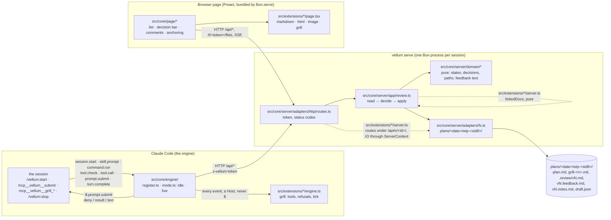
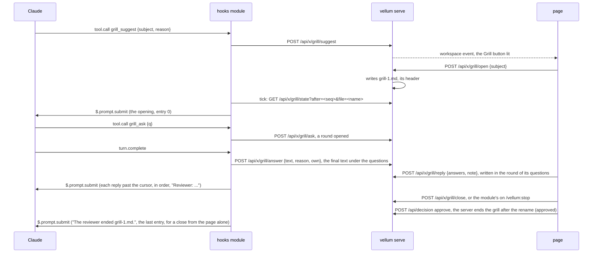
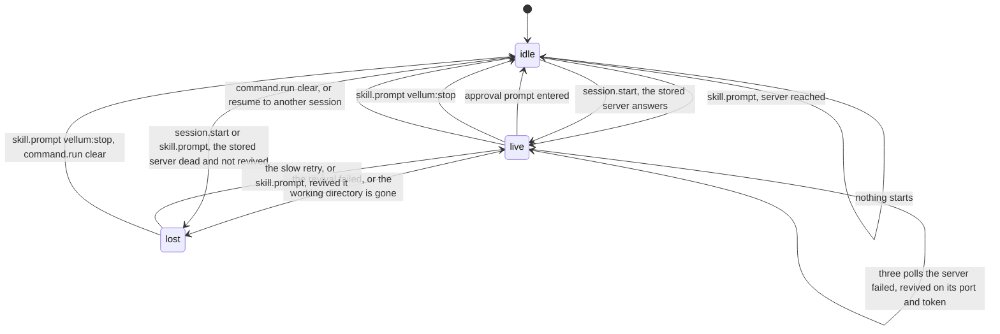
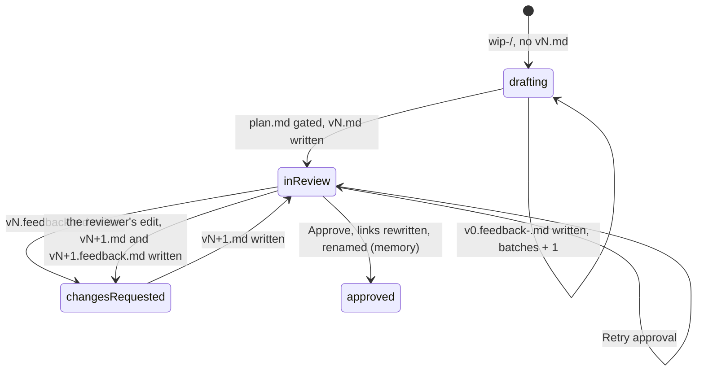

# Vellum: the map, and where it goes next

For the people who change the tree. The tree itself is drawn once, in
[`AGENTS.md`](../AGENTS.md) § Shape; the rules an agent holds to are in
[`.claude/rules/`](../.claude/rules/), one file per zone (engine, server, page, extensions, tests), each
naming its own files. This file draws what those texts describe, names the shape and the
shapes left aside, says where phases 2 and 3 landed, and where extensions go next.

## Three runtimes, one contract



`src/core/protocol.ts` is the one contract the three share: every value that crosses HTTP or
an extension boundary is typed there and is JSON. What an extension hands the core is typed
beside it, in `src/core/extension.ts`, and what crosses an extension's own routes in its
`protocol.ts`: § Extensions.

## What kind of architecture this is

**Hexagonal with a functional core**: two hexagons and one page, with the renderers as
feature slices. Ports and adapters give the direction (everything points at the domain,
the domain does no IO); "functional core, imperative shell" gives the weight (the domain
is functions over immutable data, one application module orchestrates, the adapters are
plain modules with no interface and no injection).

| Part | Shape | Driving side | Driven side |
|---|---|---|---|
| Hooks module | ports and adapters, `Host` the port | the engine's events (`session.start`, `skill.prompt`, `command.run`, `tool.check`, `tool.call`, `prompt.submit`, `turn.complete`) | the engine's `$` (clock, store, http, process, prompt, tool), answered by the kit in tests |
| Server | ports and adapters, domain / app / adapters | `adapters/http/routes.ts` | the file system through `adapters/fs.ts`, real in tests (a temp directory) |
| Page | a store of signals and components | the reviewer's clicks | `/api`, the files route, SSE |
| `src/extensions/<id>/` | feature slices: one extension = one folder, a half per runtime it plugs into; today one per document kind | | |

Four levels of ceremony exist for the same principle; this is the lightest. The next one
up, ports as interfaces with a fake each and a contract test per port, is one hour away
the day a second file-system adapter exists: extract the port from `adapters/fs.ts`, hand
it to `app/review.ts`. The ones above (a use case object per intention, then aggregates
and repositories) answer needs this plugin does not have.

Two other shapes were weighed and left:

- **Folders by kind of code, the IO moved out** (a `server/fs.ts` beside the parsing).
  Cheaper by an hour; leaves the domain types in the HTTP contract and the next feature asking
  where its pure part goes.
- **Vertical slices by feature** (`gate/`, `decision/`, `finalize/`, `docs/`). Wrong here:
  the features share one state machine and one directory layout; slicing them splits the
  union across folders, and the first review's bugs were exactly cross-feature state.

Also weighed and left, for now:

- File and function length thresholds: the pedantic oxlint and the anti-slop pack are the
  mechanical backstop.
- Ports as interfaces with a fake each: `adapters/fs.ts` has one implementation and the file
  system is fast; the port is extracted the day a second one exists.
- A contract test between the fake `$` and the engine: `claude plugin test` runs in the
  engine's environment, and `bun test` at the repository root fails on its import.

## A review round

```mermaid
sequenceDiagram
  participant CC as Claude Code
  participant M as hooks module
  participant S as vellum serve
  participant B as page
  CC->>M: skill.prompt vellum:start
  M->>S: start (detached), GET /api/review, POST /api/open
  S-->>B: the page opens on the working directory's files
  M-->>CC: skill text + "Working directory: plans/<date>/wip-<sid8>/"
  loop every tool call while live
    CC->>M: tool.check → allow inside the working directory, deny outside it
  end
  CC->>M: turn.complete (the main loop answered), or tool.call mcp__vellum__submit
  M->>S: POST /api/gate → reads plan.md, writes .review/vN.md, opens the browser once; an unchanged text is kept
  M-->>CC: status "plan vN under review" (and the tool's result: "End your turn.")
  loop every second
    M->>S: GET /api/pending
  end
  B->>S: PUT /api/draft (the unsent comments and edit, at every change)
  B->>S: POST /api/decision (feedback | approve, with the reviewer's edit or none)
  S->>S: an edit is vN+1: plan.md, then .review/vN+1.md; approve → notes file, links rewritten, directory renamed
  S-->>B: SSE workspace
  M->>CC: $.prompt.submit ("Changes requested on vN: read <path>." | "Plan vN approved, at <dir>. Read <notes file> first.")
```

## A grill



A round is Claude's: `grill_ask` alone opens one, and the reviewer's reply is written in it, so
an answer is read beside its question. A reply closes every open question, the ones left empty
with "As recommended, by default."; so does the end of the grill. A question is open until a
reply answers it, whatever happened since: a command of the session (`/vellum:start`, `/clear`)
is the harness's, written as an event line that opens and closes nothing. What the reviewer
types in the terminal, and what Claude answers to it, are not the grill's and are not written.

The file is the queue and the state: the server writes every round, the module writes nothing,
and what is open, who speaks next and what waits for the relay are read off `grill-<n>.md`
(`extensions/grill/transcript.ts`). `relaysOf` numbers the entries in file order: 0 the opening,
1..n the reviewer's replies, n+1 the end when the footer says `page`. The module keeps one
record of its own, in `$.store`: its cursor, `{ file, seq, taught }`. Each poll asks for the
entries past it and submits them one by one, the cursor written after each, so two replies
between two polls both go and nothing Claude says cancels one. The file serves the human, the
prompt serves the agent, and they no longer share a text: a prompt names its object
(`grill-2.md`) and repeats nothing Claude wrote or read. A reply goes under `Reviewer:`, the
note first, then the typed answers, never a default; `grilling.md` is named at the first grill
of a session alone (`taught`); the end names the file, its path goes to `$.ui.log`. Every relay
keeps the plugin's origin: the lock lets Claude write `grill-<n>.md`, so a `Reviewer` block
proves no human wrote it, and it must never reach Claude as the user's own words. The
suggestion alone lives in the server's memory.

Claude's final text is written when its turn is the grill's own: `prompt.submit` notes the
last prompt that entered and its origin, `turn.start`, which carries no origin itself, takes
that note when its text holds the noted one, and `turn.complete` hands `own` to the transcript
(`core/engine/turn.ts`, pure). A turn the terminal
started writes nothing, whatever the file's last voice is; the turn that just asked a round
closes it either way. While a grill is open the status line says `grill open, answer in the
page`: the warning for a prompt typed in the terminal, outside the context. A prompt Vellum itself submits comes back through its own `prompt.submit` hook, since
`$.prompt.submit` skips the calling hook alone; its origin (`plugin`, `vellum`) keeps it out of
the transcript, where the server already wrote what it carries.

## The two state machines

The hooks module, in memory, one union:



`lost` keeps the lock and the session with no server behind them: a failure never opens the
repository. `live` allows the file tools inside the working directory and denies them under the project
outside it, serves
`mcp__vellum__submit`, and polls `GET /api/pending` once a second until it closes: drafting
batches, then the review's decision, each relayed as a prompt.

The server, derived from the directory plus a memory overlay
(`src/core/server/domain/workspace.ts`, `workspaceOf`):



A version has an author: Claude through `gate`, or the reviewer, whose edit a decision records as
`vN+1` before it applies to it. The edit names the version it was made on, and `decideOn` refuses
one made on another. No state was added for it: `vN+1.md` with its feedback file reads as
`changesRequested`, like any other.

What the hooks module must relay is read off that state (`pendingOf`): `drafting` with
batches means the drafting files to name, `changesRequested` a feedback file, `approved` the
final directory and the notes file when its listing holds one, anything else nothing. No second variable. The module keeps one number of
its own, in `$.store`: how many batches it already named, so a reload never repeats one.

## Where phases 2 and 3 landed

| Feature | Pure part | Adapter part | Page part |
|---|---|---|---|
| Comment on an HTML element (#105) | `ElementRef`, the `Anchor` variant `element` and its line in the feedback text; `extensions/html/pick.ts` and `page/selection.ts` | `frame.js` built once at `startServer` and injected into `text/html` responses, `postMessage` across the sandbox | the HTML renderer bridges the frame and opens the Composer over the iframe |
| Coloured code and Mermaid (#105) | `rehype-highlight` in the `toTree` pipeline, so the hast keeps `data-lines`; the target kind `diagram` and `diagramPassage` in `extensions/markdown/pinpoint.ts` | | the Markdown renderer turns a `mermaid` block into a `figure`, draws it after the mount, and boxes it where text is highlighted |
| Diff `vN-1` / `vN` (#106) | `domain/diff.ts`: `lineDiff` over the `diff` package, `countChanges`; `extensions/markdown/changes.ts`: which block carries a mark, where a removed run goes | `/api/review` returns the previous version's text | `planChanges` computed once; the count beside the version, the "Changes since" toggle, the marks and the text-free removed blocks in the Markdown renderer |
| Delete marks and quick labels (#106) | `Mark` on `Annotation`, `QUICK_LABELS` with the sentence Claude reads, in `domain/feedback.ts` | `parseMark` in the boundary block of `routes.ts` | the Composer's label row and "Delete this", the card's chip and struck quote |
| Direct edit (#106) | `Edit`, `decideOn` (the edit is `vN+1`, refused on another version), `editOnLoad`, `landedAnnotations` in `domain/review.ts`; `shiftLines`, `shiftAnnotations` in `domain/diff.ts` | `parseEdit`; `Review.decide` writes `plan.md`, then the version file | `page/editor.tsx` and `page/caret.ts`; `edited`, `editing`, `finishEdit`, `settleEdit` in `state.ts` |
| Approval notes (#106) | `formatNotes`, `notesFile`, `approved.notes` read off the final directory's listing, `Pending.approved.notes` | the notes file written before the rename; `engine/relay.ts` names it in the approval's prompt | the decision bar's one popover state: notes, and the warning before unsent comments are discarded |
| Drafts (#106) | `Draft`, `DRAFT_FILE`, `takesComments` | `GET` and `PUT /api/draft`, stored and never read back; removed by a decision that lands | `start`: restore, load, then save at every change, in order |

Every one added a pure part first; `src/core/server/domain/` is where a new domain concept
goes, and a renderer's own choice stays beside its `page.tsx`.

## Extensions

`markdown`, `html`, `image` and `grill` are extensions, and so is whatever comes next
(`advisor`): a folder under `src/extensions/`, with one file per place where it plugs into the
core. The contract's client is the next agent that writes one, not a third party; the engine
constraints below are why. The contract is `src/core/extension.ts`, types only, and
`src/core/engine/extension.ts` for the engine half, types only, and the three registries are
`src/extensions/page.ts`, `server.ts` and `engine.ts`: read them rather than a copy here.

| Half | File | Declares | Reached from |
|---|---|---|---|
| page | `<id>/page.tsx` | a `PageExtension`: its renderers, tried in registry order, and its actions in the decision bar | `core/page/app.tsx`, through `extensions/page.ts` |
| server | `<id>/server.ts` | a `ServerExtension`: `linkedDocs`, pure, candidates in and links out; its routes, mounted at `/api/x/<id>/`, their IO through a `ServerContext`; `holds`, what holds the review; `approved`, what it closes after the rename | `core/server/adapters/http/serve.ts`, through `extensions/server.ts` |
| engine | `<id>/engine.ts` | an `EngineExtension`: tools, refusals, and handlers for a prompt, a finished turn, a poll and the mode's end | `core/engine/register.ts`, through `extensions/engine.ts` |

`src/boundaries.spec.ts` holds the layout: an extension imports `core/` and its own folder,
never another extension; the core reaches the extensions from those three files alone; an
engine half loads its own folder and nothing else; from
`core/page/` an extension imports the files of `PAGE_SURFACE`, the list found when the rule was
written, and no other; every folder holds a half, a half's `id` is its folder's name, and its
registry names it. One exception is left, marked TODO in `serve.ts`: the server builds
`extensions/html/frame.ts` by its path, because a server half cannot hand the core a script
yet.

### What the engine allows

Claude Code takes one hooks module per plugin and one hook per event in it, so an extension
never calls `on(...)`: `core/engine/register.ts` keeps every event and calls the extensions'
handlers, imported by value through `../../extensions/engine.ts`, each handed a `Host`. A
`tool.call` matcher must be a literal written in `register.ts`, so the extensions' tools go
through the one unmatched `tool.call` hook, which dispatches on `e.tool`. The engine rule of
`boundaries.spec.ts` allows siblings alone, and that one registry for `register.ts`. No module path may leave the plugin, so no third party ever has an
engine half: no dynamic loading, no versioned API. The measurements, which hold for every
plugin: `docs/plugin-testing.md` at the repository root, § Testing a hooks module.

### Config: not designed yet

Two facts from Claude Code's docs shape it. Skills and agents load with the plugin, so a Vellum
config cannot hide one per repository; the module can only refuse it at `skill.prompt`. And
`userConfig` values live in the user's settings, project entries ignored, so a per-repository
config is a file of Vellum's own.

Nothing below exists yet, and `grill` landed without it: an option or a flag is added when
someone asks to turn it. `grill` is the first that will: `enabled: false` there means no tool
registered, no route, no action, no renderer, and step 2 of the `start` skill names
`grill_suggest`, so whether the module adds that paragraph at `skill.prompt` only when `grill`
is on is the question left open. The design to revisit with what `grill` taught is `extension-contract.md` in
`plans/2026-09-17/extensions-de-vellum-arbre-noms-et-garde-fous/`; in short:

- A fourth file, `<id>/manifest.ts`: `id`, `required`, and the options as data (`boolean`,
  `number`, `text`, `choice`, each with its default). Pure, and the one file all three runtimes
  import. `definePage` and `defineServer` hand a half its options already typed; an extension
  writes no validation.
- Three layers, merged key by key, the last one winning: `~/.claude/vellum.json`,
  `.claude/vellum.json` (committed), `.claude/vellum.local.json` (git-ignored). With no file,
  every default applies. `enabled` is the core's key, never an option.
- `resolveConfig(manifests, layers)` refuses, naming the file, the key and what it expected:
  an unknown extension or option, a wrong kind, a number out of bounds, a choice outside its
  list, `enabled: false` on a required extension. The server reads the files when it starts
  and refuses to start on an error; the page and the engine get the resolved config from the
  server, and nothing else reads the files.

The crossroads a feature used to edit, and the place `grill` opened for each:

| Crossroads | Place opened |
|---|---|
| `core/server/adapters/http/routes.ts` | `ServerExtension.routes`, mounted under `/api/x/<id>/` behind the token |
| `core/page/app.tsx`, `core/page/state.ts` | `PageExtension.actions`, drawn in the decision bar |
| `core/engine/register.ts` | `EngineExtension`: tools, refusals, prompted, answered, tick, closing |
| `core/protocol.ts` | an extension's messages live in its own `protocol.ts` |

Left as they were: the document list names a kind by its media type, so a transcript reads
"Markdown" there, and an extension's styles still go to `core/page/style.css`.

The target to check next: `advisor` fits in one folder plus three registry lines.

