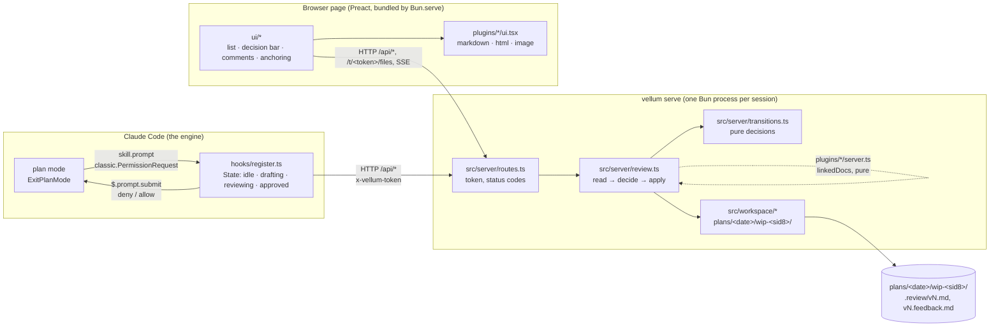
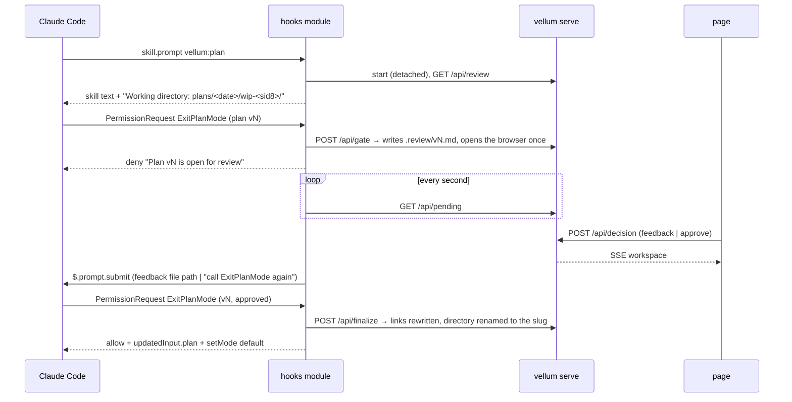
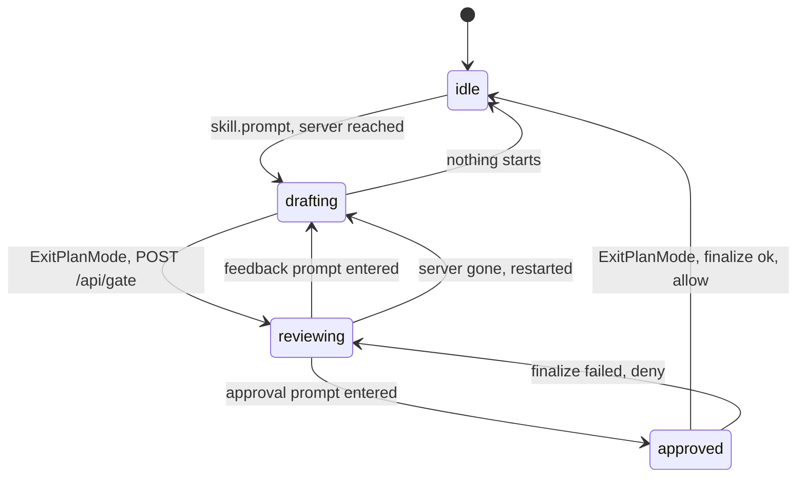
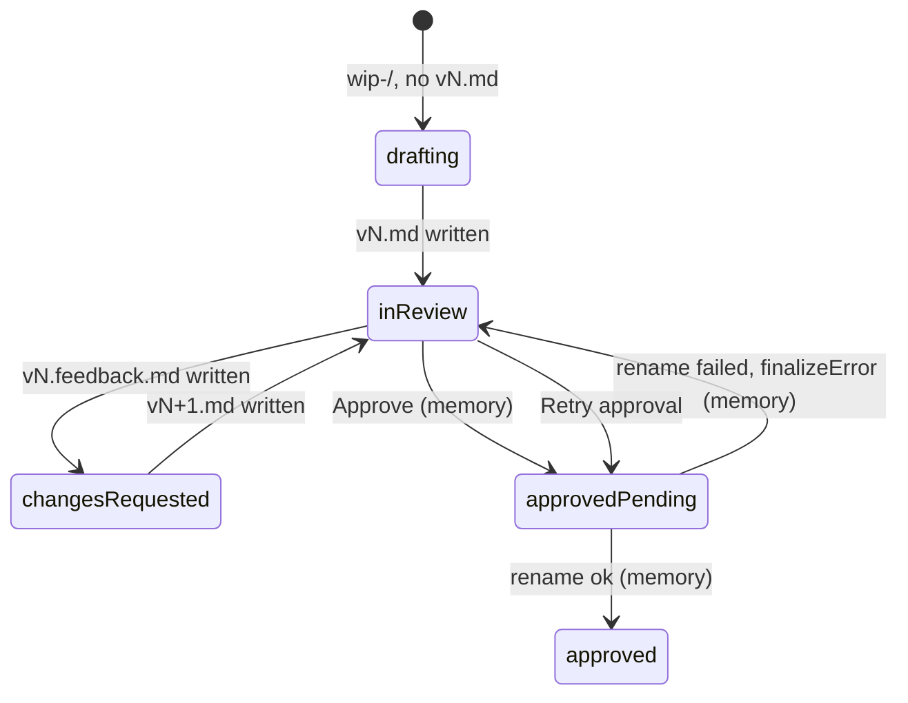

# Vellum: the map, and where it goes next

For the people who change the tree. The rules an agent holds to are in
[`.claude/rules/architecture.md`](../.claude/rules/architecture.md); this file draws what
that text describes, says what kind of architecture it is, names the untidy parts, and
proposes the shape for phases 2 and 3.

## Three runtimes, one contract



`src/protocol.ts` is the one contract the three share: every value that crosses HTTP or a
plugin boundary is typed there and is JSON.

## What kind of architecture this is

Two hexagons and one page, laid out in folders by kind of code, with the renderers as
feature slices. Not one thing, and the mix is where the "brouillon" feeling comes from.

| Part | Shape | Driving side | Driven side |
|---|---|---|---|
| Hooks module | ports and adapters, one file | the engine's events (`skill.prompt`, `classic.PermissionRequest`) | the engine's `$` (clock, store, http, process, prompt), faked in tests |
| Server | ports and adapters, three layers | `routes.ts` (HTTP) | the file system, called directly (`Bun.file`, `readdir`, `rename`) |
| Page | a store of signals and components | the reviewer's clicks | `/api`, the files route, SSE |
| `plugins/<kind>/` | feature slices: one document kind = one folder with its server half and its UI half | | |

What is clean: the server's core is pure (`transitions.ts`), tested with plain calls; the
hooks module's only port is explicit and faked; the page never imports `src/`.

What is untidy, by file:

1. `src/workspace/` mixes pure parsing (`paths.ts`, `slug.ts`, `links.ts`) with file
   operations (`read.ts` lists a directory, `finalize.ts` renames and rewrites). A domain
   folder that does IO is neither.
2. `src/server/review.ts` is the use case and the file-system adapter at once: `Bun.file`,
   `Bun.write` and `join(project, …)` sit next to the orchestration.
3. `src/protocol.ts` holds domain types (`PlanWorkspace`, `Anchor`, `Annotation`) and HTTP
   shapes (`ReviewView`, `Pending`, `Decision`) in one file, so the page and the server
   share the domain by accident of the contract.
4. `ui/state.ts` is the API client and the store in one module.
5. `plugins/index.ts` defines the renderer protocol and registers the renderers; the
   server-side counterpart (`plugins/server.ts`) is a separate index because one index
   would drag `node:*` into the browser bundle. Two indexes for one plugin system.

None of it is wrong at 3,000 lines. Phases 2 and 3 add domain concepts (element anchors,
drafting feedback, diffs, direct edits, approval notes, drafts) and each will ask where its
pure part lives; today the answer is "next to whatever touched it first".

## A review round



## The two state machines

The hooks module, in memory, one union:



The server, derived from the directory plus a memory overlay (`transitions.ts: workspaceOf`):



What the hooks module must relay is read off that state (`pendingOf`): `changesRequested`
means a feedback file to name, `approvedPending` an approval to announce, anything else
nothing. No second variable.

## Where phases 2 and 3 land

| Feature | Pure part | Adapter part | Page part |
|---|---|---|---|
| Comment on an HTML element (#105) | an `Anchor` variant `element` and its line in the feedback text | a script injected into `text/html` responses, `postMessage` across the sandbox | the HTML renderer listens |
| Feedback while drafting (#105) | a `Pending` variant `draft`, `v0.feedback-<n>.md` naming | the module polls from `drafting` too | the page lists the directory when there is no plan |
| `$.tool.call` + `consent` (#105) | the module's `approved` state may disappear | | |
| Diff `vN-1` / `vN` (#106) | a line diff over two texts | `/api/review` returns the previous text | a toggle |
| Direct edit (#106) | the edited text is the version to finalize | a field on the decision or on finalize | an editor |
| Approval notes (#106) | `vN.notes.md` naming, the note in the prompt or the consent | | a textarea on Approve |
| Drafts (#106) | | `draft.json` read and written | restore on load |

Six of seven add a pure part first. The tree should say where that goes.

## Proposed shape

Keep the two hexagons and the page; name the layers by role instead of by kind of code, and
move the file operations out of the domain. The moves are renames, no logic changes:

```
vellum/
  hooks/register.ts            the engine adapter, one file (the contract wants it self-contained)
  src/
    domain/                    pure, no IO, no Bun, no node:*
      paths.ts                 brands and parsers (today src/workspace/paths.ts)
      slug.ts, links.ts        (today src/workspace/)
      workspace.ts             DiskWorkspace from a listing, PlanWorkspace, Memory, workspaceOf, pendingOf
      review.ts                gateVersion, decideOn, slugFor (today src/server/transitions.ts)
      feedback.ts              formatFeedback (today src/feedback/format.ts)
      anchors.ts               phase 2: Anchor variants and their text
    app/
      review.ts                the use case: read the directory, decide, apply (today src/server/review.ts, minus the Bun calls)
    adapters/
      fs.ts                    list .review/, write a version, write a feedback, rename and rewrite (today read.ts + finalize.ts IO)
      http/routes.ts, http/serve.ts, cli.ts
      browser.ts               open the page
    protocol.ts                the JSON contract: what crosses HTTP, re-exporting the domain types it carries
  ui/
    api.ts                     the client (token, fetch, SSE)   ← split out of state.ts
    state.ts, app.tsx, …       the store and the components
    anchoring.ts, highlights.ts
  plugins/<kind>/{server.ts,ui.tsx}   one folder per document kind, unchanged
  plugins/index.ts, plugins/server.ts unchanged: two indexes because one bundle is a browser's
```

`domain/` has one rule: no import of `node:*`, `bun` or `ui/`. `app/review.ts` is the only
caller of `adapters/fs.ts`. A test of `domain/` is a plain call; a test of `app/` uses a temp
directory through the real adapter (no fake: the file system is fast and honest); a test of
`adapters/http` starts the server on port 0, as today.

Two other shapes were weighed:

- **Keep the tree, move only the IO** (`read.ts` and `finalize.ts` IO into `src/server/fs.ts`).
  Cheapest; leaves `protocol.ts` and `workspace/` as they are. Right if the plugin stays this size.
- **Vertical slices by feature** (`gate/`, `decision/`, `finalize/`, `docs/`). Wrong here:
  the features share one state machine and one directory layout; slicing them splits the
  union across folders, and the first review's bugs were exactly cross-feature state.

The proposed shape costs an afternoon: `git mv`, import paths, the test paths in
`AGENTS.md` and `README.md`, and `.claude/rules/architecture.md` rewritten to the new names.
Done before #105, every later feature has a home on its first line.
