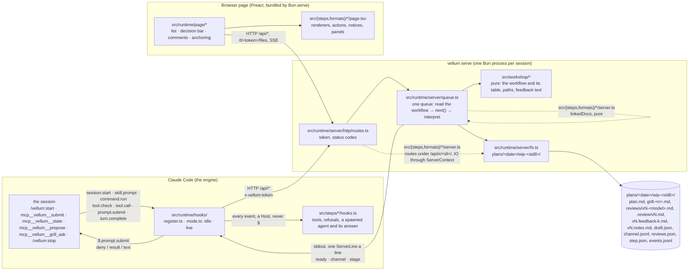
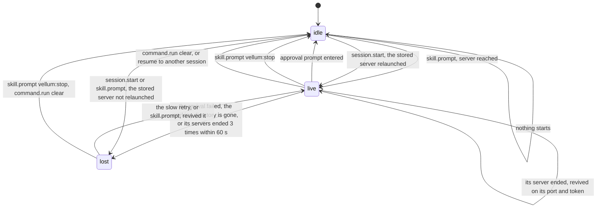
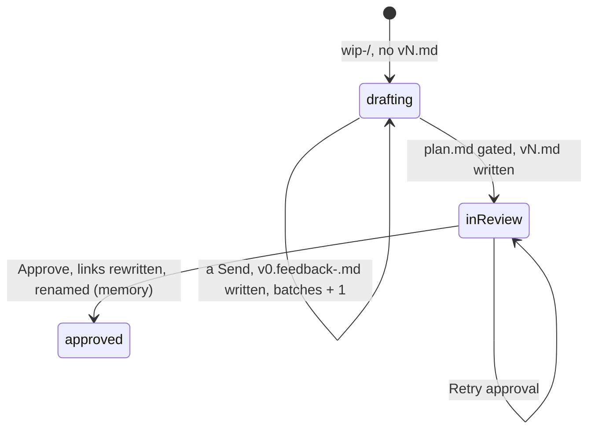

# Vellum: the map, and where it goes next

For the people who change the tree. The tree itself is drawn once, in
[`AGENTS.md`](../AGENTS.md) § Shape; the rules an agent holds to are in
[`.claude/rules/`](../.claude/rules/), one file per zone (workshop, engine, server, page, extensions, slices, tests), each
naming its own files. This file draws what those texts describe, names the shape and the
shapes left aside, shows where each part of a feature goes, and where extensions go next.

## Three runtimes, one contract

```mermaid
flowchart LR
  subgraph engine["Claude Code (the engine)"]
    CC["the session<br/>/vellum:start · mcp__vellum__submit · mcp__vellum__state · mcp__vellum__propose · mcp__vellum__grill_ask · /vellum:stop"]
    M["src/runtime/hooks/<br/>register.ts · mode.ts: idle · live"]
    E["src/steps/*/hooks.ts<br/>tools, refusals, a spawned agent and its answer"]
    CC -- "session.start · skill.prompt · command.run<br/>tool.check · tool.call · prompt.submit · turn.complete" --> M
    M -- "$.prompt.submit<br/>deny / result / text" --> CC
    M -- "every event, a Host, never $" --> E
  end
  subgraph server["vellum serve (one Bun process per session)"]
    R["src/runtime/server/http/routes.ts<br/>token, status codes"]
    A["src/runtime/server/queue.ts<br/>one queue: read the workflow → next() → interpret"]
    T["src/workshop/*<br/>pure: the workflow and its table, paths, feedback text"]
    W["src/runtime/server/fs.ts<br/>plans/&lt;date&gt;/wip-&lt;sid8&gt;/"]
    R --> A --> T
    A --> W
  end
  subgraph page["Browser page (Preact, bundled by Bun.serve)"]
    U["src/runtime/page/*<br/>list · decision bar · comments · anchoring"]
    P["src/{steps,formats}/*/page.tsx<br/>renderers, actions, notices, panels"]
    U --> P
  end
  M -- "HTTP /api/*<br/>x-vellum-token" --> R
  A -- "stdout, one ServerLine a line<br/>ready · channel · stage" --> M
  U -- "HTTP /api/*, /t/&lt;token&gt;/files, SSE" --> R
  A -. "src/{steps,formats}/*/server.ts<br/>linkedDocs, pure" .-> A
  R -. "src/{steps,formats}/*/server.ts<br/>routes under /api/x/&lt;id&gt;/, IO through ServerContext" .-> W
  F[("plans/&lt;date&gt;/wip-&lt;sid8&gt;/<br/>plan.md, grill-&lt;n&gt;.md, reviews/vN-&lt;model&gt;.md, .review/vN.md,<br/>vN.feedback-k.md, vN.notes.md, draft.json, channel.jsonl, reviews.json, step.json, events.jsonl")]
  W --> F
```

`src/runtime/protocol.ts` is the one contract the three share: every value that crosses HTTP or
an extension boundary is typed there and is JSON. What an extension hands the core is typed
beside it, in `src/runtime/extension.ts`, and what crosses an extension's own routes in its
`protocol.ts`: § Extensions.

## What kind of architecture this is

**Hexagonal with a functional core**: two hexagons and one page, with the renderers as
feature slices. Ports and adapters give the direction (everything points at the domain,
the domain does no IO); "functional core, imperative shell" gives the weight (the domain
is functions over immutable data, one application module orchestrates, the adapters are
plain modules with no interface and no injection).

| Part | Shape | Driving side | Driven side |
|---|---|---|---|
| Hooks module | ports and adapters, `Host` the port | the engine's events (`session.start`, `skill.prompt`, `command.run`, `tool.check`, `tool.call`, `prompt.submit`, `turn.complete`), and the lines its server writes on stdout | the engine's `$` (clock, store, http, process, prompt, tool, agent), answered by the kit in tests |
| Server | ports and adapters, the workshop / the server's modules | `http/routes.ts` | the file system through `fs.ts`, real in tests (a temp directory) |
| Page | a store of signals and components | the reviewer's clicks | `/api`, the files route, SSE |
| `src/steps/<name>/`, `src/formats/<name>/` | feature slices: one extension = one folder, a half per runtime it plugs into | | |

Four levels of ceremony exist for the same principle; this is the lightest. The next one
up, ports as interfaces with a fake each and a contract test per port, is one hour away
the day a second file-system adapter exists: extract the port from `runtime/server/fs.ts`, hand
it to `runtime/server/queue.ts`. The ones above (a use case object per intention, then aggregates
and repositories) answer needs this plugin does not have.

Two other shapes were weighed and left:

- **Folders by kind of code, the IO moved out** (a `server/fs.ts` beside the parsing).
  Cheaper by an hour; leaves the domain types in the HTTP contract and the next feature asking
  where its pure part goes.
- **Vertical slices by feature** (`gate/`, `decision/`, `finalize/`, `docs/`). Wrong here:
  the features share one state machine and one directory layout; slicing them splits the
  union across folders, and the first review's bugs were exactly cross-feature state.

Also weighed and left, for now:

- File and function length thresholds: the pedantic oxlint and the anti-slop pack are the
  mechanical backstop.
- Ports as interfaces with a fake each: `runtime/server/fs.ts` has one implementation and the file
  system is fast; the port is extracted the day a second one exists.
- A contract test between the fake `$` and the engine: `claude plugin test` runs in the
  engine's environment, and `bun test` at the repository root fails on its import.

## A review round

```mermaid
sequenceDiagram
  participant CC as Claude Code
  participant M as hooks module
  participant S as vellum serve
  participant B as page
  CC->>M: skill.prompt vellum:start
  M->>S: $.process.spawn cli.ts serve, POST /api/open
  S-->>M: stdout: ready, then the stage; GET /api/channel reads what is not relayed yet
  S-->>B: the page opens on the working directory's files
  M-->>CC: skill text + "Working directory: plans/<date>/wip-<sid8>/"
  loop every tool call while live
    CC->>M: tool.check → allow inside the working directory, deny outside it
  end
  CC->>M: turn.complete (the main loop answered), or tool.call mcp__vellum__submit
  M->>S: POST /api/gate → reads plan.md, writes .review/vN.md, opens the browser once; an unchanged text is kept
  M-->>CC: the tool's result: "End your turn."
  B->>S: PUT /api/draft (the unsent comments, edit, mockup choices and typing, at every change, and once more before a Send)
  B->>S: POST /api/send (what the reviewer saw at the click: comment ids, the edit, the choices, the parts) | POST /api/decision (approve, with the reviewer's edit or none)
  S->>S: a Send writes .review/vN.feedback-k.md from the draft it keeps, what it named, the stage unchanged; an edit is vN+1 first
  S->>S: approve → plan.md, the notes file, links rewritten, directory renamed
  S->>S: appends the entry to .review/channel.jsonl: sent (the batch) | approved
  S-->>B: SSE workspace
  S-->>M: stdout: the entry, then the stage
  M->>CC: $.prompt.submit ("Reviewer sent: read <path>." | "Plan vN approved, at <dir>. Read <notes file> first.")
```

## The next step, then a grill

```mermaid
sequenceDiagram
  participant C as Claude
  participant M as hooks module
  participant S as vellum serve
  participant P as page
  C->>M: tool.call propose {reason, moves, recommended}
  M->>S: POST /api/x/proposal/propose, pending under a new id (refused while a grill holds the review), then POST wait, held under 30 s, again and again
  S-->>P: workspace event, the "Next step" window over the page, or the Next step button's dot under a typing
  P->>S: POST /api/x/proposal/answer {id, answer}: a move picked, one of the reviewer's own, or their words
  S->>S: a grill picked: ServerContext.start("grill") words its opening, writing nothing
  S->>S: one step: next() judges answerProposal, the step's hold row refusing it while a grill is open, and answers the effects
  S->>S: one text entry on the channel: "Accepted: <move>." | "Chose: <move>." | "Own: <text>.", the opening after it; the grill's reaction writes grill-1.md, its header
  S-->>M: stdout: the entry, held by the follower while propose waits
  S-->>M: the wait's answer: the entry's number and its text
  M->>C: the tool's result; the follower never relays that entry
  C->>M: tool.call grill_ask {q}
  M->>S: POST /api/x/grill/ask, a round opened, then POST wait, held under 30 s, again and again
  P->>S: POST /api/send (the bar's, parts included): the grill's part reads the reply, writing nothing
  S->>S: the batch vN.feedback-k.md, Grill then Comments; its sent entry; the grill's reaction answers the wait (returnToCall), then writes the reply in the round
  S-->>M: stdout: the entry, held by the follower while grill_ask waits
  S-->>M: the wait's answer: the entry's number and "Reviewer: ..."
  M->>C: the tool's result; the follower never relays that entry
  C->>M: turn.complete
  M->>S: POST /api/x/grill/answer {text, reason, own, asked}, the turn's text after the reply
  P->>S: POST /api/x/grill/close, with what the draft holds as the reply, or the module's on /vellum:stop
  P->>S: POST /api/decision approve, the server ends the grill after the rename (approved)
  M->>C: $.prompt.submit ("The reviewer ended grill-1.md.", told for a close from the page alone)
```

A round is Claude's: `grill_ask` alone opens one, and the reviewer's reply is written in it, so
an answer is read beside its question. The reply leaves with the page's one Send, beside the
comments, as the batch's Grill section; it closes every open question, the ones the reviewer
left untouched with "As recommended, by default.", where "As recommended." is the
recommendation chosen, and the page asks before it takes one by default; so does the end of
the grill, which asks nothing. `grill_ask` waits for that Send and returns the reply as its
result, a `POST wait` at a time on the server, each under the engine's 30 s cut; Escape, or a
wait that fails, ends the call, and the batch reaches Claude through the channel as any other
("Reviewer sent: read <file>."). A question is open until a
reply answers it, whatever happened since: a command of the session (`/vellum:start`, `/clear`)
is the harness's, written as an event line that opens and closes nothing. What the reviewer
types in the terminal, and what Claude answers to it, are not the grill's and are not written.

The file is the transcript and the state: the server writes every round, the module writes
nothing, and what is open and who speaks next are read off `grill-<n>.md`
(`steps/grill/transcript.ts`). What Claude hears is the core's channel and the waiting
tool's result: a Send's reply goes in its batch; any other write the reviewer causes appends,
as text the server words, the entries it added to the transcript, which `relaysOf` reads in
file order: the opening, the reply End grill writes, the end when the footer says `page`. So
nothing Claude says cancels one; a block written into the file by hand was there before the
write and is not told. The file serves the human,
the prompt serves the agent, and they no longer share a text: a prompt names its object
(`grill-2.md`) and repeats nothing Claude wrote or read. A reply goes under `Reviewer:`, the
note first, then the typed answers, never a default; `grilling.md` is named at the first grill
of the working directory alone; the end names the file. Every relay keeps the plugin's origin:
the lock lets Claude write in the working directory, the channel included, so an entry proves
no human wrote it, and it must never reach Claude as the user's own words.

What to do next is `proposal`'s, never the grill's: `propose` offers moves (a grill, a mockup, a
prototype, the plan) and marks the one Claude recommends, which the window never checks. The
proposal is kept in `.review/step.json`, one at a time; whether Claude's call still waits on it
is the server's memory. A new one replaces it, the approval takes it, and `plan.md` written takes
the plan out of its moves, dropping it when the plan was its one move; a wait on it says so
(`ended`: `replaced`, `approved` or `written`). A restarted server shows it again, paused, since
no call survives it, and so does a turn cut short while the call waited, which the engine half
reports at the turn's end (`POST pause`): the page marks it Paused, never opens it by itself, and
the pick reaches Claude as a prompt. A wait that fails is asked once more at once, and two
failures answer that the pick comes as a prompt. The window opened blank from the Next step
button takes a step of the reviewer's own, and settles the proposal waiting, if any, never
reading the pick against a recommendation it did not show. A grill opens only there, through
`ServerContext.start`, in the answer's step of the queue: two never open, and the table refuses a
proposal while a region holds the review, and one that offers the plan once `plan.md` exists.

Claude's final text is written when its turn is the grill's own: `prompt.submit` notes the
last prompt that entered and its origin, `turn.start`, which carries no origin itself, takes
that note when its text holds the noted one, and `turn.complete` hands `own` to the transcript
(`runtime/hooks/turn.ts`, pure). A turn the terminal
started writes nothing, whatever the file's last voice is; the turn that asked a round closes it
either way, `asked` in the post: the grill's engine half marks the turn whose `grill_ask` the
server took, so its text goes with the round, before a reply the reviewer sent meanwhile, which
still waits for Claude. The file also says where the grill stands, `phaseOf`: `asking` while a
question is open and its call waits, `paused` once the turn that asked it was cut, `working`
while the reviewer spoke last, then `idle` or `stopped` by how Claude's last turn ended,
`_(turn aborted)_` and the like written by the server, a cut while a round waits whoever
started the turn. While a grill is open the band above the prompt says `grill · open`: a
prompt typed in the terminal is outside the grill. A prompt Vellum itself submits comes back through its own `prompt.submit` hook, since
`$.prompt.submit` skips the calling hook alone; its origin (`plugin`, `vellum`) keeps it out of
the transcript, where the server already wrote what it carries.

## A plan review

```mermaid
sequenceDiagram
  participant P as page
  participant S as vellum serve
  participant M as hooks module
  participant A as plan reviewer
  P->>S: POST /api/x/agent-review/request {version}, in `inReview` alone: a run `requested`, under a new number
  S-->>M: stdout: the stage
  M->>S: GET state, then $.agent.spawn vellum:plan-reviewer on .review/vN.md
  M->>S: POST launched {seq, agentId, model}: the run is `running`
  A-->>M: its own turn.complete, the agentId's (agentAnswered)
  M->>S: POST ended {seq, outcome}: its final text, or why it failed
  S->>S: reviews/vN-<model>.md written, then -2, -3; the rail lists it
```

The run lives in `.review/reviews.json`, so a restarted server still knows it and its number;
the engine half keeps only timers, and reads the run from the server each time a `stage` line
comes, whose `review · running` segment the server words. A run holds the review from its
request to its end, as the review region says (`Region.holds`): no version of Claude's is
recorded and `proposal` takes no proposal; when Claude wrote `plan.md` meanwhile, the run's end
tells it once (the notice), and the end of Claude's next turn records the version. A run whose agent was killed or
failed ends at once, one gone without an answer after `GRACE_MS`; the ✕ (`forget`), `/vellum:stop` and the approval give it
up and stop its agent. The agent reads files only (`agents/plan-reviewer.md`), so vellum writes
its verdict; why that verdict is the agent's final text and not a tool call: a subagent vellum
spawns reaches none of vellum's hooks but `turn.complete`
([Hook runtime](../../docs/plugin-testing/hook-runtime.md)).

## The two state machines

The hooks module, in memory, one union:

```mermaid
stateDiagram-v2
  [*] --> idle
  idle --> live: skill.prompt, server reached
  idle --> live: session.start, the stored server relaunched
  live --> live: another session id, server restarted
  live --> live: its server ended, revived on its port and token
  live --> lost: the revival failed, the working directory is gone, or its servers ended 3 times within 60 s
  idle --> lost: session.start or skill.prompt, the stored server not relaunched
  lost --> live: the slow retry, or skill.prompt, revived it
  lost --> idle: skill.prompt vellum:stop, command.run clear
  live --> idle: approval prompt entered
  live --> idle: skill.prompt vellum:stop
  live --> idle: command.run clear, or resume to another session
  idle --> idle: nothing starts
```

`lost` keeps the lock and the session with no server behind them: a failure never opens the
repository. `live` allows the file tools inside the working directory and denies them under the project
outside it, serves
`mcp__vellum__submit`, and reads its server's stdout until it closes: each entry of the channel
relayed as a prompt, once and in order, and each stage drawn in the band.

The server, derived from the directory plus a memory overlay
(`src/workshop/workspace.ts`, `workspaceOf`):

```mermaid
stateDiagram-v2
  [*] --> drafting: wip-<sid8>/, no vN.md
  drafting --> drafting: a Send, v0.feedback-<k>.md written, batches + 1
  drafting --> inReview: plan.md gated, vN.md written
  inReview --> inReview: a Send, vN.feedback-<k>.md written, batches + 1
  inReview --> inReview: a Send with the reviewer's edit, vN+1.md and vN+1.feedback-1.md written
  inReview --> inReview: plan.md gated, vN+1.md written, batches 0
  inReview --> approved: Approve, links rewritten, renamed (memory)
  inReview --> inReview: rename failed, finalizeError (memory)
  inReview --> inReview: Retry approval
```

A Send locks nothing: the reviewer goes on commenting on the version, and each Send is the next
batch of it. A version has an author: Claude through `gate`, or the reviewer, whose edit a Send
or an approval records as `vN+1` before it applies to it. The edit names the version it was made
on, and `sendOn` and `decideOn` refuse one made on another. A gate after a batch records a new
version even with the same text, as the explicit `submit` means it.

Everything else the session is lives in one value, the `Workflow` (`workshop/workflow.ts`): the
workspace above, `planText` (`plan.md` against the last version: `none`, `pending`, `absent`), and
one region per extension that has a part in it (the grill, the proposal, the plan review), each
read off its files by its own `workflow.ts`. Each route that changes the session dispatches an
event; `next()` judges it against one table of rows, each written beside the event it guards
(while a region holds the review, `record` and `propose` are refused and `approve` asks to
confirm; `approve-draft` refuses an approval while `plan.md` holds a text the version lacks), and
answers the next `Workflow` and its effects, which `interpret` (`runtime/server/effects.ts`) runs, the one
code that writes for the workflow. Every event judged is a line of `.review/events.jsonl`. When
the last hold lifts while `plan.md` waits, `next()` emits the notice, one entry of the channel,
and the end of Claude's next turn records the version. The page, the band and
`mcp__vellum__state` read the same value: its pill, each region's line, what is refused now.

What the hooks module relays is not read off that state: each Send and the approval append their
entry to the channel as they land (`workshop/channel.ts`), `sent` naming the batch, `approved` the
final directory and the notes file when its listing holds one. The module
keeps one number of its own, in `$.store`: the last entry it relayed, under the channel's identity
(`.review/channel.id`, which the rename carries), so a reload never repeats one and a new working
directory at the same path starts from its first. The mode owns its server: leaving `live` ends
it, and so does a revival replacing it.

## Where the parts of a feature go

| Feature | Pure part | Adapter part | Page part |
|---|---|---|---|
| Comment on an HTML element | `ElementRef`, its `ElementDescription`, the `Anchor` variant `element` and its line in the feedback text (`describeElement`); `formats/html/pick.ts`, `formats/html/describe.ts` and `runtime/page/selection.ts` | `frame.js` built once at `startServer` and injected into `text/html` responses, `postMessage` across the sandbox | the HTML renderer bridges the frame and opens the Composer over the iframe |
| Coloured code and Mermaid | `rehype-highlight` in the `toTree` pipeline, so the hast keeps `data-lines`; the target kind `diagram` and `diagramPassage` in `formats/markdown/pinpoint.ts` | | the Markdown renderer turns a `mermaid` block into a `figure`, draws it after the mount, and boxes it where text is highlighted |
| Diff `vN-1` / `vN` | `workshop/diff.ts`: `lineDiff` over the `diff` package, `countChanges`; `formats/markdown/changes.ts`: which block carries a mark, where a removed run goes | `/api/review` returns the previous version's text | `planChanges` computed once; the count beside the version, the "Changes since" toggle, the marks and the text-free removed blocks in the Markdown renderer |
| Delete marks and quick labels | `Mark` on `Annotation`, `QUICK_LABELS` with the sentence Claude reads, in `workshop/feedback.ts` | `parseMark` in the draft's parser, `runtime/server/draft.ts` | the Composer's label row and "Delete this", the card's chip and struck quote |
| Direct edit | `Edit`, `sendOn` and `decideOn` (the edit is `vN+1`, refused on another version), `editOnLoad`, `landedAnnotations` in `workshop/review.ts`; `shiftLines`, `shiftAnnotations` in `workshop/diff.ts` | `parseEdit` in `runtime/server/draft.ts`; `Review.send` and `Review.decide` write `plan.md`, then the version file | `page/editor.tsx` and `page/caret.ts`; `edited`, `editing`, `finishEdit`, `settleEdit` in `state.ts` |
| Approval notes | `formatNotes`, `notesFile`, `approved.notes` read off the final directory's listing, the channel's `approved` entry and its `notes` | the notes file written before the rename; `engine/relay.ts` names it in the approval's prompt | the decision bar's one popover state: notes, and the warning before unsent comments or choices are discarded |
| Drafts | `Draft`, `DRAFT_FILE`, `takesComments` | `GET` and `PUT /api/draft`, through the one parser of `review/draft.ts`; read back by a Send and by End grill; what a Send took leaves it, an approval removes it | `start`: restore, load, then save at every change, in order; `writeDraft` before a Send |
| One Send | `sendOn`, `batchFile`, `formatBatch`: what the Send names or its refusal, the extensions' parts, then the comments, then the choices made in mockups | `POST /api/send`, `Review.send` in one step of the queue: the `send` rows and each `part`, nothing written; the edit, the batch, the `sent` entry; each extension's reaction, the draft's rest | the bar's `Send (n)` and its warning, a card's Send now, `PageExtension.send`: a snapshot at the click, taken out of the page once sent |

Every one added a pure part first; `src/workshop/` is where a new domain concept
goes, and a renderer's own choice stays beside its `page.tsx`.

## Extensions

An extension is a folder under `src/steps/` or `src/formats/`, with one file per place where it plugs into the
core; the registries list them. The contract's client is the next agent that writes one, not a third party; the engine
constraints below are why. The contract is `src/runtime/extension.ts`, types only, and
`src/runtime/hooks/extension.ts` for the engine half, types only, and the three registries are
`slices.ts` of `src/runtime/page/`, `server/` and `hooks/`: read them rather than a copy here.

| Half | File | Declares | Reached from |
|---|---|---|---|
| page | `<folder>/page.tsx` | a `PageHalf`, a `PageExtension` as it is: its renderers, tried in registry order, its actions in the decision bar, its notices under it, its panel, a pane `panesOf` places beside the document pane, and its share of the Send | `runtime/page/app.tsx`, through `runtime/page/slices.ts` |
| server | `<folder>/server.ts` | a `ServerHalf`, which `serverExtension` makes a `ServerExtension`: `linkedDocs`, pure, candidates in and links out; its routes, mounted at `/api/x/<id>/`, their IO through a `ServerContext`, each change an event they `dispatch`; its `workflow` (from `<folder>/workflow.ts`: its region, events, rows, transitions, its reaction to the others' events, its segment of the band and its line in the view); `part`, its part of the bar's Send | `runtime/server/http/serve.ts`, through `runtime/server/slices.ts` |
| hooks | `<folder>/hooks.ts` | a `HooksHalf`: tools, a tool's wait for the reviewer and the entries it returns, refusals, and handlers for a prompt, a finished turn, a spawned agent's answer, a `stage` line and the mode's end | `runtime/hooks/register.ts`, through `runtime/hooks/slices.ts` |

`src/boundaries.spec.ts` holds the layout: an extension imports `workshop/`, `runtime/` and its
own folder, never another extension; a runtime reaches the extensions from those three files
alone; an engine half loads its own folder and nothing else; from a runtime's folder an
extension imports what `SURFACES` lists for a half it fills, `PAGE_SURFACE` from
`runtime/page/` the list found when the rule was written, and no other; every folder holds a
half, every half carries the id its folder declares, and its registry names it. One exception is left, marked TODO in `serve.ts`: the server builds
`formats/html/frame.ts` by its path, because a server half cannot hand the core a script
yet.

Every extension is a slice: read through
one declaration, `defineSlice` (`src/workshop/plugs.ts`), whose plugs type its halves `hooks.ts`,
`server.ts` and `page.tsx` (`HooksHalf`, `ServerHalf`, `PageHalf`), which the registries fold into
the three types above (`engineExtension`, `serverExtension`); its rows are built from that
declaration by `workshop/rows.ts`. `src/slices.spec.ts` holds each half to the
declaration at run time. `.claude/rules/slices.md` says the rest.

### What the engine allows

Claude Code takes one hooks module per plugin and one hook per event and matcher in it, so an extension
never calls `on(...)`: `runtime/hooks/register.ts` keeps every event and calls the extensions'
handlers, imported by value through `./slices.ts`, each handed a `Host`. A
hook of vellum's targets vellum's own tools: a hook with no matcher applies to every agent of
the session, and an unmatched `tool.call` hook takes the working directory from every
worktree-isolated agent's shell. So the extensions' tools and refusals go through one
`tool.call` hook whose matcher lists them, a literal written in `register.ts` as a matcher must
be, held equal to the registry by `register.spec.ts`; the hook dispatches on `e.tool`. The engine rule of
`boundaries.spec.ts` allows siblings alone, and that one registry for `register.ts`. No module path may leave the plugin, so no third party ever has an
engine half: no dynamic loading, no versioned API. The measurements, which hold for every
plugin: [Hook tests](../../docs/plugin-testing/hooks.md).

### Config: not designed yet

Two facts from Claude Code's docs shape it. Skills and agents load with the plugin, so a Vellum
config cannot hide one per repository; the module can only refuse it at `skill.prompt`. And
`userConfig` values live in the user's settings, project entries ignored, so a per-repository
config is a file of Vellum's own.

Nothing below exists yet, and `grill` does without it: an option or a flag is added when
someone asks to turn it. `grill` is the first that will: `enabled: false` there means no tool
registered, no route, no action, no renderer, and step 1 of the `start` skill offers a
`grill` move to `propose`, so whether the module adds that move at `skill.prompt` only when
`grill` is on is the question left open. The design to revisit with what `grill` taught is `extension-contract.md` in
`plans/2026-09-17/extensions-de-vellum-arbre-noms-et-garde-fous/`; in short:

- A fourth file, `<id>/manifest.ts`: `id`, `required`, and the options as data (`boolean`,
  `number`, `text`, `choice`, each with its default). Pure, and the one file all three runtimes
  import. `definePage` and `defineServer` hand a half its options already typed; an extension
  writes no validation.
- Three layers, merged key by key, the last one winning: `~/.claude/vellum.json`,
  `.claude/vellum.json` (committed), `.claude/vellum.local.json` (git-ignored). With no file,
  every default applies. `enabled` is the core's key, never an option.
- `resolveConfig(manifests, layers)` refuses, naming the file, the key and what it expected:
  an unknown extension or option, a wrong kind, a number out of bounds, a choice outside its
  list, `enabled: false` on a required extension. The server reads the files when it starts
  and refuses to start on an error; the page and the engine get the resolved config from the
  server, and nothing else reads the files.

The crossroads a feature used to edit, and the place `grill` opened for each:

| Crossroads | Place opened |
|---|---|
| `runtime/server/http/routes.ts` | `ServerExtension.routes`, mounted under `/api/x/<id>/` behind the token |
| `runtime/page/app.tsx`, `runtime/page/state.ts` | `PageExtension.actions`, drawn in the decision bar; `PageExtension.panel`, a pane beside the documents, in the order `PANE_ORDER` of `runtime/page/panes.ts` holds |
| `runtime/hooks/register.ts` | `EngineExtension`: tools, refusals, prompted, answered, agentAnswered, staged, closing |
| `workshop/workflow.ts` | `ServerExtension.workflow`: an extension's region, events, rows, transitions and reaction, assembled into one table |
| `runtime/protocol.ts` | an extension's messages live in its own `protocol.ts` |

Left as they were: the document list names a kind by its media type, so a transcript reads
"Markdown" there, and an extension's styles still go to `runtime/page/style.css`.

The target to check next: `advisor` fits in one folder plus three registry lines.

